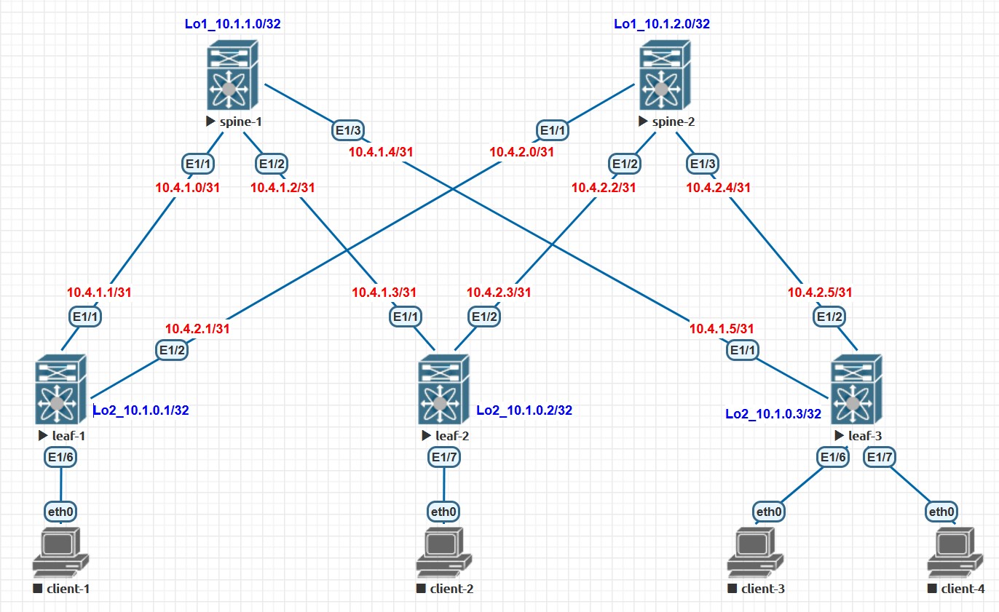

# Домашнее задание №1
## Проектирование адресного пространства

### Задачи:

- Собрать схему CLOS;
- Распределить адресное пространство.

## Выполнение:

### Собранная схема сети




### Таблица адресов

| hostname | interface |   IP/MASK   | Description |
| :------: | :-------: | :----------: | :---------: |
|  leaf-1  | Loopback2 | 10.2.0.1 /32 |            |
|  leaf-1  |  eth 1/1  | 10.6.1.1 /31 | to-spine-1 |
|  leaf-1  |  eth 1/2  | 10.6.2.1 /31 | to-spine-2 |
|          |          |              |            |
|  leaf-2  | Loopback2 | 10.2.0.2 /32 |            |
|  leaf-2  |  eth 1/1  | 10.6.1.3 /31 | to-spine-1 |
|  leaf-2  |  eth 1/2  | 10.6.2.3 /31 | to-spine-2 |
|          |          |              |            |
|  leaf-3  | Loopback2 | 10.2.0.3 /32 |            |
|  leaf-3  |  eth 1/1  | 10.6.1.5 /31 | to-spine-1 |
|  leaf-3  |  eth 1/2  | 10.6.2.5 /31 | to-spine-2 |
|          |          |              |            |
| spine-1 | Loopback1 | 10.1.1.0/32 |            |
| spine-1 |  eth 1/1  | 10.6.1.0/31 |  to-leaf-1  |
| spine-1 |  eth 1/2  | 10.6.1.2/31 |  to-leaf-2  |
| spine-1 |  eth 1/3  | 10.6.1.4/31 |  to-leaf-3  |
|          |          |              |            |
| spine-2 | Loopback1 | 10.1.2.0/32 |            |
| spine-2 |  eth 1/1  | 10.6.2.0/31 |  to-leaf-1  |
| spine-2 |  eth 1/2  | 10.6.2.2/31 |  to-leaf-2  |
| spine-2 |  eth 1/3  | 10.6.2.2/31 |  to-leaf-3  |

### Конфигурация оборудования

- #### [leaf-1](config/leaf-1.conf)

```
hostname leaf-1

interface Ethernet1/1
  description to-spine-1
  no switchport
  ip address 10.6.1.1/31
  no shutdown

interface Ethernet1/2
  description to-spine-2
  no switchport
  ip address 10.6.2.1/31
  no shutdown
  
interface loopback2
  ip address 10.1.0.1/32
```

- #### [leaf-2](config/leaf-2.conf)

```
hostname leaf-2

interface Ethernet1/1
  description to-spine-1
  no switchport
  ip address 10.6.1.3/31
  no shutdown

interface Ethernet1/2
  description to-spine-2
  no switchport
  ip address 10.6.2.3/31
  no shutdown
  
interface loopback2
  ip address 10.1.0.2/32
```

- #### [leaf-3](config/leaf-3.conf)

```
hostname leaf-3

interface Ethernet1/1
  description to-spine-1
  no switchport
  ip address 10.6.1.5/31
  no shutdown

interface Ethernet1/2
  description to-spine-2
  no switchport
  ip address 10.6.2.5/31
  no shutdown
  
interface loopback2
  ip address 10.1.0.3/32
```

- #### [spine-1](config/spine-1.conf)

```
hostname spine-1

interface Ethernet1/1
  description to-leaf-1
  no switchport
  ip address 10.6.1.0/31
  no shutdown

interface Ethernet1/2
  description to-leaf-2
  no switchport
  ip address 10.6.1.2/31
  no shutdown

interface Ethernet1/3
  description to-leaf-3
  no switchport
  ip address 10.6.1.4/31
  no shutdown

interface loopback1
  ip address 10.1.1.0/32
```

- #### [spine-2](config/spine-2.conf)

```
hostname spine-2

interface Ethernet1/1
  description to-leaf-1
  no switchport
  ip address 10.6.2.0/31
  no shutdown

interface Ethernet1/2
  description to-leaf-2
  no switchport
  ip address 10.6.2.2/31
  no shutdown

interface Ethernet1/3
  description to-leaf-3
  no switchport
  ip address 10.6.2.4/31
  no shutdown
  
interface loopback1
  ip address 10.1.2.0/32
```

### Проверка доступности

- #### spine-1

~~~
spine-1# ping 10.6.1.1
PING 10.6.1.1 (10.6.1.1): 56 data bytes
64 bytes from 10.6.1.1: icmp_seq=0 ttl=254 time=7.214 ms
64 bytes from 10.6.1.1: icmp_seq=1 ttl=254 time=5.438 ms
64 bytes from 10.6.1.1: icmp_seq=2 ttl=254 time=5.331 ms
64 bytes from 10.6.1.1: icmp_seq=3 ttl=254 time=6.061 ms
64 bytes from 10.6.1.1: icmp_seq=4 ttl=254 time=3.86 ms

--- 10.6.1.1 ping statistics ---
5 packets transmitted, 5 packets received, 0.00% packet loss
round-trip min/avg/max = 3.86/5.58/7.214 ms
spine-1#
spine-1#
spine-1# ping 10.6.1.2
PING 10.6.1.2 (10.6.1.2): 56 data bytes
64 bytes from 10.6.1.3: icmp_seq=0 ttl=254 time=2.793 ms
64 bytes from 10.6.1.3: icmp_seq=1 ttl=254 time=3.027 ms
64 bytes from 10.6.1.3: icmp_seq=2 ttl=254 time=3.117 ms
64 bytes from 10.6.1.3: icmp_seq=3 ttl=254 time=2.677 ms
64 bytes from 10.6.1.3: icmp_seq=4 ttl=254 time=3.037 ms

--- 10.6.1.3 ping statistics ---
5 packets transmitted, 5 packets received, 0.00% packet loss
round-trip min/avg/max = 2.677/2.93/3.117 ms
spine-1#
spine-1#
spine-1# ping 10.6.1.5
PING 10.6.1.5 (10.6.1.5): 56 data bytes
64 bytes from 10.6.1.5: icmp_seq=0 ttl=254 time=6.107 ms
64 bytes from 10.6.1.5: icmp_seq=1 ttl=254 time=4.889 ms
64 bytes from 10.6.1.5: icmp_seq=2 ttl=254 time=4.243 ms
64 bytes from 10.6.1.5: icmp_seq=3 ttl=254 time=4.066 ms
64 bytes from 10.6.1.5: icmp_seq=4 ttl=254 time=4.616 ms

--- 10.6.1.5 ping statistics ---
5 packets transmitted, 5 packets received, 0.00% packet loss
round-trip min/avg/max = 4.066/4.784/6.107 ms
spine-1#
~~~

- #### spine-2

~~~
spine-2# ping 10.6.2.1
PING 10.6.2.1 (10.6.2.1): 56 data bytes
64 bytes from 10.6.2.1: icmp_seq=0 ttl=254 time=4.581 ms
64 bytes from 10.6.2.1: icmp_seq=1 ttl=254 time=3.621 ms
64 bytes from 10.6.2.1: icmp_seq=2 ttl=254 time=3.721 ms
64 bytes from 10.6.2.1: icmp_seq=3 ttl=254 time=3.414 ms
64 bytes from 10.6.2.1: icmp_seq=4 ttl=254 time=3.475 ms

--- 10.6.2.1 ping statistics ---
5 packets transmitted, 5 packets received, 0.00% packet loss
round-trip min/avg/max = 3.414/3.762/4.581 ms
spine-2#
spine-2#
spine-2# ping 10.6.2.3
PING 10.6.2.3 (10.6.2.3): 56 data bytes
64 bytes from 10.6.2.3: icmp_seq=0 ttl=254 time=2.595 ms
64 bytes from 10.6.2.3: icmp_seq=1 ttl=254 time=2.727 ms
64 bytes from 10.6.2.3: icmp_seq=2 ttl=254 time=2.556 ms
64 bytes from 10.6.2.3: icmp_seq=3 ttl=254 time=2.971 ms
64 bytes from 10.6.2.3: icmp_seq=4 ttl=254 time=3.685 ms

--- 10.6.2.3 ping statistics ---
5 packets transmitted, 5 packets received, 0.00% packet loss
round-trip min/avg/max = 2.556/2.906/3.685 ms
spine-2#
spine-2#
spine-2# ping 10.6.2.5
PING 10.6.2.5 (10.6.2.5): 56 data bytes
64 bytes from 10.6.2.5: icmp_seq=0 ttl=254 time=4.053 ms
64 bytes from 10.6.2.5: icmp_seq=1 ttl=254 time=2.695 ms
64 bytes from 10.6.2.5: icmp_seq=2 ttl=254 time=2.577 ms
64 bytes from 10.6.2.5: icmp_seq=3 ttl=254 time=3.3 ms
64 bytes from 10.6.2.5: icmp_seq=4 ttl=254 time=3.543 ms

--- 10.6.2.5 ping statistics ---
5 packets transmitted, 5 packets received, 0.00% packet loss
round-trip min/avg/max = 2.577/3.233/4.053 ms
~~~
