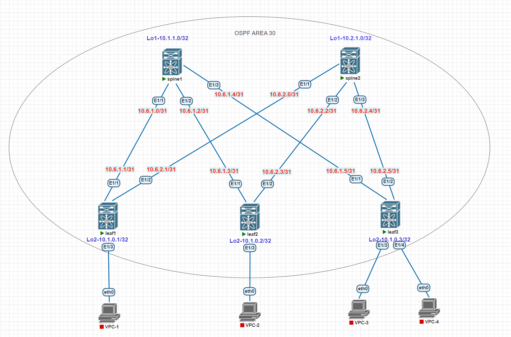

# Домашнее задание №2
## Underlay. OSPF

### Задача:

- Настроить протокол OSPF для Underlay сети
- Проверить связанность между устройствами

## Выполнение:

### Схема сети




### Конфигурация оборудования

- #### [leaf-1](config/leaf-1.conf)

```
feature ospf
feature bfd

router ospf Underlay
  bfd
  router-id 10.1.0.1
  passive-interface default

interface Ethernet1/1
  description to-spine-1
  no switchport
  bfd interval 100 min_rx 100 multiplier 3
  bfd authentication Keyed-SHA1 key-id 1 key bfdkey
  no ip redirects
  ip address 10.4.1.1/31
  ip ospf authentication message-digest
  ip ospf message-digest-key 11 md5 0 spine1leaf1
  ip ospf network point-to-point
  no ip ospf passive-interface
  ip router ospf Underlay area 0.0.0.0
  ip ospf bfd
  no shutdown

interface Ethernet1/2
  description to-spine-2
  no switchport
  bfd interval 100 min_rx 100 multiplier 3
  bfd authentication Keyed-SHA1 key-id 1 key bfdkey
  no ip redirects
  ip address 10.4.2.1/31
  ip ospf authentication message-digest
  ip ospf message-digest-key 21 md5 0 spine2leaf1
  ip ospf network point-to-point
  no ip ospf passive-interface
  ip router ospf Underlay area 0.0.0.0
  ip ospf bfd
  no shutdown

interface loopback2
  ip address 10.1.0.1/32
  ip router ospf Underlay area 0.0.0.0
```

- #### [leaf-2](config/leaf-2.conf)

```
feature ospf
feature bfd

router ospf Underlay
  bfd
  router-id 10.1.0.2
  passive-interface default

interface Ethernet1/1
  description to-spine-1
  no switchport
  bfd interval 100 min_rx 100 multiplier 3
  bfd authentication Keyed-SHA1 key-id 1 key bfdkey
  no ip redirects
  ip address 10.4.1.3/31
  ip ospf authentication message-digest
  ip ospf message-digest-key 12 md5 0 spine1leaf2
  ip ospf network point-to-point
  no ip ospf passive-interface
  ip router ospf Underlay area 0.0.0.0
  ip ospf bfd
  no shutdown

interface Ethernet1/2
  description to-spine-2
  no switchport
  bfd interval 100 min_rx 100 multiplier 3
  bfd authentication Keyed-SHA1 key-id 1 key bfdkey
  no ip redirects
  ip address 10.4.2.3/31
  ip ospf authentication message-digest
  ip ospf message-digest-key 22 md5 0 spine2leaf2
  ip ospf network point-to-point
  no ip ospf passive-interface
  ip router ospf Underlay area 0.0.0.0
  ip ospf bfd
  no shutdown

interface loopback2
  ip address 10.1.0.2/32
  ip router ospf Underlay area 0.0.0.0
```

- #### [leaf-3](config/leaf-3.conf)

```
feature ospf
feature bfd

router ospf Underlay
  bfd
  router-id 10.1.0.3
  passive-interface default

interface Ethernet1/1
  description to-spine-1
  no switchport
  bfd interval 100 min_rx 100 multiplier 3
  bfd authentication Keyed-SHA1 key-id 1 key bfdkey
  no ip redirects
  ip address 10.4.1.5/31
  ip ospf authentication message-digest
  ip ospf message-digest-key 13 md5 0 spine1leaf3
  ip ospf network point-to-point
  no ip ospf passive-interface
  ip router ospf Underlay area 0.0.0.0
  ip ospf bfd
  no shutdown

interface Ethernet1/2
  description to-spine-2
  no switchport
  bfd interval 100 min_rx 100 multiplier 3
  bfd authentication Keyed-SHA1 key-id 1 key bfdkey
  no ip redirects
  ip address 10.4.2.5/31
  ip ospf authentication message-digest
  ip ospf message-digest-key 23 md5 0 spine2leaf3
  ip ospf network point-to-point
  no ip ospf passive-interface
  ip router ospf Underlay area 0.0.0.0
  ip ospf bfd
  no shutdown

interface loopback2
  ip address 10.1.0.3/32
  ip router ospf Underlay area 0.0.0.0
```

- #### [spine-1](config/spine-1.conf)

```
feature ospf
feature bfd

router ospf Underlay
  bfd
  router-id 10.1.1.0
  passive-interface default

interface Ethernet1/1
  description to-leaf-1
  no switchport
  bfd interval 100 min_rx 100 multiplier 3
  bfd authentication Keyed-SHA1 key-id 1 key bfdkey
  no ip redirects
  ip address 10.4.1.0/31
  ip ospf authentication message-digest
  ip ospf message-digest-key 11 md5 0 spine1leaf1
  ip ospf network point-to-point
  no ip ospf passive-interface
  ip router ospf Underlay area 0.0.0.0
  ip ospf bfd
  no shutdown

interface Ethernet1/2
  description to-leaf-2
  no switchport
  bfd interval 100 min_rx 100 multiplier 3
  bfd authentication Keyed-SHA1 key-id 1 key bfdkey
  no ip redirects
  ip address 10.4.1.2/31
  ip ospf authentication message-digest
  ip ospf message-digest-key 12 md5 0 spine1leaf2
  ip ospf network point-to-point
  no ip ospf passive-interface
  ip router ospf Underlay area 0.0.0.0
  ip ospf bfd
  no shutdown
  
interface Ethernet1/3
  description to-leaf-3
  no switchport
  bfd interval 100 min_rx 100 multiplier 3
  bfd authentication Keyed-SHA1 key-id 1 key bfdkey
  no ip redirects
  ip address 10.4.1.4/31
  ip ospf authentication message-digest
  ip ospf message-digest-key 13 md5 0 spine1leaf3
  ip ospf network point-to-point
  no ip ospf passive-interface
  ip router ospf Underlay area 0.0.0.0
  ip ospf bfd
  no shutdown

interface loopback1
  ip address 10.1.1.0/32
  ip router ospf Underlay area 0.0.0.0
```

- #### [spine-2](config/spine-2.conf)

```
feature ospf
feature bfd

router ospf Underlay
  bfd
  router-id 10.1.2.0
  passive-interface default

interface Ethernet1/1
  description to-leaf-1
  no switchport
  bfd interval 100 min_rx 100 multiplier 3
  bfd authentication Keyed-SHA1 key-id 1 key bfdkey
  no ip redirects
  ip address 10.4.2.0/31
  ip ospf authentication message-digest
  ip ospf message-digest-key 21 md5 0 spine2leaf1
  ip ospf network point-to-point
  no ip ospf passive-interface
  ip router ospf Underlay area 0.0.0.0
  ip ospf bfd
  no shutdown

interface Ethernet1/2
  description to-leaf-2
  no switchport
  bfd interval 100 min_rx 100 multiplier 3
  bfd authentication Keyed-SHA1 key-id 1 key bfdkey
  no ip redirects
  ip address 10.4.2.2/31
  ip ospf authentication message-digest
  ip ospf message-digest-key 22 md5 0 spine2leaf2
  ip ospf network point-to-point
  no ip ospf passive-interface
  ip router ospf Underlay area 0.0.0.0
  ip ospf bfd
  no shutdown
  
interface Ethernet1/3
  description to-leaf-3
  no switchport
  bfd interval 100 min_rx 100 multiplier 3
  bfd authentication Keyed-SHA1 key-id 1 key bfdkey
  no ip redirects
  ip address 10.4.2.4/31
  ip ospf authentication message-digest
  ip ospf message-digest-key 23 md5 0 spine2leaf3
  ip ospf network point-to-point
  no ip ospf passive-interface
  ip router ospf Underlay area 0.0.0.0
  ip ospf bfd
  no shutdown

interface loopback1
  ip address 10.1.2.0/32
  ip router ospf Underlay area 0.0.0.0
```
---
### Проверка связанности устройств по протоколу OSPF

- #### spine-1

```
spine-1# sh ip ospf neighbors
 OSPF Process ID Underlay VRF default
 Total number of neighbors: 3
 Neighbor ID     Pri State            Up Time  Address         Interface
 10.1.0.1          1 FULL/ -          01:43:41 10.4.1.1        Eth1/1
 10.1.0.2          1 FULL/ -          00:34:51 10.4.1.3        Eth1/2
 10.1.0.3          1 FULL/ -          00:36:27 10.4.1.5        Eth1/3
```

- #### spine-2

```
spine-2# sh ip ospf neighbors
 OSPF Process ID Underlay VRF default
 Total number of neighbors: 3
 Neighbor ID     Pri State            Up Time  Address         Interface
 10.1.0.1          1 FULL/ -          01:16:55 10.4.2.1        Eth1/1
 10.1.0.2          1 FULL/ -          00:35:15 10.4.2.3        Eth1/2
 10.1.0.3          1 FULL/ -          00:36:48 10.4.2.5        Eth1/3
```
