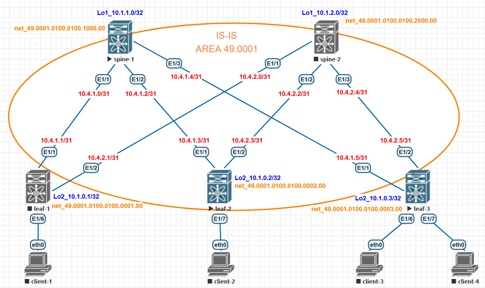

# Домашнее задание №3

## Underlay. IS-IS

### Задача:

- Настроите ISIS в Underlay сети, для IP связанности между всеми сетевыми устройствами.
- Зафиксируете в документации - план работы, адресное пространство, схему сети, конфигурацию устройств
- Убедитесь в наличии IP связанности между устройствами в ISIS домене

## Выполнение:

### Схема сети



### Конфигурация оборудования

- #### [leaf-1](config/leaf-1.conf)

```
feature isis
feature bfd

bfd echo-interface loopback2
bfd ipv4 interval 100 min_rx 100 multiplier 3

   
interface Ethernet1/1
  description to-spine-1
  no switchport
  bfd interval 100 min_rx 100 multiplier 3
  bfd authentication Keyed-SHA1 key-id 1 hex-key 0123AB
  no ip redirects
  ip address 10.6.1.1/31
  no isis hello-padding
  isis network point-to-point
  isis circuit-type level-1
  ip router isis UNDERLAY
  no isis passive-interface level-1
  no shutdown

interface Ethernet1/2
  description to-spine-2
  no switchport
  bfd interval 100 min_rx 100 multiplier 3
  bfd authentication Keyed-SHA1 key-id 1 hex-key 0123AB
  no ip redirects
  ip address 10.6.2.1/31
  no isis hello-padding
  isis network point-to-point
  isis circuit-type level-1
  ip router isis UNDERLAY
  no isis passive-interface level-1
  no shutdown

  
interface loopback2
  ip address 10.1.0.1/32
  ip router isis UNDERLAY
  
router isis UNDERLAY
  net 49.0005.0100.0100.0001.00
  address-family ipv4 unicast
  passive-interface default level-1

```

- #### [leaf-2](config/leaf-2.conf)

```
feature isis
feature bfd

bfd echo-interface loopback2
bfd ipv4 interval 100 min_rx 100 multiplier 3

interface Ethernet1/1
  description to-spine-1
  no switchport
  bfd interval 100 min_rx 100 multiplier 3
  bfd authentication Keyed-SHA1 key-id 1 hex-key 0123AB
  no ip redirects
  ip address 10.6.1.3/31
  no isis hello-padding
  isis network point-to-point
  isis circuit-type level-1
  ip router isis UNDERLAY
  no isis passive-interface level-1
  no shutdown

interface Ethernet1/2
  description to-spine-2
  no switchport
  bfd interval 100 min_rx 100 multiplier 3
  bfd authentication Keyed-SHA1 key-id 1 hex-key 0123AB
  no ip redirects
  ip address 10.6.2.3/31
  no isis hello-padding
  isis network point-to-point
  isis circuit-type level-1
  ip router isis UNDERLAY
  no isis passive-interface level-1
  no shutdown


interface loopback2
  ip address 10.1.0.2/32
  ip router isis UNDERLAY

router isis UNDERLAY
  net 49.0005.0100.0100.0001.00
  address-family ipv4 unicast
  passive-interface default level-1

```

- #### [leaf-3](config/leaf-3.conf)

```
feature isis
feature bfd

bfd echo-interface loopback2
bfd ipv4 interval 100 min_rx 100 multiplier 3

interface Ethernet1/1
  description to-spine-1
  no switchport
  bfd interval 100 min_rx 100 multiplier 3
  bfd authentication Keyed-SHA1 key-id 1 hex-key 0123AB
  no ip redirects
  ip address 10.6.1.5/31
  no isis hello-padding
  isis network point-to-point
  isis circuit-type level-1
  ip router isis UNDERLAY
  no isis passive-interface level-1
  no shutdown

interface Ethernet1/2
  description to-spine-2
  no switchport
  bfd interval 100 min_rx 100 multiplier 3
  bfd authentication Keyed-SHA1 key-id 1 hex-key 0123AB
  no ip redirects
  ip address 10.6.2.5/31
  no isis hello-padding
  isis network point-to-point
  isis circuit-type level-1
  ip router isis UNDERLAY
  no isis passive-interface level-1
  no shutdown


interface loopback2
  ip address 10.1.0.3/32
  ip router isis UNDERLAY

router isis UNDERLAY
  net 49.0005.0100.0100.0001.00
  address-family ipv4 unicast
  passive-interface default level-1

```

- #### [spine-1](config/spine-1.conf)

```
feature isis
feature bfd

bfd echo-interface loopback2
bfd ipv4 interval 100 min_rx 100 multiplier 3

interface Ethernet1/1
  description to-leaf-1
  no switchport
  bfd interval 100 min_rx 100 multiplier 3
  bfd authentication Keyed-SHA1 key-id 1 hex-key 0123AB
  no ip redirects
  ip address 10.6.1.0/31
  no isis hello-padding
  isis network point-to-point
  isis circuit-type level-1
  ip router isis UNDERLAY
  no isis passive-interface level-1
  no shutdown

interface Ethernet1/2
  description to-leaf-2
  no switchport
  bfd interval 100 min_rx 100 multiplier 3
  bfd authentication Keyed-SHA1 key-id 1 hex-key 0123AB
  no ip redirects
  ip address 10.6.1.2/31
  no isis hello-padding
  isis network point-to-point
  isis circuit-type level-1
  ip router isis UNDERLAY
  no isis passive-interface level-1
  no shutdown

interface Ethernet1/3
  description to-leaf-3
  no switchport
  bfd interval 100 min_rx 100 multiplier 3
  bfd authentication Keyed-SHA1 key-id 1 hex-key 0123AB
  no ip redirects
  ip address 10.6.1.4/31
  no isis hello-padding
  isis network point-to-point
  isis circuit-type level-1
  ip router isis UNDERLAY
  no isis passive-interface level-1
  no shutdown

interface loopback1
  ip address 10.1.1.0/32
  ip router isis UNDERLAY

router isis UNDERLAY
  net 49.0005.0100.0100.1000.00
  address-family ipv4 unicast
  passive-interface default level-1

```

- #### [spine-2](config/spine-2.conf)

```
feature isis
feature bfd

bfd echo-interface loopback2
bfd ipv4 interval 100 min_rx 100 multiplier 3


interface Ethernet1/1
  description to-leaf-1
  no switchport
  bfd interval 100 min_rx 100 multiplier 3
  bfd authentication Keyed-SHA1 key-id 1 hex-key 0123AB
  no ip redirects
  ip address 10.6.2.0/31
  no isis hello-padding
  isis network point-to-point
  isis circuit-type level-1
  ip router isis UNDERLAY
  no isis passive-interface level-1
  no shutdown

interface Ethernet1/2
  description to-leaf-2
  no switchport
  bfd interval 100 min_rx 100 multiplier 3
  bfd authentication Keyed-SHA1 key-id 1 hex-key 0123AB
  no ip redirects
  ip address 10.6.2.2/31
  no isis hello-padding
  isis network point-to-point
  isis circuit-type level-1
  ip router isis UNDERLAY
  no isis passive-interface level-1
  no shutdown

interface Ethernet1/3
  description to-leaf-3
  no switchport
  bfd interval 100 min_rx 100 multiplier 3
  bfd authentication Keyed-SHA1 key-id 1 hex-key 0123AB
  no ip redirects
  ip address 10.6.2.4/31
  no isis hello-padding
  isis network point-to-point
  isis circuit-type level-1
  ip router isis UNDERLAY
  no isis passive-interface level-1
  no shutdown


interface loopback1
  ip address 10.1.2.0/32
  ip router isis UNDERLAY

router isis UNDERLAY
  net 49.0005.0100.0100.2000.00
  address-family ipv4 unicast
  passive-interface default level-1
```

---

### Проверка связанности устройств по протоколу IS-IS

- #### spine-1

```
Spine-1#  sh isis adjacency
IS-IS process: UNDERLAY VRF: default
IS-IS adjacency database:
Legend: '!': No AF level connectivity in given topology
System ID       SNPA            Level  State  Hold Time  Interface
Leaf-1          N/A             1      UP     00:00:28   Ethernet1/1
Leaf-1          N/A             1      UP     00:00:28   Ethernet1/2
Leaf-1          N/A             1      UP     00:00:26   Ethernet1/3


Spine-1# sh ip route
IP Route Table for VRF "default"
'*' denotes best ucast next-hop
'**' denotes best mcast next-hop
'[x/y]' denotes [preference/metric]
'%<string>' in via output denotes VRF <string>

10.1.0.2/32, ubest/mbest: 3/0
    *via 10.6.1.1, Eth1/1, [115/41], 00:00:13, isis-UNDERLAY, L1
    *via 10.6.1.3, Eth1/2, [115/41], 00:00:13, isis-UNDERLAY, L1
    *via 10.6.1.5, Eth1/3, [115/41], 00:00:13, isis-UNDERLAY, L1
10.1.2.0/32, ubest/mbest: 2/0, attached
    *via 10.1.2.0, Lo1, [0/0], 01:25:23, local
    *via 10.1.2.0, Lo1, [0/0], 01:25:23, direct
10.6.1.0/31, ubest/mbest: 1/0, attached
    *via 10.6.1.0, Eth1/1, [0/0], 00:01:03, direct
10.6.1.0/32, ubest/mbest: 1/0, attached
    *via 10.6.1.0, Eth1/1, [0/0], 00:01:03, local
10.6.1.2/31, ubest/mbest: 1/0, attached
    *via 10.6.1.2, Eth1/2, [0/0], 00:00:55, direct
10.6.1.2/32, ubest/mbest: 1/0, attached
    *via 10.6.1.2, Eth1/2, [0/0], 00:00:55, local
10.6.1.4/31, ubest/mbest: 1/0, attached
    *via 10.6.1.4, Eth1/3, [0/0], 00:00:49, direct
10.6.1.4/32, ubest/mbest: 1/0, attached
    *via 10.6.1.4, Eth1/3, [0/0], 00:00:49, local
10.6.2.0/31, ubest/mbest: 3/0
    *via 10.6.1.1, Eth1/1, [115/120], 00:00:04, isis-UNDERLAY, L1
    *via 10.6.1.3, Eth1/2, [115/120], 00:00:04, isis-UNDERLAY, L1
    *via 10.6.1.5, Eth1/3, [115/120], 00:00:04, isis-UNDERLAY, L1
10.6.2.2/31, ubest/mbest: 3/0
    *via 10.6.1.1, Eth1/1, [115/80], 00:00:13, isis-UNDERLAY, L1
    *via 10.6.1.3, Eth1/2, [115/80], 00:00:13, isis-UNDERLAY, L1
    *via 10.6.1.5, Eth1/3, [115/80], 00:00:13, isis-UNDERLAY, L1
10.6.2.4/31, ubest/mbest: 3/0
    *via 10.6.1.1, Eth1/1, [115/120], 00:00:04, isis-UNDERLAY, L1
    *via 10.6.1.3, Eth1/2, [115/120], 00:00:04, isis-UNDERLAY, L1
    *via 10.6.1.5, Eth1/3, [115/120], 00:00:04, isis-UNDERLAY, L1

```

- #### spine-2

```
spine-2# sh isis adjacency
IS-IS process: Underlay VRF: default
IS-IS adjacency database:
Legend: '!': No AF level connectivity in given topology
System ID       SNPA            Level  State  Hold Time  Interface
leaf-1          5001.0000.1b08  1      UP     00:00:31   Ethernet1/1
leaf-2          5002.0000.1b08  1      UP     00:00:27   Ethernet1/2
leaf-3          5003.0000.1b08  1      UP     00:00:26   Ethernet1/3

spine-2# sh ip route
IP Route Table for VRF "default"
'*' denotes best ucast next-hop
'**' denotes best mcast next-hop
'[x/y]' denotes [preference/metric]
'%<string>' in via output denotes VRF <string>

10.1.0.1/32, ubest/mbest: 1/0
    *via 10.4.2.1, Eth1/1, [115/41], 14:48:32, isis-Underlay, L1
10.1.0.2/32, ubest/mbest: 1/0
    *via 10.4.2.3, Eth1/2, [115/41], 14:48:34, isis-Underlay, L1
10.1.0.3/32, ubest/mbest: 1/0
    *via 10.4.2.5, Eth1/3, [115/41], 14:48:35, isis-Underlay, L1
10.1.1.0/32, ubest/mbest: 3/0
    *via 10.4.2.1, Eth1/1, [115/81], 14:30:20, isis-Underlay, L1
    *via 10.4.2.3, Eth1/2, [115/81], 14:48:32, isis-Underlay, L1
    *via 10.4.2.5, Eth1/3, [115/81], 14:48:35, isis-Underlay, L1
10.1.2.0/32, ubest/mbest: 2/0, attached
    *via 10.1.2.0, Lo1, [0/0], 16:12:02, local
    *via 10.1.2.0, Lo1, [0/0], 16:12:02, direct
10.4.1.0/31, ubest/mbest: 1/0
    *via 10.4.2.1, Eth1/1, [115/80], 14:48:32, isis-Underlay, L1
10.4.1.2/31, ubest/mbest: 1/0
    *via 10.4.2.3, Eth1/2, [115/80], 14:48:34, isis-Underlay, L1
10.4.1.4/31, ubest/mbest: 1/0
    *via 10.4.2.5, Eth1/3, [115/80], 14:48:35, isis-Underlay, L1
10.4.2.0/31, ubest/mbest: 1/0, attached
    *via 10.4.2.0, Eth1/1, [0/0], 16:12:04, direct
10.4.2.0/32, ubest/mbest: 1/0, attached
    *via 10.4.2.0, Eth1/1, [0/0], 16:12:04, local
10.4.2.2/31, ubest/mbest: 1/0, attached
    *via 10.4.2.2, Eth1/2, [0/0], 16:12:04, direct
10.4.2.2/32, ubest/mbest: 1/0, attached
    *via 10.4.2.2, Eth1/2, [0/0], 16:12:04, local
10.4.2.4/31, ubest/mbest: 1/0, attached
    *via 10.4.2.4, Eth1/3, [0/0], 16:12:03, direct
10.4.2.4/32, ubest/mbest: 1/0, attached
    *via 10.4.2.4, Eth1/3, [0/0], 16:12:03, local
```
