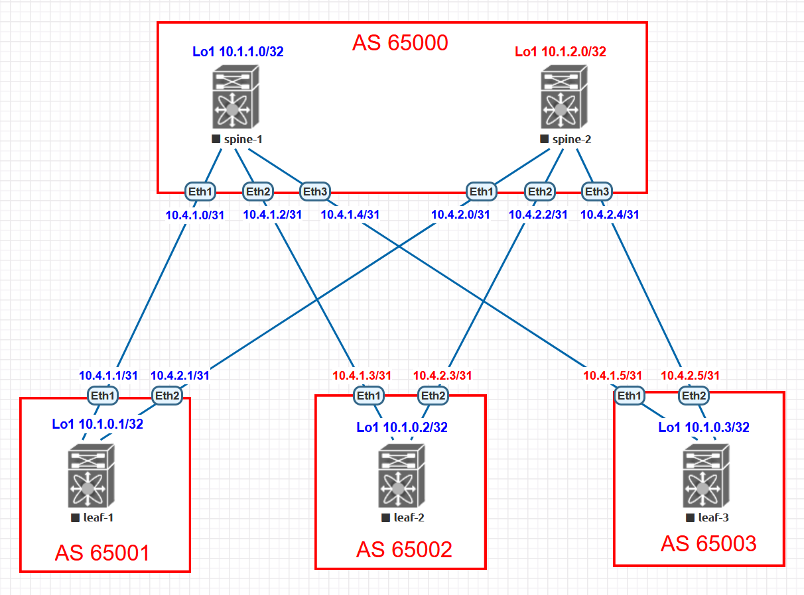

# Домашнее задание №4

## Underlay. eBGP

### Задача:

- Настроить протокол eBGP для Underlay сети
- Проверить связанность между устройствами

## Выполнение:

### Схема сети



### Конфигурация оборудования

- #### [leaf-1](config/leaf-1.conf)

```
ip routing

ip prefix-list PL_LOOP
   seq 10 permit 10.1.0.1/32

route-map RM_CONN permit 10
   match ip address prefix-list PL_LOOP

router bgp 65001
   router-id 10.1.0.1
   timers bgp 3 9
   maximum-paths 2 ecmp 2
   neighbor SPINE peer group
   neighbor SPINE remote-as 65000
   neighbor SPINE bfd
   neighbor SPINE allowas-in 1
   neighbor SPINE rib-in pre-policy retain all
   neighbor SPINE password 7 9cdhNWhDdTM=
   neighbor SPINE send-community
   neighbor SPINE maximum-routes 1000
   neighbor 10.4.1.0 peer group SPINE
   neighbor 10.4.2.0 peer group SPINE
   redistribute connected route-map RM_CONN

```

- #### [leaf-2](config/leaf-2.conf)

```
ip routing

ip prefix-list PL_LOOP
   seq 10 permit 10.1.0.2/32

route-map RM_CONN permit 10
   match ip address prefix-list PL_LOOP

router bgp 65002
   router-id 10.1.0.2
   timers bgp 3 9
   maximum-paths 2 ecmp 2
   neighbor SPINE peer group
   neighbor SPINE remote-as 65000
   neighbor SPINE bfd
   neighbor SPINE allowas-in 1
   neighbor SPINE rib-in pre-policy retain all
   neighbor SPINE password 7 9cdhNWhDdTM=
   neighbor SPINE send-community
   neighbor SPINE maximum-routes 1000
   neighbor 10.4.1.2 peer group SPINE
   neighbor 10.4.2.2 peer group SPINE
   redistribute connected route-map RM_CONN
```

- #### [leaf-3](config/leaf-3.conf)

```
ip routing

ip prefix-list PL_LOOP
   seq 10 permit 10.1.0.3/32

route-map RM_CONN permit 10
   match ip address prefix-list PL_LOOP

router bgp 65003
   router-id 10.1.0.3
   timers bgp 3 9
   maximum-paths 2 ecmp 2
   neighbor SPINE peer group
   neighbor SPINE remote-as 65000
   neighbor SPINE bfd
   neighbor SPINE allowas-in 1
   neighbor SPINE rib-in pre-policy retain all
   neighbor SPINE password 7 9cdhNWhDdTM=
   neighbor SPINE send-community
   neighbor SPINE maximum-routes 1000
   neighbor 10.4.1.4 peer group SPINE
   neighbor 10.4.2.4 peer group SPINE
   redistribute connected route-map RM_CONN
```

- #### [spine-1](config/spine-1.conf)

```
ip routing

ip prefix-list PL_LOOP
   seq 10 permit 10.1.1.0/32

route-map RM_CONN permit 10
   match ip address prefix-list PL_LOOP

peer-filter LEAF
   10 match as-range 65001-65003 result accept

router bgp 65000
   router-id 10.1.1.0
   timers bgp 3 9
   maximum-paths 2 ecmp 2
   bgp listen range 10.4.1.0/24 peer-group LEAF peer-filter LEAF
   neighbor LEAF peer group
   neighbor LEAF bfd
   neighbor LEAF rib-in pre-policy retain all
   neighbor LEAF password 7 7zCpOlU0aME=
   neighbor LEAF send-community
   neighbor LEAF maximum-routes 1000
   redistribute connected route-map RM_CONN
```

- #### [spine-2](config/spine-2.conf)

```
ip routing

ip prefix-list PL_LOOP
   seq 10 permit 10.1.2.0/32

route-map RM_CONN permit 10
   match ip address prefix-list PL_LOOP

peer-filter LEAF
   10 match as-range 65001-65003 result accept

router bgp 65000
   router-id 10.1.2.0
   timers bgp 3 9
   maximum-paths 2 ecmp 2
   bgp listen range 10.4.2.0/24 peer-group LEAF peer-filter LEAF
   neighbor LEAF peer group
   neighbor LEAF bfd
   neighbor LEAF rib-in pre-policy retain all
   neighbor LEAF password 7 7zCpOlU0aME=
   neighbor LEAF send-community
   neighbor LEAF maximum-routes 1000
   redistribute connected route-map RM_CONN
```

---

### Проверка связанности устройств по протоколу BGP

- #### spine-1

```
spine-1#show ip bgp summary
BGP summary information for VRF default
Router identifier 10.1.1.0, local AS number 65000
Neighbor Status Codes: m - Under maintenance
  Neighbor         V  AS           MsgRcvd   MsgSent  InQ OutQ  Up/Down State   PfxRcd PfxAcc
  10.4.1.1         4  65001             12        13    0    0 00:06:48 Estab   2      1
  10.4.1.3         4  65002            265       337    0    0 01:24:51 Estab   2      1
  10.4.1.5         4  65003            265       337    0    0 01:24:05 Estab   2      1

spine-1#show ip route

VRF: default
Codes: C - connected, S - static, K - kernel,
       O - OSPF, IA - OSPF inter area, E1 - OSPF external type 1,
       E2 - OSPF external type 2, N1 - OSPF NSSA external type 1,
       N2 - OSPF NSSA external type2, B - BGP, B I - iBGP, B E - eBGP,
       R - RIP, I L1 - IS-IS level 1, I L2 - IS-IS level 2,
       O3 - OSPFv3, A B - BGP Aggregate, A O - OSPF Summary,
       NG - Nexthop Group Static Route, V - VXLAN Control Service,
       DH - DHCP client installed default route, M - Martian,
       DP - Dynamic Policy Route, L - VRF Leaked,
       G  - gRIBI, RC - Route Cache Route

Gateway of last resort is not set

 B E      10.1.0.1/32 [200/0] via 10.4.1.1, Ethernet1
 B E      10.1.0.2/32 [200/0] via 10.4.1.3, Ethernet2
 B E      10.1.0.3/32 [200/0] via 10.4.1.5, Ethernet3
 C        10.1.1.0/32 is directly connected, Loopback1
 C        10.4.1.0/31 is directly connected, Ethernet1
 C        10.4.1.2/31 is directly connected, Ethernet2
 C        10.4.1.4/31 is directly connected, Ethernet3

spine-1#show bfd peers
VRF name: default
-----------------
DstAddr               MyDisc         YourDisc       Interface/Transport         Type               LastUp       LastDown            LastDiag    State
-------------- ---------------- ---------------- ------------------------- ------------ -------------------- -------------- ------------------- -----
10.4.1.1          3210810017       1345640997              Ethernet1(9)       normal       11/05/23 16:23             NA       No Diagnostic       Up
10.4.1.3          3794903262       2625880677             Ethernet2(10)       normal       11/05/23 15:05             NA       No Diagnostic       Up
10.4.1.5           178888515        349303187             Ethernet3(11)       normal       11/05/23 15:06             NA       No Diagnostic       Up
```

- #### spine-2

```
spine-2#show ip bgp summary
BGP summary information for VRF default
Router identifier 10.1.2.0, local AS number 65000

  Neighbor         V  AS           MsgRcvd   MsgSent  InQ OutQ  Up/Down State   PfxRcd PfxAcc
  10.4.2.1         4  65001             21        20    0    0 00:13:34 Estab   4      1
  10.4.2.3         4  65002             36        35    0    0 00:18:33 Estab   4      1
  10.4.2.5         4  65003             36        35    0    0 00:18:33 Estab   4      1

spine-2#show ip route

 B E      10.1.0.1/32 [200/0] via 10.4.2.1, Ethernet1
 B E      10.1.0.2/32 [200/0] via 10.4.2.3, Ethernet2
 B E      10.1.0.3/32 [200/0] via 10.4.2.5, Ethernet3
 C        10.1.2.0/32 is directly connected, Loopback1
 C        10.4.2.0/31 is directly connected, Ethernet1
 C        10.4.2.2/31 is directly connected, Ethernet2
 C        10.4.2.4/31 is directly connected, Ethernet3
 
spine-2#show bfd peers
VRF name: default
-----------------
DstAddr               MyDisc         YourDisc       Interface/Transport         Type               LastUp             LastDown            LastDiag    State
-------------- ---------------- ---------------- ------------------------- ------------ -------------------- -------------------- ------------------- -----
10.4.2.1          1502997836        209664590              Ethernet1(9)       normal       11/05/23 16:23                   NA       No Diagnostic       Up
10.4.2.3           894390704       1024033939             Ethernet2(10)       normal       11/05/23 16:23       11/05/23 16:23       No Diagnostic       Up
10.4.2.5            41538789       1991262938             Ethernet3(11)       normal       11/05/23 16:23       11/05/23 16:23       No Diagnostic       Up
```

- #### leaf-1

```
leaf-1#show ip bgp summary
BGP summary information for VRF default
Router identifier 10.1.0.1, local AS number 65001

  Neighbor         V  AS           MsgRcvd   MsgSent  InQ OutQ  Up/Down State   PfxRcd PfxAcc
  10.4.1.0         4  65000            942       973    0    0 00:13:38 Estab   3      3
  10.4.2.0         4  65000            702       735    0    0 00:13:33 Estab   3      3


leaf-1#show ip route

 C        10.1.0.1/32 is directly connected, Loopback1
 B E      10.1.0.2/32 [200/0] via 10.4.1.0, Ethernet1
                              via 10.4.2.0, Ethernet2
 B E      10.1.0.3/32 [200/0] via 10.4.1.0, Ethernet1
                              via 10.4.2.0, Ethernet2
 B E      10.1.1.0/32 [200/0] via 10.4.1.0, Ethernet1
 B E      10.1.2.0/32 [200/0] via 10.4.2.0, Ethernet2
 C        10.4.1.0/31 is directly connected, Ethernet1
 C        10.4.2.0/31 is directly connected, Ethernet2
 
leaf-1#ping 10.1.0.2 source 10.1.0.1
PING 10.1.0.2 (10.1.0.2) from 10.1.0.1 : 72(100) bytes of data.
80 bytes from 10.1.0.2: icmp_seq=1 ttl=63 time=9.09 ms
80 bytes from 10.1.0.2: icmp_seq=2 ttl=63 time=4.56 ms
80 bytes from 10.1.0.2: icmp_seq=3 ttl=63 time=4.53 ms
80 bytes from 10.1.0.2: icmp_seq=4 ttl=63 time=4.68 ms
80 bytes from 10.1.0.2: icmp_seq=5 ttl=63 time=4.29 ms

leaf-1#ping 10.1.0.3 source 10.1.0.1
PING 10.1.0.3 (10.1.0.3) from 10.1.0.1 : 72(100) bytes of data.
80 bytes from 10.1.0.3: icmp_seq=1 ttl=63 time=8.09 ms
80 bytes from 10.1.0.3: icmp_seq=2 ttl=63 time=5.38 ms
80 bytes from 10.1.0.3: icmp_seq=3 ttl=63 time=6.30 ms
80 bytes from 10.1.0.3: icmp_seq=4 ttl=63 time=5.38 ms
80 bytes from 10.1.0.3: icmp_seq=5 ttl=63 time=5.07 ms
```

- #### leaf-2

```
leaf-2#show ip bgp summary
BGP summary information for VRF default
Router identifier 10.1.0.2, local AS number 65002

  Neighbor         V  AS           MsgRcvd   MsgSent  InQ OutQ  Up/Down State   PfxRcd PfxAcc
  10.4.1.2         4  65000            559       478    0    0 01:31:41 Estab   3      3
  10.4.2.2         4  65000            495       496    0    0 00:18:32 Estab   3      3

leaf-2#show ip route

 B E      10.1.0.1/32 [200/0] via 10.4.1.2, Ethernet1
                              via 10.4.2.2, Ethernet2
 C        10.1.0.2/32 is directly connected, Loopback1
 B E      10.1.0.3/32 [200/0] via 10.4.1.2, Ethernet1
                              via 10.4.2.2, Ethernet2
 B E      10.1.1.0/32 [200/0] via 10.4.1.2, Ethernet1
 B E      10.1.2.0/32 [200/0] via 10.4.2.2, Ethernet2
 C        10.4.1.2/31 is directly connected, Ethernet1
 C        10.4.2.2/31 is directly connected, Ethernet2

leaf-2#ping 10.1.0.1 source 10.1.0.2
PING 10.1.0.1 (10.1.0.1) from 10.1.0.2 : 72(100) bytes of data.
80 bytes from 10.1.0.1: icmp_seq=1 ttl=63 time=5.47 ms
80 bytes from 10.1.0.1: icmp_seq=2 ttl=63 time=5.72 ms
80 bytes from 10.1.0.1: icmp_seq=3 ttl=63 time=4.83 ms
80 bytes from 10.1.0.1: icmp_seq=4 ttl=63 time=7.84 ms
80 bytes from 10.1.0.1: icmp_seq=5 ttl=63 time=4.96 ms

leaf-2#ping 10.1.0.3 source 10.1.0.2
PING 10.1.0.3 (10.1.0.3) from 10.1.0.2 : 72(100) bytes of data.
80 bytes from 10.1.0.3: icmp_seq=1 ttl=63 time=7.04 ms
80 bytes from 10.1.0.3: icmp_seq=2 ttl=63 time=4.80 ms
80 bytes from 10.1.0.3: icmp_seq=3 ttl=63 time=4.90 ms
80 bytes from 10.1.0.3: icmp_seq=4 ttl=63 time=7.11 ms
80 bytes from 10.1.0.3: icmp_seq=5 ttl=63 time=5.38 ms

```

- #### leaf-3

```
leaf-3#show ip bgp summary
BGP summary information for VRF default
Router identifier 10.1.0.3, local AS number 65003

  Neighbor         V  AS           MsgRcvd   MsgSent  InQ OutQ  Up/Down State   PfxRcd PfxAcc
  10.4.1.4         4  65000            343       271    0    0 01:30:55 Estab   3      3
  10.4.2.4         4  65000            279       279    0    0 00:18:32 Estab   3      3

leaf-3#show ip route

 B E      10.1.0.1/32 [200/0] via 10.4.1.4, Ethernet1
                              via 10.4.2.4, Ethernet2
 B E      10.1.0.2/32 [200/0] via 10.4.1.4, Ethernet1
                              via 10.4.2.4, Ethernet2
 C        10.1.0.3/32 is directly connected, Loopback1
 B E      10.1.1.0/32 [200/0] via 10.4.1.4, Ethernet1
 B E      10.1.2.0/32 [200/0] via 10.4.2.4, Ethernet2
 C        10.4.1.4/31 is directly connected, Ethernet1
 C        10.4.2.4/31 is directly connected, Ethernet2
 
leaf-3#ping 10.1.0.1 source 10.1.0.3
PING 10.1.0.1 (10.1.0.1) from 10.1.0.3 : 72(100) bytes of data.
80 bytes from 10.1.0.1: icmp_seq=1 ttl=63 time=5.47 ms
80 bytes from 10.1.0.1: icmp_seq=2 ttl=63 time=4.47 ms
80 bytes from 10.1.0.1: icmp_seq=3 ttl=63 time=5.46 ms
80 bytes from 10.1.0.1: icmp_seq=4 ttl=63 time=6.10 ms
80 bytes from 10.1.0.1: icmp_seq=5 ttl=63 time=4.66 ms

leaf-3#ping 10.1.0.2 source 10.1.0.3
PING 10.1.0.2 (10.1.0.2) from 10.1.0.3 : 72(100) bytes of data.
80 bytes from 10.1.0.2: icmp_seq=1 ttl=63 time=5.43 ms
80 bytes from 10.1.0.2: icmp_seq=2 ttl=63 time=4.31 ms
80 bytes from 10.1.0.2: icmp_seq=3 ttl=63 time=4.58 ms
80 bytes from 10.1.0.2: icmp_seq=4 ttl=63 time=4.98 ms
80 bytes from 10.1.0.2: icmp_seq=5 ttl=63 time=6.11 ms
```