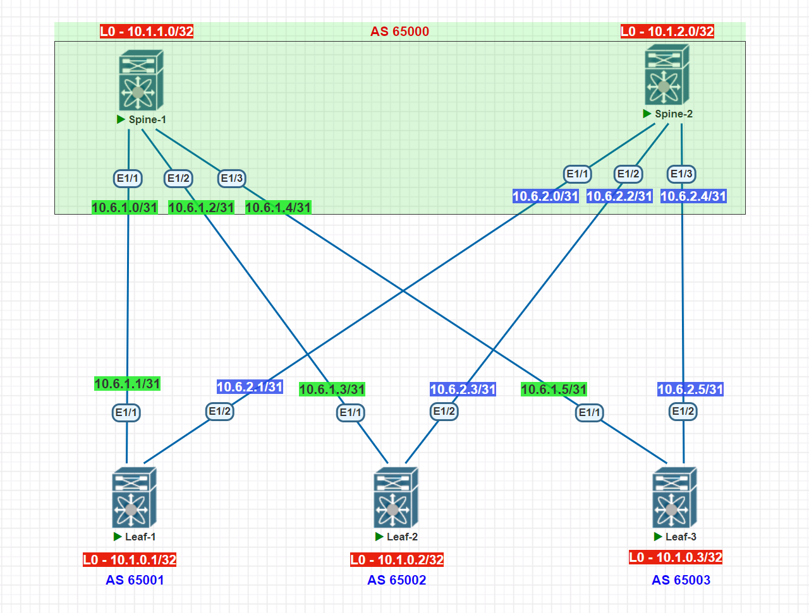

# Домашнее задание №4

## Underlay. eBGP

### Задача:

- Настроите BGP в Underlay сети, для IP связанности между всеми сетевыми устройствами. iBGP или eBGP - решать вам!
- Зафиксируете в документации - план работы, адресное пространство, схему сети, конфигурацию устройств
- Убедитесь в наличии IP связанности между устройствами в BGP домене

## Выполнение:

### Схема сети



### Конфигурация оборудования

- #### [leaf-1](config/leaf-1.conf)

```
feature bgp
feature bfd

route-map UNDERLAY_CONNECTED_TO_BGP permit 10
  set metric 100
vrf context management

interface Ethernet1/1
  description spine-1
  no switchport
  bfd interval 100 min_rx 100 multiplier 3
  ip address 10.6.1.1/31
  no shutdown

interface Ethernet1/2
  description spine-2
  no switchport
  bfd interval 100 min_rx 100 multiplier 3
  ip address 10.6.2.1/31
  no shutdown

interface loopback1
  ip address 10.1.0.1/32

router bgp 65001
  router-id 10.1.0.1
  reconnect-interval 12
  log-neighbor-changes
  address-family ipv4 unicast
    redistribute direct route-map UNDERLAY_CONNECTED_TO_BGP
    maximum-paths 10
  template peer SPINE
    bfd
    timers 3 9
    address-family ipv4 unicast
  neighbor 10.6.1.0
    inherit peer SPINE
    remote-as 65000
  neighbor 10.6.2.0
    inherit peer SPINE
    remote-as 65000

```

- #### [leaf-2](config/leaf-2.conf)

```
feature bgp
feature bfd

route-map UNDERLAY_CONNECTED_TO_BGP permit 10
  set metric 100
vrf context management

interface Ethernet1/1
  description spine-1
  no switchport
  bfd interval 100 min_rx 100 multiplier 3
  ip address 10.6.1.3/31
  no shutdown

interface Ethernet1/2
  description spine-2
  no switchport
  bfd interval 100 min_rx 100 multiplier 3
  ip address 10.6.2.3/31
  no shutdown

interface loopback1
  ip address 10.1.0.2/32

router bgp 65002
  router-id 10.1.0.2
  reconnect-interval 12
  log-neighbor-changes
  address-family ipv4 unicast
    redistribute direct route-map UNDERLAY_CONNECTED_TO_BGP
    maximum-paths 10
  template peer SPINE
    bfd
    timers 3 9
    address-family ipv4 unicast
  neighbor 10.6.1.2
    inherit peer SPINE
    remote-as 65000
  neighbor 10.6.2.2
    inherit peer SPINE
    remote-as 65000
```

- #### [leaf-3](config/leaf-3.conf)

```
feature bgp
feature bfd

route-map UNDERLAY_CONNECTED_TO_BGP permit 10
  set metric 100
vrf context management

interface Ethernet1/1
  description spine-1
  no switchport
  bfd interval 100 min_rx 100 multiplier 3
  ip address 10.6.1.5/31
  no shutdown

interface Ethernet1/2
  description spine-2
  no switchport
  bfd interval 100 min_rx 100 multiplier 3
  ip address 10.6.2.5/31
  no shutdown

interface loopback1
  ip address 10.1.0.3/32

router bgp 65003
  router-id 10.1.0.3
  reconnect-interval 12
  log-neighbor-changes
  address-family ipv4 unicast
    redistribute direct route-map UNDERLAY_CONNECTED_TO_BGP
    maximum-paths 10
  template peer SPINE
    bfd
    timers 3 9
    address-family ipv4 unicast
  neighbor 10.6.1.4
    inherit peer SPINE
    remote-as 65000
  neighbor 10.6.2.4
    inherit peer SPINE
    remote-as 65000
```

- #### [spine-1](config/spine-1.conf)

```

feature bgp
feature bfd

route-map RM_Leaves_BGP permit 10
  match as-number 65001, 65002, 65003

interface Ethernet1/1
  description leaf-1
  no switchport
  bfd interval 100 min_rx 100 multiplier 3
  ip address 10.6.1.0/31
  no shutdown

interface Ethernet1/2
  description leaf-2
  no switchport
  bfd interval 100 min_rx 100 multiplier 3
  ip address 10.6.1.2/31
  no shutdown

interface Ethernet1/3
  description leaf-3
  no switchport
  bfd interval 100 min_rx 100 multiplier 3
  ip address 10.6.1.4/31
  no shutdown

interface loopback1
  ip address 10.1.1.0/32

router bgp 65000
  router-id 10.1.1.0
  timers bgp 3 9
  reconnect-interval 12
  log-neighbor-changes
  address-family ipv4 unicast
    maximum-paths 10
  neighbor 10.6.1.0/27 remote-as route-map RM_Leaves_BGP
    bfd
    address-family ipv4 unicast
```

- #### [spine-2](config/spine-2.conf)

```
feature bgp
feature bfd

route-map RM_Leaves_BGP permit 10
  match as-number 65001, 65002, 65003

interface Ethernet1/1
  description leaf-1
  no switchport
  bfd interval 100 min_rx 100 multiplier 3
  ip address 10.6.2.0/31
  no shutdown

interface Ethernet1/2
  description leaf-2
  no switchport
  bfd interval 100 min_rx 100 multiplier 3
  ip address 10.6.2.2/31
  no shutdown

interface Ethernet1/3
  description leaf-3
  no switchport
  bfd interval 100 min_rx 100 multiplier 3
  ip address 10.6.2.4/31
  no shutdown

interface loopback1
  ip address 10.1.2.0/32

router bgp 65000
  router-id 10.1.2.0
  timers bgp 3 9
  reconnect-interval 12
  log-neighbor-changes
  address-family ipv4 unicast
    maximum-paths 10
  neighbor 10.6.2.0/27 remote-as route-map RM_Leaves_BGP
    bfd
    address-family ipv4 unicast
```

---

### Проверка связанности устройств по протоколу BGP

- #### spine-1

```
Spine-1# sh ip bgp summary
Neighbor        V    AS MsgRcvd MsgSent   TblVer  InQ OutQ Up/Down  State/PfxRcd
10.6.1.1        4 65001     483     481       13    0    0 00:23:58 3
10.6.1.3        4 65002     305     304       13    0    0 00:15:02 3
10.6.1.5        4 65003     229     227       13    0    0 00:11:08 3


Spine-1# sh ip route
10.1.0.1/32, ubest/mbest: 1/0
    *via 10.6.1.1, [20/100], 00:24:12, bgp-65000, external, tag 65001
10.1.0.2/32, ubest/mbest: 1/0
    *via 10.6.1.3, [20/100], 00:15:16, bgp-65000, external, tag 65002
10.1.0.3/32, ubest/mbest: 1/0
    *via 10.6.1.5, [20/100], 00:11:23, bgp-65000, external, tag 65003
10.1.1.0/32, ubest/mbest: 2/0, attached
    *via 10.1.1.0, Lo1, [0/0], 01:29:37, local
    *via 10.1.1.0, Lo1, [0/0], 01:29:37, direct
10.6.1.0/31, ubest/mbest: 1/0, attached
    *via 10.6.1.0, Eth1/1, [0/0], 01:30:07, direct
10.6.1.0/32, ubest/mbest: 1/0, attached
    *via 10.6.1.0, Eth1/1, [0/0], 01:30:07, local
10.6.1.2/31, ubest/mbest: 1/0, attached
    *via 10.6.1.2, Eth1/2, [0/0], 01:30:02, direct
10.6.1.2/32, ubest/mbest: 1/0, attached
    *via 10.6.1.2, Eth1/2, [0/0], 01:30:02, local
10.6.1.4/31, ubest/mbest: 1/0, attached
    *via 10.6.1.4, Eth1/3, [0/0], 01:29:59, direct
10.6.1.4/32, ubest/mbest: 1/0, attached
    *via 10.6.1.4, Eth1/3, [0/0], 01:29:59, local
10.6.2.0/31, ubest/mbest: 1/0
    *via 10.6.1.1, [20/100], 00:24:12, bgp-65000, external, tag 65001
10.6.2.2/31, ubest/mbest: 1/0
    *via 10.6.1.3, [20/100], 00:15:16, bgp-65000, external, tag 65002
10.6.2.4/31, ubest/mbest: 1/0
    *via 10.6.1.5, [20/100], 00:11:23, bgp-65000, external, tag 65003

Spine-1# ping 10.6.1.1
PING 10.6.1.1 (10.6.1.1): 56 data bytes
64 bytes from 10.6.1.1: icmp_seq=0 ttl=254 time=20.642 ms
64 bytes from 10.6.1.1: icmp_seq=1 ttl=254 time=8.059 ms
64 bytes from 10.6.1.1: icmp_seq=2 ttl=254 time=6.369 ms
64 bytes from 10.6.1.1: icmp_seq=3 ttl=254 time=8.487 ms
64 bytes from 10.6.1.1: icmp_seq=4 ttl=254 time=5.06 ms

--- 10.6.1.1 ping statistics ---
5 packets transmitted, 5 packets received, 0.00% packet loss
round-trip min/avg/max = 5.06/9.723/20.642 ms
Spine-1# ping 10.6.1.3
PING 10.6.1.3 (10.6.1.3): 56 data bytes
64 bytes from 10.6.1.3: icmp_seq=0 ttl=254 time=18.258 ms
64 bytes from 10.6.1.3: icmp_seq=1 ttl=254 time=5.617 ms
64 bytes from 10.6.1.3: icmp_seq=2 ttl=254 time=4.589 ms
64 bytes from 10.6.1.3: icmp_seq=3 ttl=254 time=4.821 ms
64 bytes from 10.6.1.3: icmp_seq=4 ttl=254 time=5.014 ms

--- 10.6.1.3 ping statistics ---
5 packets transmitted, 5 packets received, 0.00% packet loss
round-trip min/avg/max = 4.589/7.659/18.258 ms
Spine-1# ping 10.6.1.5
PING 10.6.1.5 (10.6.1.5): 56 data bytes
64 bytes from 10.6.1.5: icmp_seq=0 ttl=254 time=24.532 ms
64 bytes from 10.6.1.5: icmp_seq=1 ttl=254 time=10.842 ms
64 bytes from 10.6.1.5: icmp_seq=2 ttl=254 time=5.833 ms
64 bytes from 10.6.1.5: icmp_seq=3 ttl=254 time=3.741 ms
64 bytes from 10.6.1.5: icmp_seq=4 ttl=254 time=4.149 ms

--- 10.6.1.5 ping statistics ---
5 packets transmitted, 5 packets received, 0.00% packet loss
round-trip min/avg/max = 3.741/9.819/24.532 ms


```

- #### spine-2

```
Leaf-1#  sh ip bgp summary
Neighbor        V    AS MsgRcvd MsgSent   TblVer  InQ OutQ Up/Down  State/PfxRcd
10.6.1.0        4 65000     583     580       12    0    0 00:28:53 6
10.6.2.0        4 65000     547     544       12    0    0 00:27:03 6


Spine-2# sh ip route
10.1.0.1/32, ubest/mbest: 1/0
    *via 10.6.2.1, [20/100], 00:25:52, bgp-65000, external, tag 65001
10.1.0.2/32, ubest/mbest: 1/0
    *via 10.6.2.3, [20/100], 00:18:47, bgp-65000, external, tag 65002
10.1.0.3/32, ubest/mbest: 1/0
    *via 10.6.2.5, [20/100], 00:14:53, bgp-65000, external, tag 65003
10.1.2.0/32, ubest/mbest: 2/0, attached
    *via 10.1.2.0, Lo1, [0/0], 01:08:26, local
    *via 10.1.2.0, Lo1, [0/0], 01:08:26, direct
10.6.1.0/31, ubest/mbest: 1/0
    *via 10.6.2.1, [20/100], 00:25:52, bgp-65000, external, tag 65001
10.6.1.2/31, ubest/mbest: 1/0
    *via 10.6.2.3, [20/100], 00:18:47, bgp-65000, external, tag 65002
10.6.1.4/31, ubest/mbest: 1/0
    *via 10.6.2.5, [20/100], 00:14:53, bgp-65000, external, tag 65003
10.6.2.0/31, ubest/mbest: 1/0, attached
    *via 10.6.2.0, Eth1/1, [0/0], 01:10:47, direct
10.6.2.0/32, ubest/mbest: 1/0, attached
    *via 10.6.2.0, Eth1/1, [0/0], 01:10:47, local
10.6.2.2/31, ubest/mbest: 1/0, attached
    *via 10.6.2.2, Eth1/2, [0/0], 01:10:46, direct
10.6.2.2/32, ubest/mbest: 1/0, attached
    *via 10.6.2.2, Eth1/2, [0/0], 01:10:46, local
10.6.2.4/31, ubest/mbest: 1/0, attached
    *via 10.6.2.4, Eth1/3, [0/0], 01:10:45, direct
10.6.2.4/32, ubest/mbest: 1/0, attached
    *via 10.6.2.4, Eth1/3, [0/0], 01:10:45, local

Spine-2# ping 10.6.2.1
PING 10.6.2.1 (10.6.2.1): 56 data bytes
64 bytes from 10.6.2.1: icmp_seq=0 ttl=254 time=99.148 ms
64 bytes from 10.6.2.1: icmp_seq=1 ttl=254 time=40.701 ms
64 bytes from 10.6.2.1: icmp_seq=2 ttl=254 time=14.554 ms
64 bytes from 10.6.2.1: icmp_seq=3 ttl=254 time=13.114 ms
64 bytes from 10.6.2.1: icmp_seq=4 ttl=254 time=9.11 ms

--- 10.6.2.1 ping statistics ---
5 packets transmitted, 5 packets received, 0.00% packet loss
round-trip min/avg/max = 9.11/35.325/99.148 ms
Spine-2# ping 10.6.2.3
PING 10.6.2.3 (10.6.2.3): 56 data bytes
64 bytes from 10.6.2.3: icmp_seq=0 ttl=254 time=29.398 ms
64 bytes from 10.6.2.3: icmp_seq=1 ttl=254 time=6.689 ms
64 bytes from 10.6.2.3: icmp_seq=2 ttl=254 time=4.664 ms
64 bytes from 10.6.2.3: icmp_seq=3 ttl=254 time=8.365 ms
64 bytes from 10.6.2.3: icmp_seq=4 ttl=254 time=5.565 ms

--- 10.6.2.3 ping statistics ---
5 packets transmitted, 5 packets received, 0.00% packet loss
round-trip min/avg/max = 4.664/10.936/29.398 ms
Spine-2# ping 10.6.2.5
PING 10.6.2.5 (10.6.2.5): 56 data bytes
64 bytes from 10.6.2.5: icmp_seq=0 ttl=254 time=38.933 ms
64 bytes from 10.6.2.5: icmp_seq=1 ttl=254 time=12.014 ms
64 bytes from 10.6.2.5: icmp_seq=2 ttl=254 time=14.058 ms
64 bytes from 10.6.2.5: icmp_seq=3 ttl=254 time=8.868 ms
64 bytes from 10.6.2.5: icmp_seq=4 ttl=254 time=14.12 ms

--- 10.6.2.5 ping statistics ---
5 packets transmitted, 5 packets received, 0.00% packet loss
round-trip min/avg/max = 8.868/17.598/38.933 ms


```

- #### leaf-1

```
Leaf-1#  sh ip bgp summary
Neighbor        V    AS MsgRcvd MsgSent   TblVer  InQ OutQ Up/Down  State/PfxRcd
10.6.1.0        4 65000     583     580       12    0    0 00:28:53 6
10.6.2.0        4 65000     547     544       12    0    0 00:27:03 6


lLeaf-1# sh ip route
10.1.0.1/32, ubest/mbest: 2/0, attached
    *via 10.1.0.1, Lo1, [0/0], 00:55:54, local
    *via 10.1.0.1, Lo1, [0/0], 00:55:54, direct
10.1.0.2/32, ubest/mbest: 2/0
    *via 10.6.1.0, [20/0], 00:20:42, bgp-65001, external, tag 65000
    *via 10.6.2.0, [20/0], 00:20:43, bgp-65001, external, tag 65000
10.1.0.3/32, ubest/mbest: 2/0
    *via 10.6.1.0, [20/0], 00:16:49, bgp-65001, external, tag 65000
    *via 10.6.2.0, [20/0], 00:16:49, bgp-65001, external, tag 65000
10.6.1.0/31, ubest/mbest: 1/0, attached
    *via 10.6.1.1, Eth1/1, [0/0], 01:05:35, direct
10.6.1.1/32, ubest/mbest: 1/0, attached
    *via 10.6.1.1, Eth1/1, [0/0], 01:05:35, local
10.6.1.2/31, ubest/mbest: 2/0
    *via 10.6.1.0, [20/0], 00:20:42, bgp-65001, external, tag 65000
    *via 10.6.2.0, [20/0], 00:20:43, bgp-65001, external, tag 65000
10.6.1.4/31, ubest/mbest: 2/0
    *via 10.6.1.0, [20/0], 00:16:49, bgp-65001, external, tag 65000
    *via 10.6.2.0, [20/0], 00:16:49, bgp-65001, external, tag 65000
10.6.2.0/31, ubest/mbest: 1/0, attached
    *via 10.6.2.1, Eth1/2, [0/0], 01:05:34, direct
10.6.2.1/32, ubest/mbest: 1/0, attached
    *via 10.6.2.1, Eth1/2, [0/0], 01:05:34, local
10.6.2.2/31, ubest/mbest: 2/0
    *via 10.6.1.0, [20/0], 00:20:42, bgp-65001, external, tag 65000
    *via 10.6.2.0, [20/0], 00:20:43, bgp-65001, external, tag 65000
10.6.2.4/31, ubest/mbest: 2/0
    *via 10.6.1.0, [20/0], 00:16:49, bgp-65001, external, tag 65000
    *via 10.6.2.0, [20/0], 00:16:49, bgp-65001, external, tag 65000

Leaf-1# ping 10.6.1.0
PING 10.6.1.0 (10.6.1.0): 56 data bytes
64 bytes from 10.6.1.0: icmp_seq=0 ttl=254 time=30.073 ms
64 bytes from 10.6.1.0: icmp_seq=1 ttl=254 time=8.815 ms
64 bytes from 10.6.1.0: icmp_seq=2 ttl=254 time=7.748 ms
64 bytes from 10.6.1.0: icmp_seq=3 ttl=254 time=6.179 ms
64 bytes from 10.6.1.0: icmp_seq=4 ttl=254 time=5.088 ms

--- 10.6.1.0 ping statistics ---
5 packets transmitted, 5 packets received, 0.00% packet loss
round-trip min/avg/max = 5.088/11.58/30.073 ms
Leaf-1# ping 10.6.2.0
PING 10.6.2.0 (10.6.2.0): 56 data bytes
64 bytes from 10.6.2.0: icmp_seq=0 ttl=254 time=13.861 ms
64 bytes from 10.6.2.0: icmp_seq=1 ttl=254 time=6.425 ms
64 bytes from 10.6.2.0: icmp_seq=2 ttl=254 time=4.211 ms
64 bytes from 10.6.2.0: icmp_seq=3 ttl=254 time=4.903 ms
64 bytes from 10.6.2.0: icmp_seq=4 ttl=254 time=5.417 ms

--- 10.6.2.0 ping statistics ---
5 packets transmitted, 5 packets received, 0.00% packet loss
round-trip min/avg/max = 4.211/6.963/13.861 ms
Leaf-1#


```

- #### leaf-2

```
Leaf-2#    sh ip bgp ipv4 summary
Neighbor        V    AS MsgRcvd MsgSent   TblVer  InQ OutQ Up/Down  State/PfxRcd
10.6.1.2        4 65000     445     441       18    0    0 00:21:54 6
10.6.2.2        4 65000     445     441       18    0    0 00:21:54 6


Leaf-2# sh ip route
10.1.0.1/32, ubest/mbest: 2/0
    *via 10.6.1.2, [20/0], 00:22:06, bgp-65002, external, tag 65000
    *via 10.6.2.2, [20/0], 00:22:06, bgp-65002, external, tag 65000
10.1.0.2/32, ubest/mbest: 2/0, attached
    *via 10.1.0.2, Lo1, [0/0], 00:24:44, local
    *via 10.1.0.2, Lo1, [0/0], 00:24:44, direct
10.1.0.3/32, ubest/mbest: 2/0
    *via 10.6.1.2, [20/0], 00:18:12, bgp-65002, external, tag 65000
    *via 10.6.2.2, [20/0], 00:18:12, bgp-65002, external, tag 65000
10.6.1.0/31, ubest/mbest: 2/0
    *via 10.6.1.2, [20/0], 00:22:06, bgp-65002, external, tag 65000
    *via 10.6.2.2, [20/0], 00:22:06, bgp-65002, external, tag 65000
10.6.1.2/31, ubest/mbest: 1/0, attached
    *via 10.6.1.3, Eth1/1, [0/0], 00:26:04, direct
10.6.1.3/32, ubest/mbest: 1/0, attached
    *via 10.6.1.3, Eth1/1, [0/0], 00:26:04, local
10.6.1.4/31, ubest/mbest: 2/0
    *via 10.6.1.2, [20/0], 00:18:12, bgp-65002, external, tag 65000
    *via 10.6.2.2, [20/0], 00:18:12, bgp-65002, external, tag 65000
10.6.2.0/31, ubest/mbest: 2/0
    *via 10.6.1.2, [20/0], 00:22:06, bgp-65002, external, tag 65000
    *via 10.6.2.2, [20/0], 00:22:06, bgp-65002, external, tag 65000
10.6.2.2/31, ubest/mbest: 1/0, attached
    *via 10.6.2.3, Eth1/2, [0/0], 00:26:03, direct
10.6.2.3/32, ubest/mbest: 1/0, attached
    *via 10.6.2.3, Eth1/2, [0/0], 00:26:03, local
10.6.2.4/31, ubest/mbest: 2/0
    *via 10.6.1.2, [20/0], 00:18:12, bgp-65002, external, tag 65000
    *via 10.6.2.2, [20/0], 00:18:12, bgp-65002, external, tag 65000

Leaf-2# ping 10.6.1.2
PING 10.6.1.2 (10.6.1.2): 56 data bytes
64 bytes from 10.6.1.2: icmp_seq=0 ttl=254 time=14.834 ms
64 bytes from 10.6.1.2: icmp_seq=1 ttl=254 time=3.457 ms
64 bytes from 10.6.1.2: icmp_seq=2 ttl=254 time=3.907 ms
64 bytes from 10.6.1.2: icmp_seq=3 ttl=254 time=10.959 ms
64 bytes from 10.6.1.2: icmp_seq=4 ttl=254 time=7.094 ms

--- 10.6.1.2 ping statistics ---
5 packets transmitted, 5 packets received, 0.00% packet loss
round-trip min/avg/max = 3.457/8.05/14.834 ms
Leaf-2# ping 10.6.2.2
PING 10.6.2.2 (10.6.2.2): 56 data bytes
64 bytes from 10.6.2.2: icmp_seq=0 ttl=254 time=9.053 ms
64 bytes from 10.6.2.2: icmp_seq=1 ttl=254 time=10.575 ms
64 bytes from 10.6.2.2: icmp_seq=2 ttl=254 time=8.211 ms
64 bytes from 10.6.2.2: icmp_seq=3 ttl=254 time=5.977 ms
64 bytes from 10.6.2.2: icmp_seq=4 ttl=254 time=6.112 ms

--- 10.6.2.2 ping statistics ---
5 packets transmitted, 5 packets received, 0.00% packet loss
round-trip min/avg/max = 5.977/7.985/10.575 ms


```

- #### leaf-3

```
Leaf-3# sh ip bgp ipv4 summary
Neighbor        V    AS MsgRcvd MsgSent   TblVer  InQ OutQ Up/Down  State/PfxRcd
10.6.1.4        4 65000     389     385       12    0    0 00:19:04 6
10.6.2.4        4 65000     389     385       12    0    0 00:19:04 6


Leaf-3# sh ip route
10.1.0.1/32, ubest/mbest: 2/0
    *via 10.6.1.4, [20/0], 00:19:21, bgp-65003, external, tag 65000
    *via 10.6.2.4, [20/0], 00:19:21, bgp-65003, external, tag 65000
10.1.0.2/32, ubest/mbest: 2/0
    *via 10.6.1.4, [20/0], 00:19:21, bgp-65003, external, tag 65000
    *via 10.6.2.4, [20/0], 00:19:21, bgp-65003, external, tag 65000
10.1.0.3/32, ubest/mbest: 2/0, attached
    *via 10.1.0.3, Lo1, [0/0], 00:21:12, local
    *via 10.1.0.3, Lo1, [0/0], 00:21:12, direct
10.6.1.0/31, ubest/mbest: 2/0
    *via 10.6.1.4, [20/0], 00:19:21, bgp-65003, external, tag 65000
    *via 10.6.2.4, [20/0], 00:19:21, bgp-65003, external, tag 65000
10.6.1.2/31, ubest/mbest: 2/0
    *via 10.6.1.4, [20/0], 00:19:21, bgp-65003, external, tag 65000
    *via 10.6.2.4, [20/0], 00:19:21, bgp-65003, external, tag 65000
10.6.1.4/31, ubest/mbest: 1/0, attached
    *via 10.6.1.5, Eth1/1, [0/0], 00:21:03, direct
10.6.1.5/32, ubest/mbest: 1/0, attached
    *via 10.6.1.5, Eth1/1, [0/0], 00:21:03, local
10.6.2.0/31, ubest/mbest: 2/0
    *via 10.6.1.4, [20/0], 00:19:21, bgp-65003, external, tag 65000
    *via 10.6.2.4, [20/0], 00:19:21, bgp-65003, external, tag 65000
10.6.2.2/31, ubest/mbest: 2/0
    *via 10.6.1.4, [20/0], 00:19:21, bgp-65003, external, tag 65000
    *via 10.6.2.4, [20/0], 00:19:21, bgp-65003, external, tag 65000
10.6.2.4/31, ubest/mbest: 1/0, attached
    *via 10.6.2.5, Eth1/2, [0/0], 00:21:02, direct
10.6.2.5/32, ubest/mbest: 1/0, attached
    *via 10.6.2.5, Eth1/2, [0/0], 00:21:02, local

Leaf-3# ping 10.6.1.4
PING 10.6.1.4 (10.6.1.4): 56 data bytes
64 bytes from 10.6.1.4: icmp_seq=0 ttl=254 time=20.712 ms
64 bytes from 10.6.1.4: icmp_seq=1 ttl=254 time=7.166 ms
64 bytes from 10.6.1.4: icmp_seq=2 ttl=254 time=6.264 ms
64 bytes from 10.6.1.4: icmp_seq=3 ttl=254 time=8.374 ms
64 bytes from 10.6.1.4: icmp_seq=4 ttl=254 time=7.269 ms

--- 10.6.1.4 ping statistics ---
5 packets transmitted, 5 packets received, 0.00% packet loss
round-trip min/avg/max = 6.264/9.957/20.712 ms
Leaf-3# ping 10.6.2.4
PING 10.6.2.4 (10.6.2.4): 56 data bytes
64 bytes from 10.6.2.4: icmp_seq=0 ttl=254 time=13.935 ms
64 bytes from 10.6.2.4: icmp_seq=1 ttl=254 time=5.358 ms
64 bytes from 10.6.2.4: icmp_seq=2 ttl=254 time=8.187 ms
64 bytes from 10.6.2.4: icmp_seq=3 ttl=254 time=6.44 ms
64 bytes from 10.6.2.4: icmp_seq=4 ttl=254 time=8.18 ms

--- 10.6.2.4 ping statistics ---
5 packets transmitted, 5 packets received, 0.00% packet loss
round-trip min/avg/max = 5.358/8.42/13.935 ms


