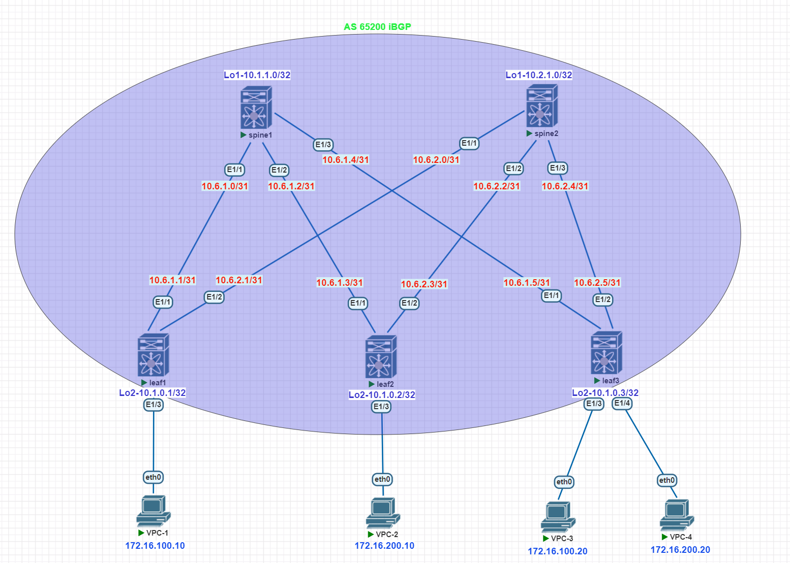

# Домашнее задание №5

## Overlay. VxLAN EVPN L2

### Задача:

  Настроить Overlay на основе VxLAN EVPN для L2 связанности между клиентами
- Настроите BGP peering между Leaf и Spine в AF l2vpn evpn
- Настроите связанность между клиентами в первой зоне и убедитесь в её наличии

  
## Выполнение:

### Схема сети



### Конфигурация оборудования

- #### [leaf-1](config/leaf-1.conf)

```
Leaf-1# sh run

cfs eth distribute
nv overlay evpn
feature ospf
feature bgp
feature fabric forwarding
feature interface-vlan
feature vn-segment-vlan-based
feature bfd
clock timezone MSK 3 0
feature nv overlay

vlan 1,100,200
vlan 100
  name Hosts
  vn-segment 100
vlan 200
  name Servers
  vn-segment 200

vrf context management

interface Vlan1

interface nve1
  no shutdown
  host-reachability protocol bgp
  source-interface loopback2
  member vni 100
    ingress-replication protocol bgp
  member vni 200
    ingress-replication protocol bgp

interface Ethernet1/1
  description to-spine-1
  no switchport
  no ip redirects
  ip address 10.6.1.1/31
  ip ospf network point-to-point
  no ip ospf passive-interface
  ip router ospf UNDERLAY area 0.0.0.30
  no shutdown

interface Ethernet1/2
  description to-spine-2
  no switchport
  no ip redirects
  ip address 10.6.2.1/31
  ip ospf network point-to-point
  no ip ospf passive-interface
  ip router ospf UNDERLAY area 0.0.0.30
  ip ospf bfd
  no shutdown

interface Ethernet1/3
  description VPC1
  switchport access vlan 100

interface mgmt0
  vrf member management

interface loopback2
  ip address 10.1.0.1/32
  ip router ospf UNDERLAY area 0.0.0.30
icam monitor scale

line console
line vty
router ospf UNDERLAY
  bfd
  router-id 10.1.0.1
router bgp 65200
  router-id 10.1.0.1
  address-family ipv4 unicast
    maximum-paths 2
  address-family l2vpn evpn
  template peer RR
    remote-as 65200
    log-neighbor-changes
    update-source loopback2
    address-family l2vpn evpn
      send-community
      send-community extended
  neighbor 10.1.1.0
    inherit peer RR
    address-family l2vpn evpn
  neighbor 10.2.1.0
    inherit peer RR
    address-family l2vpn evpn
evpn
  vni 100 l2
    rd auto
    route-target import auto
    route-target export auto
  vni 200 l2
    rd auto
    route-target import auto
    route-target export auto

```

- #### [leaf-2](config/leaf-2.conf)

```
Leaf-2# sh run

nv overlay evpn
feature ospf
feature bgp
feature fabric forwarding
feature interface-vlan
feature vn-segment-vlan-based
feature bfd
clock timezone MSK 3 0
feature nv overlay

vlan 1,100,200
vlan 100
  name Hosts
  vn-segment 100
vlan 200
  name Servers
  vn-segment 200

vrf context management

interface Vlan1

interface nve1
  no shutdown
  host-reachability protocol bgp
  source-interface loopback2
  member vni 100
    ingress-replication protocol bgp
  member vni 200
    ingress-replication protocol bgp

interface Ethernet1/1
  description to-spine-1
  no switchport
  no ip redirects
  ip address 10.6.1.3/31
  ip ospf network point-to-point
  no ip ospf passive-interface
  ip router ospf UNDERLAY area 0.0.0.30
  no shutdown

interface Ethernet1/2
  description to-spine-2
  no switchport
  no ip redirects
  ip address 10.6.2.3/31
  ip ospf network point-to-point
  no ip ospf passive-interface
  ip router ospf UNDERLAY area 0.0.0.30
  no shutdown

interface Ethernet1/3
  description VPC2
  switchport access vlan 200

interface mgmt0
  vrf member management

interface loopback2
  ip address 10.1.0.2/32
  ip router ospf UNDERLAY area 0.0.0.30
icam monitor scale

line console
line vty
router ospf UNDERLAY
  router-id 10.1.0.2
  passive-interface default
router bgp 65200
  router-id 10.1.0.2
  address-family ipv4 unicast
    maximum-paths 2
  address-family l2vpn evpn
  template peer RR
    remote-as 65200
    log-neighbor-changes
    update-source loopback2
    address-family l2vpn evpn
      send-community
      send-community extended
  neighbor 10.1.1.0
    inherit peer RR
    address-family l2vpn evpn
  neighbor 10.2.1.0
    inherit peer RR
    address-family l2vpn evpn
evpn
  vni 100 l2
    rd auto
    route-target import auto
    route-target export auto
  vni 200 l2
    rd auto
    route-target import auto
    route-target export auto

```

- #### [leaf-3](config/leaf-3.conf)

```
Leaf-3# sh run

nv overlay evpn
feature ospf
feature bgp
feature fabric forwarding
feature interface-vlan
feature vn-segment-vlan-based
feature bfd
clock timezone MSK 3 0
feature nv overlay

vlan 1,100,200
vlan 100
  name Hosts
  vn-segment 100
vlan 200
  name Servers
  vn-segment 200

vrf context management

interface Vlan1

interface nve1
  no shutdown
  host-reachability protocol bgp
  source-interface loopback2
  member vni 100
    ingress-replication protocol bgp
  member vni 200
    ingress-replication protocol bgp

interface Ethernet1/1
  description to-spine-1
  no switchport
  no ip redirects
  ip address 10.6.1.5/31
  ip ospf network point-to-point
  no ip ospf passive-interface
  ip router ospf UNDERLAY area 0.0.0.30
  no shutdown

interface Ethernet1/2
  description to-spine-2
  no switchport
  no ip redirects
  ip address 10.6.2.5/31
  ip ospf network point-to-point
  no ip ospf passive-interface
  ip router ospf UNDERLAY area 0.0.0.30
  no shutdown

interface Ethernet1/3
  description VPC3
  switchport access vlan 100

interface Ethernet1/4
  description VPC4
  switchport access vlan 200

interface mgmt0
  vrf member management

interface loopback2
  ip address 10.1.0.3/32
  ip router ospf UNDERLAY area 0.0.0.30
icam monitor scale

line console
line vty
router ospf UNDERLAY
  bfd
  router-id 10.1.0.3
  passive-interface default
router bgp 65200
  router-id 10.1.0.3
  address-family ipv4 unicast
    maximum-paths 2
  address-family l2vpn evpn
  template peer RR
     remote-as 65200
    log-neighbor-changes
    update-source loopback2
    address-family l2vpn evpn
      send-community
      send-community extended
  neighbor 10.1.1.0
    inherit peer RR
    address-family l2vpn evpn
  neighbor 10.2.1.0
    inherit peer RR
    address-family l2vpn evpn
evpn
  vni 100 l2
    rd auto
    route-target import auto
    route-target export auto
  vni 200 l2
    rd auto
    route-target import auto
    route-target export auto


```

- #### [spine-1](config/spine-1.conf)

```
Spine-1# sh run

cfs eth distribute
nv overlay evpn
feature ospf
feature bgp
feature fabric forwarding
feature interface-vlan
feature vn-segment-vlan-based
feature bfd
clock timezone MSK 3 0
feature nv overlay

vlan 1

vrf context management

interface Vlan1

interface Ethernet1/1
  description to-leaf-1
  no switchport
  no ip redirects
  ip address 10.6.1.0/31
  ip ospf network point-to-point
  no ip ospf passive-interface
  ip router ospf UNDERLAY area 0.0.0.30
  ip ospf bfd
  no shutdown

interface Ethernet1/2
  description to-leaf-2
  no switchport
  no ip redirects
  ip address 10.6.1.2/31
  ip ospf network point-to-point
  no ip ospf passive-interface
  ip router ospf UNDERLAY area 0.0.0.30
  no shutdown

interface Ethernet1/3
  description to-leaf-3
  no switchport
  no ip redirects
  ip address 10.6.1.4/31
  ip ospf network point-to-point
  no ip ospf passive-interface
  ip router ospf UNDERLAY area 0.0.0.30
  no shutdown

interface mgmt0
  vrf member management

interface loopback1
  ip address 10.1.1.0/32
  ip router ospf UNDERLAY area 0.0.0.30
icam monitor scale

line console
line vty
router ospf UNDERLAY
  bfd
  router-id 10.1.1.0
router bgp 65200
  router-id 10.1.1.0
  address-family l2vpn evpn
    maximum-paths 10
  template peer RR
    remote-as 65200
    update-source loopback1
    address-family l2vpn evpn
      send-community extended
  template peer RRC
    remote-as 65200
    log-neighbor-changes
    update-source loopback1
    address-family l2vpn evpn
      send-community extended
      route-reflector-client
  neighbor 10.1.0.1
    inherit peer RRC
  neighbor 10.1.0.2
    inherit peer RRC
  neighbor 10.1.0.3
    inherit peer RRC
  neighbor 10.2.1.0
    inherit peer RR


```

- #### [spine-2](config/spine-2.conf)

```
Spine-2# sh run

nv overlay evpn
feature ospf
feature bgp
feature fabric forwarding
feature interface-vlan
feature vn-segment-vlan-based
feature bfd
clock timezone MSK 3 0
feature nv overlay

vlan 1

vrf context management

interface Vlan1

interface Ethernet1/1
  description to-leaf-1
  no switchport
  no ip redirects
  ip address 10.6.2.0/31
  ip ospf network point-to-point
  no ip ospf passive-interface
  ip router ospf UNDERLAY area 0.0.0.30
  no shutdown

interface Ethernet1/2
  description to-leaf-2
  no switchport
  no ip redirects
  ip address 10.6.2.2/31
  ip ospf network point-to-point
  no ip ospf passive-interface
  ip router ospf UNDERLAY area 0.0.0.30
  no shutdown

interface Ethernet1/3
  description to-leaf-3
  no switchport
  no ip redirects
  ip address 10.6.2.4/31
  ip ospf network point-to-point
  no ip ospf passive-interface
  ip router ospf UNDERLAY area 0.0.0.30
  no shutdown

interface mgmt0
  vrf member management

interface loopback1
  ip address 10.2.1.0/32
  ip router ospf UNDERLAY area 0.0.0.30
icam monitor scale

line console
line vty
router ospf UNDERLAY
  bfd
  router-id 10.2.1.0
router bgp 65200
  router-id 10.2.1.0
  address-family l2vpn evpn
    maximum-paths 10
  template peer RR
    remote-as 65200
    update-source loopback1
    address-family l2vpn evpn
      send-community extended
  template peer RRC
    remote-as 65200
    log-neighbor-changes
    update-source loopback1
    address-family l2vpn evpn
      send-community extended
      route-reflector-client
  neighbor 10.1.0.1
    inherit peer RRC
  neighbor 10.1.0.2
    inherit peer RRC
  neighbor 10.1.0.3
    inherit peer RRC
  neighbor 10.1.1.0
    inherit peer RR


```

- #### Проверка связанности Spine-1

```


Spine-1# show bgp l2vpn evpn summary
Neighbor        V    AS MsgRcvd MsgSent   TblVer  InQ OutQ Up/Down  State/PfxRcd
10.1.0.1        4 65200     417     405      297    0    0 00:57:49 2
10.1.0.2        4 65200      81      76      297    0    0 00:57:36 3
10.1.0.3        4 65200      89      78      297    0    0 00:56:31 3
10.2.1.0        4 65200     162      85      297    0    0 00:13:39 8


```

- #### Проверка связанности Spine-2

```


Spine-2# show bgp l2vpn evpn summary
Neighbor        V    AS MsgRcvd MsgSent   TblVer  InQ OutQ Up/Down  State/PfxRcd
10.1.0.1        4 65200      78      80      249    0    0 00:58:05 2
10.1.0.2        4 65200      81      78      249    0    0 00:58:04 3
10.1.0.3        4 65200      89      79      249    0    0 00:56:44 3
10.1.1.0        4 65200     155      86      249    0    0 00:13:57 8


```

- #### Проверка связанности Leaf-1

```

Leaf-1# sh bgp l2vpn evpn
   Network            Next Hop            Metric     LocPrf     Weight Path
Route Distinguisher: 10.1.0.1:32867    (L2VNI 100)
*>l[3]:[0]:[32]:[10.1.0.1]/88
                      10.1.0.1                          100      32768 i
*>i[3]:[0]:[32]:[10.1.0.2]/88
                      10.1.0.2                          100          0 i
*>i[3]:[0]:[32]:[10.1.0.3]/88
                      10.1.0.3                          100          0 i

Route Distinguisher: 10.1.0.1:32967    (L2VNI 200)
*>i[2]:[0]:[0]:[48]:[0050.7966.6813]:[0]:[0.0.0.0]/216
                      10.1.0.2                          100          0 i
*>i[2]:[0]:[0]:[48]:[0050.7966.6815]:[0]:[0.0.0.0]/216
                      10.1.0.3                          100          0 i
*>l[3]:[0]:[32]:[10.1.0.1]/88
                      10.1.0.1                          100      32768 i
*>i[3]:[0]:[32]:[10.1.0.2]/88
                      10.1.0.2                          100          0 i
*>i[3]:[0]:[32]:[10.1.0.3]/88
                      10.1.0.3                          100          0 i

Route Distinguisher: 10.1.0.2:32867
*>i[3]:[0]:[32]:[10.1.0.2]/88
                      10.1.0.2                          100          0 i
* i                   10.1.0.2                          100          0 i

Route Distinguisher: 10.1.0.2:32967
*>i[2]:[0]:[0]:[48]:[0050.7966.6813]:[0]:[0.0.0.0]/216
                      10.1.0.2                          100          0 i
* i                   10.1.0.2                          100          0 i
*>i[3]:[0]:[32]:[10.1.0.2]/88
                      10.1.0.2                          100          0 i
* i                   10.1.0.2                          100          0 i

Route Distinguisher: 10.1.0.3:32867
* i[3]:[0]:[32]:[10.1.0.3]/88
                      10.1.0.3                          100          0 i
*>i                   10.1.0.3                          100          0 i

Route Distinguisher: 10.1.0.3:32967
*>i[2]:[0]:[0]:[48]:[0050.7966.6815]:[0]:[0.0.0.0]/216
                      10.1.0.3                          100          0 i
* i                   10.1.0.3                          100          0 i
* i[3]:[0]:[32]:[10.1.0.3]/88
                      10.1.0.3                          100          0 i
*>i                   10.1.0.3                          100          0 i


Leaf-1# show nve vni
Interface VNI      Multicast-group   State Mode Type [BD/VRF]      Flags
--------- -------- ----------------- ----- ---- ------------------ -----
nve1      100      UnicastBGP        Up    CP   L2 [100]
nve1      200      UnicastBGP        Up    CP   L2 [200]


Leaf-1# show nve interface
Interface: nve1, State: Up, encapsulation: VXLAN
 VPC Capability: VPC-VIP-Only [not-notified]
 Local Router MAC: 5000.0e00.1b08
 Host Learning Mode: Control-Plane
 Source-Interface: loopback2 (primary: 10.1.0.1, secondary: 0.0.0.0)


```


```


```

- #### Проверка связанности Leaf-2

```
Leaf-2# sh bgp l2vpn evpn
   Network            Next Hop            Metric     LocPrf     Weight Path
Route Distinguisher: 10.1.0.1:32867
*>i[3]:[0]:[32]:[10.1.0.1]/88
                      10.1.0.1                          100          0 i
* i                   10.1.0.1                          100          0 i

Route Distinguisher: 10.1.0.1:32967
*>i[3]:[0]:[32]:[10.1.0.1]/88
                      10.1.0.1                          100          0 i
* i                   10.1.0.1                          100          0 i

Route Distinguisher: 10.1.0.2:32867    (L2VNI 100)
*>i[3]:[0]:[32]:[10.1.0.1]/88
                      10.1.0.1                          100          0 i
*>l[3]:[0]:[32]:[10.1.0.2]/88
                      10.1.0.2                          100      32768 i
*>i[3]:[0]:[32]:[10.1.0.3]/88
                      10.1.0.3                          100          0 i

Route Distinguisher: 10.1.0.2:32967    (L2VNI 200)
*>l[2]:[0]:[0]:[48]:[0050.7966.6813]:[0]:[0.0.0.0]/216
                      10.1.0.2                          100      32768 i
*>i[2]:[0]:[0]:[48]:[0050.7966.6815]:[0]:[0.0.0.0]/216
                      10.1.0.3                          100          0 i
*>i[3]:[0]:[32]:[10.1.0.1]/88
                      10.1.0.1                          100          0 i
*>l[3]:[0]:[32]:[10.1.0.2]/88
                      10.1.0.2                          100      32768 i
*>i[3]:[0]:[32]:[10.1.0.3]/88
                      10.1.0.3                          100          0 i

Route Distinguisher: 10.1.0.3:32867
*>i[3]:[0]:[32]:[10.1.0.3]/88
                      10.1.0.3                          100          0 i
* i                   10.1.0.3                          100          0 i

Route Distinguisher: 10.1.0.3:32967
*>i[2]:[0]:[0]:[48]:[0050.7966.6815]:[0]:[0.0.0.0]/216
                      10.1.0.3                          100          0 i
* i                   10.1.0.3                          100          0 i
*>i[3]:[0]:[32]:[10.1.0.3]/88
                      10.1.0.3                          100          0 i
* i                   10.1.0.3                          100          0 i

Leaf-2# show nve vni

Interface VNI      Multicast-group   State Mode Type [BD/VRF]      Flags
--------- -------- ----------------- ----- ---- ------------------ -----
nve1      100      UnicastBGP        Up    CP   L2 [100]
nve1      200      UnicastBGP        Up    CP   L2 [200]


Leaf-2# show nve interface
Interface: nve1, State: Up, encapsulation: VXLAN
 VPC Capability: VPC-VIP-Only [not-notified]
 Local Router MAC: 5000.1100.1b08
 Host Learning Mode: Control-Plane
 Source-Interface: loopback2 (primary: 10.1.0.2, secondary: 0.0.0.0)


```


- #### Проверка связанности Leaf-3

```

Leaf-3# sh bgp l2vpn evpn
   Network            Next Hop            Metric     LocPrf     Weight Path
Route Distinguisher: 10.1.0.1:32867
* i[3]:[0]:[32]:[10.1.0.1]/88
                      10.1.0.1                          100          0 i
*>i                   10.1.0.1                          100          0 i

Route Distinguisher: 10.1.0.1:32967
* i[3]:[0]:[32]:[10.1.0.1]/88
                      10.1.0.1                          100          0 i
*>i                   10.1.0.1                          100          0 i

Route Distinguisher: 10.1.0.2:32867
* i[3]:[0]:[32]:[10.1.0.2]/88
                      10.1.0.2                          100          0 i
*>i                   10.1.0.2                          100          0 i

Route Distinguisher: 10.1.0.2:32967
*>i[2]:[0]:[0]:[48]:[0050.7966.6813]:[0]:[0.0.0.0]/216
                      10.1.0.2                          100          0 i
* i                   10.1.0.2                          100          0 i
* i[3]:[0]:[32]:[10.1.0.2]/88
                      10.1.0.2                          100          0 i
*>i                   10.1.0.2                          100          0 i

Route Distinguisher: 10.1.0.3:32867    (L2VNI 100)
*>i[3]:[0]:[32]:[10.1.0.1]/88
                      10.1.0.1                          100          0 i
*>i[3]:[0]:[32]:[10.1.0.2]/88
                      10.1.0.2                          100          0 i
*>l[3]:[0]:[32]:[10.1.0.3]/88
                      10.1.0.3                          100      32768 i

Route Distinguisher: 10.1.0.3:32967    (L2VNI 200)
*>i[2]:[0]:[0]:[48]:[0050.7966.6813]:[0]:[0.0.0.0]/216
                      10.1.0.2                          100          0 i
*>l[2]:[0]:[0]:[48]:[0050.7966.6815]:[0]:[0.0.0.0]/216
                      10.1.0.3                          100      32768 i
*>i[3]:[0]:[32]:[10.1.0.1]/88
                      10.1.0.1                          100          0 i
*>i[3]:[0]:[32]:[10.1.0.2]/88
                      10.1.0.2                          100          0 i
*>l[3]:[0]:[32]:[10.1.0.3]/88
                      10.1.0.3                          100      32768 i

Leaf-3# show nve vni
Interface VNI      Multicast-group   State Mode Type [BD/VRF]      Flags
--------- -------- ----------------- ----- ---- ------------------ -----
nve1      100      UnicastBGP        Up    CP   L2 [100]
nve1      200      UnicastBGP        Up    CP   L2 [200]

Leaf-3# show nve interface
Interface: nve1, State: Up, encapsulation: VXLAN
 VPC Capability: VPC-VIP-Only [not-notified]
 Local Router MAC: 5000.1000.1b08
 Host Learning Mode: Control-Plane
 Source-Interface: loopback2 (primary: 10.1.0.3, secondary: 0.0.0.0)


```
- #### Проверка связанности хостов

```
?
```
```


