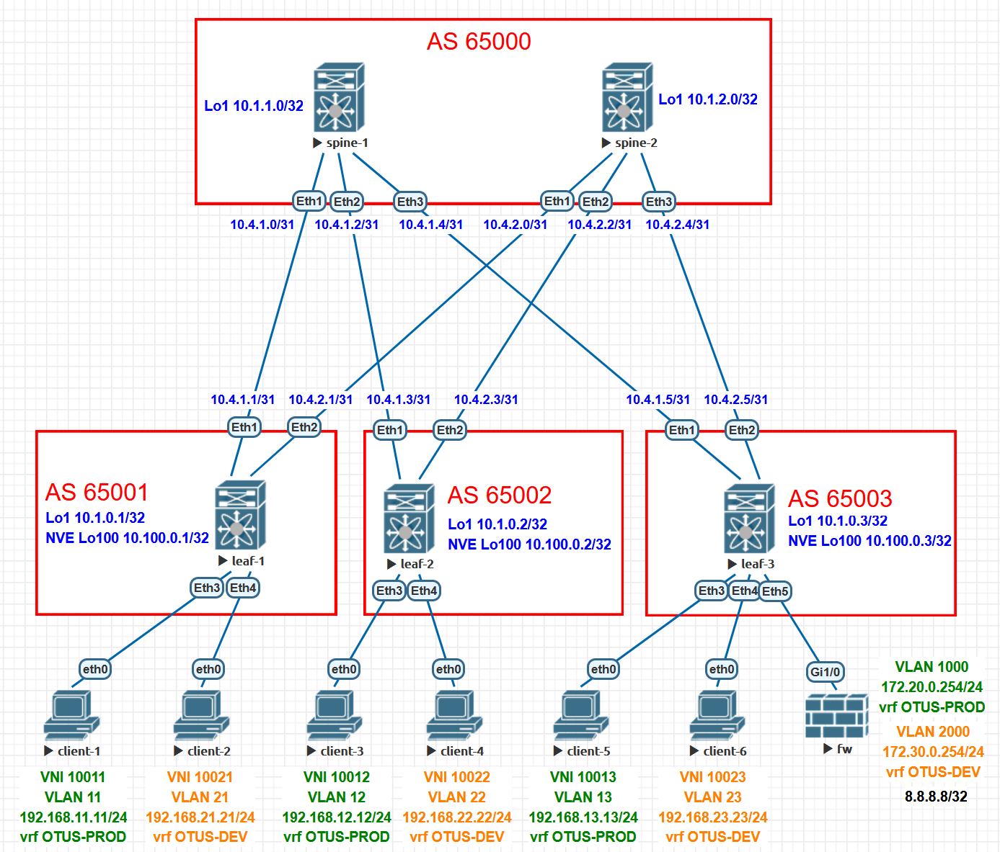

# Домашнее задание №6

## Overlay. VxLAN EVPN L3

### Задача:

- Настроить клиентов в разных VNI
- Настроить маршрутизацию между клиентами 
- Проверить связанность между клиентами

## Выполнение:

### Схема сети



### Конфигурация оборудования

- #### [leaf-1](config/leaf-1.conf)

```
vrf instance OTUS-DEV
vrf instance OTUS-PROD

interface Ethernet3
   description to-client-1
   switchport access vlan 11

interface Ethernet4
   description to-client-2
   switchport access vlan 21

interface Vlan11
   vrf OTUS-PROD
   ip address 192.168.11.1/24
   ip virtual-router address 192.168.11.254

interface Vlan21
   vrf OTUS-DEV
   ip address 192.168.21.1/24
   ip virtual-router address 192.168.21.254

interface Vxlan1

   vxlan vlan 11 vni 10011
   vxlan vlan 21 vni 10021
   vxlan vrf OTUS-DEV vni 10002
   vxlan vrf OTUS-PROD vni 10001

ip virtual-router mac-address 00:00:00:00:00:01

ip routing vrf OTUS-DEV
ip routing vrf OTUS-PROD

router bgp 65001

   vlan 11
      rd 65001:10011
      route-target both 11:10011
      redistribute learned
   
   vlan 21
      rd 65001:10021
      route-target both 21:10021
      redistribute learned
   
   vrf OTUS-DEV
      rd 65001:10002
      route-target import evpn 10002:10002
      route-target export evpn 10002:10002
      redistribute connected
   
   vrf OTUS-PROD
      rd 65001:10001
      route-target import evpn 10001:10001
      route-target export evpn 10001:10001
      redistribute connected
```

- #### [leaf-2](config/leaf-2.conf)

```
vrf instance OTUS-DEV
vrf instance OTUS-PROD

interface Ethernet3
   description to-client-3
   switchport access vlan 12

interface Ethernet4
   description to-client-4
   switchport access vlan 22
   
interface Vlan12
   vrf OTUS-PROD
   ip address 192.168.12.1/24
   ip virtual-router address 192.168.12.254
!
interface Vlan22
   vrf OTUS-DEV
   ip address 192.168.22.1/24
   ip virtual-router address 192.168.22.254
   
interface Vxlan1

   vxlan vlan 12 vni 10012
   vxlan vlan 22 vni 10022
   vxlan vrf OTUS-DEV vni 10002
   vxlan vrf OTUS-PROD vni 10001

ip virtual-router mac-address 00:00:00:00:00:02

ip routing vrf OTUS-DEV
ip routing vrf OTUS-PROD

router bgp 65002

   vlan 12
      rd 65002:10012
      route-target both 12:10012
      redistribute learned
   
   vlan 22
      rd 65002:10022
      route-target both 22:10022
      redistribute learned

   vrf OTUS-DEV
      rd 65002:10002
      route-target import evpn 10002:10002
      route-target export evpn 10002:10002
      redistribute connected
   
   vrf OTUS-PROD
      rd 65002:10001
      route-target import evpn 10001:10001
      route-target export evpn 10001:10001
      redistribute connected

```

- #### [leaf-3](config/leaf-3.conf)

```
vrf instance OTUS-DEV
vrf instance OTUS-PROD

interface Ethernet3
   description to-clien-5
   switchport access vlan 13

interface Ethernet4
   description to-clien-6
   switchport access vlan 23
   
interface Ethernet5
   switchport trunk allowed vlan 1000,2000
   switchport mode trunk

interface Vlan13
   vrf OTUS-PROD
   ip address 192.168.13.3/24
   ip virtual-router address 192.168.13.254

interface Vlan23
   vrf OTUS-DEV
   ip address 192.168.23.3/24
   ip virtual-router address 192.168.23.254

interface Vlan1000
   description to_fw
   vrf OTUS-PROD
   ip address 172.20.0.3/24

interface Vlan2000
   description to_fw
   vrf OTUS-DEV
   ip address 172.30.0.3/24

interface Vxlan1

   vxlan vlan 13 vni 10013
   vxlan vlan 23 vni 10023
   vxlan vrf OTUS-DEV vni 10002
   vxlan vrf OTUS-PROD vni 10001

ip virtual-router mac-address 00:00:00:00:00:03

ip routing vrf OTUS-DEV
ip routing vrf OTUS-PROD

router bgp 65003

   vlan 13
      rd 65003:10013
      route-target both 13:10013
	  redistribute learned				  
   
   vlan 23
      rd 65003:10023
      route-target both 23:10023
      redistribute learned
   
   vrf OTUS-DEV
      rd 65003:10002
      route-target import evpn 10002:10002
      route-target export evpn 10002:10002
      neighbor 172.30.0.254 remote-as 64999
      redistribute connected
      
      address-family ipv4
         neighbor 172.30.0.254 activate
   
   vrf OTUS-PROD
      rd 65003:10001
      route-target import evpn 10001:10001
      route-target export evpn 10001:10001
      neighbor 172.20.0.254 remote-as 64999
      redistribute connected
      
      address-family ipv4
         neighbor 172.20.0.254 activate
```

- #### [spine-1](config/spine-1.conf)

```
peer-filter EVPN
   10 match as-range 65001-65003 result accept
!
peer-filter LEAF
   10 match as-range 65001-65003 result accept
!
router bgp 65000
   router-id 10.1.1.0
   timers bgp 3 9
   maximum-paths 2 ecmp 2
   bgp listen range 10.1.0.0/24 peer-group EVPN peer-filter EVPN
   bgp listen range 10.4.1.0/24 peer-group LEAF peer-filter LEAF
   neighbor EVPN peer group
   neighbor EVPN next-hop-unchanged
   neighbor EVPN update-source Loopback1
   neighbor EVPN ebgp-multihop 3
   neighbor EVPN send-community extended
   neighbor LEAF peer group
   neighbor LEAF bfd
   neighbor LEAF rib-in pre-policy retain all
   neighbor LEAF password 7 7zCpOlU0aME=
   neighbor LEAF send-community
   neighbor LEAF maximum-routes 1000
   redistribute connected route-map RM_CONN
   !
   address-family evpn
      neighbor EVPN activate
   !
   address-family ipv4
      neighbor LEAF activate
```

- #### [spine-2](config/spine-2.conf)

```
peer-filter EVPN
   10 match as-range 65001-65003 result accept
!
peer-filter LEAF
   10 match as-range 65001-65003 result accept
!
router bgp 65000
   router-id 10.1.2.0
   timers bgp 3 9
   maximum-paths 2 ecmp 2
   bgp listen range 10.1.0.0/24 peer-group EVPN peer-filter EVPN
   bgp listen range 10.4.2.0/24 peer-group LEAF peer-filter LEAF
   neighbor EVPN peer group
   neighbor EVPN next-hop-unchanged
   neighbor EVPN update-source Loopback1
   neighbor EVPN ebgp-multihop 3
   neighbor EVPN send-community extended
   neighbor LEAF peer group
   neighbor LEAF bfd
   neighbor LEAF rib-in pre-policy retain all
   neighbor LEAF password 7 7zCpOlU0aME=
   neighbor LEAF send-community
   neighbor LEAF maximum-routes 1000
   redistribute connected route-map RM_CONN
   !
   address-family evpn
      neighbor EVPN activate
   !
   address-family ipv4
      neighbor LEAF activate
```
---

### Проверка связанности клиентов по L3

- #### leaf-1

```
leaf-1#sh ip route vrf OTUS-DEV

 B E      0.0.0.0/0 [200/0] via VTEP 10.100.0.3 VNI 10002 router-mac 50:00:00:c3:da:3f local-interface Vxlan1

 B E      8.8.8.8/32 [200/0] via VTEP 10.100.0.3 VNI 10002 router-mac 50:00:00:c3:da:3f local-interface Vxlan1
 B E      172.20.0.0/24 [200/0] via VTEP 10.100.0.3 VNI 10002 router-mac 50:00:00:c3:da:3f local-interface Vxlan1
 B E      172.30.0.0/24 [200/0] via VTEP 10.100.0.3 VNI 10002 router-mac 50:00:00:c3:da:3f local-interface Vxlan1
 C        192.168.21.0/24 is directly connected, Vlan21
 B E      192.168.22.22/32 [200/0] via VTEP 10.100.0.2 VNI 10002 router-mac 50:00:00:5b:6f:f5 local-interface Vxlan1
 B E      192.168.22.0/24 [200/0] via VTEP 10.100.0.2 VNI 10002 router-mac 50:00:00:5b:6f:f5 local-interface Vxlan1
 B E      192.168.23.0/24 [200/0] via VTEP 10.100.0.3 VNI 10002 router-mac 50:00:00:c3:da:3f local-interface Vxlan1
```
```
leaf-1#sh ip route vrf OTUS-PROD
 
 B E      0.0.0.0/0 [200/0] via VTEP 10.100.0.3 VNI 10001 router-mac 50:00:00:c3:da:3f local-interface Vxlan1

 B E      8.8.8.8/32 [200/0] via VTEP 10.100.0.3 VNI 10001 router-mac 50:00:00:c3:da:3f local-interface Vxlan1
 B E      172.20.0.0/24 [200/0] via VTEP 10.100.0.3 VNI 10001 router-mac 50:00:00:c3:da:3f local-interface Vxlan1
 B E      172.30.0.0/24 [200/0] via VTEP 10.100.0.3 VNI 10001 router-mac 50:00:00:c3:da:3f local-interface Vxlan1
 C        192.168.11.0/24 is directly connected, Vlan11
 B E      192.168.12.0/24 [200/0] via VTEP 10.100.0.2 VNI 10001 router-mac 50:00:00:5b:6f:f5 local-interface Vxlan1
 B E      192.168.13.0/24 [200/0] via VTEP 10.100.0.3 VNI 10001 router-mac 50:00:00:c3:da:3f local-interface Vxlan1
```
```
leaf-1#show bgp evpn route-type ip-prefix ipv4
BGP routing table information for VRF default
Router identifier 10.1.0.1, local AS number 65001
Route status codes: s - suppressed, * - valid, > - active, E - ECMP head, e - ECMP
                    S - Stale, c - Contributing to ECMP, b - backup
                    % - Pending BGP convergence
Origin codes: i - IGP, e - EGP, ? - incomplete
AS Path Attributes: Or-ID - Originator ID, C-LST - Cluster List, LL Nexthop - Link Local Nexthop

          Network                Next Hop              Metric  LocPref Weight  Path
 * >Ec   RD: 65003:10001 ip-prefix 0.0.0.0/0
                                 10.100.0.3            -       100     0       65000 65003 64999 ?
 *  ec   RD: 65003:10001 ip-prefix 0.0.0.0/0
                                 10.100.0.3            -       100     0       65000 65003 64999 ?
 * >Ec   RD: 65003:10002 ip-prefix 0.0.0.0/0
                                 10.100.0.3            -       100     0       65000 65003 64999 ?
 *  ec   RD: 65003:10002 ip-prefix 0.0.0.0/0
                                 10.100.0.3            -       100     0       65000 65003 64999 ?
 * >Ec   RD: 65003:10001 ip-prefix 8.8.8.8/32
                                 10.100.0.3            -       100     0       65000 65003 64999 i
 *  ec   RD: 65003:10001 ip-prefix 8.8.8.8/32
                                 10.100.0.3            -       100     0       65000 65003 64999 i
 * >Ec   RD: 65003:10002 ip-prefix 8.8.8.8/32
                                 10.100.0.3            -       100     0       65000 65003 64999 i
 *  ec   RD: 65003:10002 ip-prefix 8.8.8.8/32
                                 10.100.0.3            -       100     0       65000 65003 64999 i
 * >Ec   RD: 65003:10001 ip-prefix 172.20.0.0/24
                                 10.100.0.3            -       100     0       65000 65003 i
 *  ec   RD: 65003:10001 ip-prefix 172.20.0.0/24
                                 10.100.0.3            -       100     0       65000 65003 i
 * >Ec   RD: 65003:10002 ip-prefix 172.20.0.0/24
                                 10.100.0.3            -       100     0       65000 65003 64999 ?
 *  ec   RD: 65003:10002 ip-prefix 172.20.0.0/24
                                 10.100.0.3            -       100     0       65000 65003 64999 ?
 * >Ec   RD: 65003:10001 ip-prefix 172.30.0.0/24
                                 10.100.0.3            -       100     0       65000 65003 64999 ?
 *  ec   RD: 65003:10001 ip-prefix 172.30.0.0/24
                                 10.100.0.3            -       100     0       65000 65003 64999 ?
 * >Ec   RD: 65003:10002 ip-prefix 172.30.0.0/24
                                 10.100.0.3            -       100     0       65000 65003 i
 *  ec   RD: 65003:10002 ip-prefix 172.30.0.0/24
                                 10.100.0.3            -       100     0       65000 65003 i
 * >     RD: 65001:10001 ip-prefix 192.168.11.0/24
                                 -                     -       -       0       i
 * >Ec   RD: 65002:10001 ip-prefix 192.168.12.0/24
                                 10.100.0.2            -       100     0       65000 65002 i
 *  ec   RD: 65002:10001 ip-prefix 192.168.12.0/24
                                 10.100.0.2            -       100     0       65000 65002 i
 * >Ec   RD: 65003:10001 ip-prefix 192.168.13.0/24
                                 10.100.0.3            -       100     0       65000 65003 i
 *  ec   RD: 65003:10001 ip-prefix 192.168.13.0/24
                                 10.100.0.3            -       100     0       65000 65003 i
 * >     RD: 65001:10002 ip-prefix 192.168.21.0/24
                                 -                     -       -       0       i
 * >Ec   RD: 65002:10002 ip-prefix 192.168.22.0/24
                                 10.100.0.2            -       100     0       65000 65002 i
 *  ec   RD: 65002:10002 ip-prefix 192.168.22.0/24
                                 10.100.0.2            -       100     0       65000 65002 i
 * >Ec   RD: 65003:10002 ip-prefix 192.168.23.0/24
                                 10.100.0.3            -       100     0       65000 65003 i
 *  ec   RD: 65003:10002 ip-prefix 192.168.23.0/24
                                 10.100.0.3            -       100     0       65000 65003 i
```
```
leaf-1#show vxlan address-table
          Vxlan Mac Address Table
----------------------------------------------------------------------

VLAN  Mac Address     Type      Prt  VTEP             Moves   Last Move
----  -----------     ----      ---  ----             -----   ---------
4093  5000.005b.6ff5  EVPN      Vx1  10.100.0.2       1       0:33:33 ago
4093  5000.00c3.da3f  EVPN      Vx1  10.100.0.3       1       0:33:33 ago
4094  5000.005b.6ff5  EVPN      Vx1  10.100.0.2       1       0:33:33 ago
4094  5000.00c3.da3f  EVPN      Vx1  10.100.0.3       1       0:33:33 ago
Total Remote Mac Addresses for this criterion: 4
```
```
leaf-1#sh interfaces vxlan 1
Vxlan1 is up, line protocol is up (connected)
  Hardware is Vxlan
  Source interface is Loopback100 and is active with 10.100.0.1
  Replication/Flood Mode is headend with Flood List Source: EVPN
  Remote MAC learning via EVPN
  VNI mapping to VLANs
  Static VLAN to VNI mapping is
    [11, 10011]       [21, 10021]
  Dynamic VLAN to VNI mapping for 'evpn' is
    [4093, 10001]     [4094, 10002]
  Note: All Dynamic VLANs used by VCS are internal VLANs.
        Use 'show vxlan vni' for details.
  Static VRF to VNI mapping is
   [OTUS-DEV, 10002]
   [OTUS-PROD, 10001]
  Shared Router MAC is 0000.0000.0000
```
```  
leaf-1#show vxlan vni
VNI to VLAN Mapping for Vxlan1
VNI         VLAN       Source       Interface       802.1Q Tag
----------- ---------- ------------ --------------- ----------
10011       11         static       Ethernet3       untagged
                                    Vxlan1          11
10021       21         static       Ethernet4       untagged
                                    Vxlan1          21

VNI to dynamic VLAN Mapping for Vxlan1
VNI         VLAN       VRF             Source
----------- ---------- --------------- ------------
10001       4093       OTUS-PROD       evpn
10002       4094       OTUS-DEV        evpn
```

- #### leaf-2

```
leaf-2#sh ip route vrf OTUS-DEV

 B E      0.0.0.0/0 [200/0] via VTEP 10.100.0.3 VNI 10002 router-mac 50:00:00:c3:da:3f local-interface Vxlan1

 B E      8.8.8.8/32 [200/0] via VTEP 10.100.0.3 VNI 10002 router-mac 50:00:00:c3:da:3f local-interface Vxlan1
 B E      172.20.0.0/24 [200/0] via VTEP 10.100.0.3 VNI 10002 router-mac 50:00:00:c3:da:3f local-interface Vxlan1
 B E      172.30.0.0/24 [200/0] via VTEP 10.100.0.3 VNI 10002 router-mac 50:00:00:c3:da:3f local-interface Vxlan1
 B E      192.168.21.0/24 [200/0] via VTEP 10.100.0.1 VNI 10002 router-mac 50:00:00:be:a1:e3 local-interface Vxlan1
 C        192.168.22.0/24 is directly connected, Vlan22
 B E      192.168.23.0/24 [200/0] via VTEP 10.100.0.3 VNI 10002 router-mac 50:00:00:c3:da:3f local-interface Vxlan1
```
```
leaf-2#sh ip route vrf OTUS-PROD

 B E      0.0.0.0/0 [200/0] via VTEP 10.100.0.3 VNI 10001 router-mac 50:00:00:c3:da:3f local-interface Vxlan1

 B E      8.8.8.8/32 [200/0] via VTEP 10.100.0.3 VNI 10001 router-mac 50:00:00:c3:da:3f local-interface Vxlan1
 B E      172.20.0.0/24 [200/0] via VTEP 10.100.0.3 VNI 10001 router-mac 50:00:00:c3:da:3f local-interface Vxlan1
 B E      172.30.0.0/24 [200/0] via VTEP 10.100.0.3 VNI 10001 router-mac 50:00:00:c3:da:3f local-interface Vxlan1
 B E      192.168.11.0/24 [200/0] via VTEP 10.100.0.1 VNI 10001 router-mac 50:00:00:be:a1:e3 local-interface Vxlan1
 C        192.168.12.0/24 is directly connected, Vlan12
 B E      192.168.13.0/24 [200/0] via VTEP 10.100.0.3 VNI 10001 router-mac 50:00:00:c3:da:3f local-interface Vxlan1
```
```
leaf-2#show bgp evpn route-type ip-prefix ipv4
BGP routing table information for VRF default
Router identifier 10.1.0.2, local AS number 65002
Route status codes: s - suppressed, * - valid, > - active, E - ECMP head, e - ECMP
                    S - Stale, c - Contributing to ECMP, b - backup
                    % - Pending BGP convergence
Origin codes: i - IGP, e - EGP, ? - incomplete
AS Path Attributes: Or-ID - Originator ID, C-LST - Cluster List, LL Nexthop - Link Local Nexthop

          Network                Next Hop              Metric  LocPref Weight  Path
 * >Ec   RD: 65003:10001 ip-prefix 0.0.0.0/0
                                 10.100.0.3            -       100     0       65000 65003 64999 ?
 *  ec   RD: 65003:10001 ip-prefix 0.0.0.0/0
                                 10.100.0.3            -       100     0       65000 65003 64999 ?
 * >Ec   RD: 65003:10002 ip-prefix 0.0.0.0/0
                                 10.100.0.3            -       100     0       65000 65003 64999 ?
 *  ec   RD: 65003:10002 ip-prefix 0.0.0.0/0
                                 10.100.0.3            -       100     0       65000 65003 64999 ?
 * >Ec   RD: 65003:10001 ip-prefix 8.8.8.8/32
                                 10.100.0.3            -       100     0       65000 65003 64999 i
 *  ec   RD: 65003:10001 ip-prefix 8.8.8.8/32
                                 10.100.0.3            -       100     0       65000 65003 64999 i
 * >Ec   RD: 65003:10002 ip-prefix 8.8.8.8/32
                                 10.100.0.3            -       100     0       65000 65003 64999 i
 *  ec   RD: 65003:10002 ip-prefix 8.8.8.8/32
                                 10.100.0.3            -       100     0       65000 65003 64999 i
 * >Ec   RD: 65003:10001 ip-prefix 172.20.0.0/24
                                 10.100.0.3            -       100     0       65000 65003 i
 *  ec   RD: 65003:10001 ip-prefix 172.20.0.0/24
                                 10.100.0.3            -       100     0       65000 65003 i
 * >Ec   RD: 65003:10002 ip-prefix 172.20.0.0/24
                                 10.100.0.3            -       100     0       65000 65003 64999 ?
 *  ec   RD: 65003:10002 ip-prefix 172.20.0.0/24
                                 10.100.0.3            -       100     0       65000 65003 64999 ?
 * >Ec   RD: 65003:10001 ip-prefix 172.30.0.0/24
                                 10.100.0.3            -       100     0       65000 65003 64999 ?
 *  ec   RD: 65003:10001 ip-prefix 172.30.0.0/24
                                 10.100.0.3            -       100     0       65000 65003 64999 ?
 * >Ec   RD: 65003:10002 ip-prefix 172.30.0.0/24
                                 10.100.0.3            -       100     0       65000 65003 i
 *  ec   RD: 65003:10002 ip-prefix 172.30.0.0/24
                                 10.100.0.3            -       100     0       65000 65003 i
 * >Ec   RD: 65001:10001 ip-prefix 192.168.11.0/24
                                 10.100.0.1            -       100     0       65000 65001 i
 *  ec   RD: 65001:10001 ip-prefix 192.168.11.0/24
                                 10.100.0.1            -       100     0       65000 65001 i
 * >     RD: 65002:10001 ip-prefix 192.168.12.0/24
                                 -                     -       -       0       i
 * >Ec   RD: 65003:10001 ip-prefix 192.168.13.0/24
                                 10.100.0.3            -       100     0       65000 65003 i
 *  ec   RD: 65003:10001 ip-prefix 192.168.13.0/24
                                 10.100.0.3            -       100     0       65000 65003 i
 * >Ec   RD: 65001:10002 ip-prefix 192.168.21.0/24
                                 10.100.0.1            -       100     0       65000 65001 i
 *  ec   RD: 65001:10002 ip-prefix 192.168.21.0/24
                                 10.100.0.1            -       100     0       65000 65001 i
 * >     RD: 65002:10002 ip-prefix 192.168.22.0/24
                                 -                     -       -       0       i
 * >Ec   RD: 65003:10002 ip-prefix 192.168.23.0/24
                                 10.100.0.3            -       100     0       65000 65003 i
 *  ec   RD: 65003:10002 ip-prefix 192.168.23.0/24
                                 10.100.0.3            -       100     0       65000 65003 i
```
```
leaf-2#show vxlan address-table
          Vxlan Mac Address Table
----------------------------------------------------------------------

VLAN  Mac Address     Type      Prt  VTEP             Moves   Last Move
----  -----------     ----      ---  ----             -----   ---------
4093  5000.00be.a1e3  EVPN      Vx1  10.100.0.1       1       0:42:25 ago
4093  5000.00c3.da3f  EVPN      Vx1  10.100.0.3       1       0:42:25 ago
4094  5000.00be.a1e3  EVPN      Vx1  10.100.0.1       1       0:42:25 ago
4094  5000.00c3.da3f  EVPN      Vx1  10.100.0.3       1       0:42:25 ago
Total Remote Mac Addresses for this criterion: 4
```
```
leaf-2#sh interfaces vxlan 1
Vxlan1 is up, line protocol is up (connected)
  Hardware is Vxlan
  Source interface is Loopback100 and is active with 10.100.0.2
  Replication/Flood Mode is headend with Flood List Source: EVPN
  Remote MAC learning via EVPN
  VNI mapping to VLANs
  Static VLAN to VNI mapping is
    [12, 10012]       [22, 10022]
  Dynamic VLAN to VNI mapping for 'evpn' is
    [4093, 10002]     [4094, 10001]
  Note: All Dynamic VLANs used by VCS are internal VLANs.
        Use 'show vxlan vni' for details.
  Static VRF to VNI mapping is
   [OTUS-DEV, 10002]
   [OTUS-PROD, 10001]
  Shared Router MAC is 0000.0000.0000
```
```  
leaf-2#show vxlan vni
VNI to VLAN Mapping for Vxlan1
VNI         VLAN       Source       Interface       802.1Q Tag
----------- ---------- ------------ --------------- ----------
10012       12         static       Ethernet3       untagged
                                    Vxlan1          12
10022       22         static       Ethernet4       untagged
                                    Vxlan1          22

VNI to dynamic VLAN Mapping for Vxlan1
VNI         VLAN       VRF             Source
----------- ---------- --------------- ------------
10001       4094       OTUS-PROD       evpn
10002       4093       OTUS-DEV        evpn
```

- #### leaf-3

```
leaf-3#sh ip route vrf OTUS-DEV

 B E      0.0.0.0/0 [200/0] via 172.30.0.254, Vlan2000

 B E      8.8.8.8/32 [200/0] via 172.30.0.254, Vlan2000
 B E      172.20.0.0/24 [200/0] via 172.30.0.254, Vlan2000
 C        172.30.0.0/24 is directly connected, Vlan2000
 B E      192.168.21.0/24 [200/0] via VTEP 10.100.0.1 VNI 10002 router-mac 50:00:00:be:a1:e3 local-interface Vxlan1
 B E      192.168.22.0/24 [200/0] via VTEP 10.100.0.2 VNI 10002 router-mac 50:00:00:5b:6f:f5 local-interface Vxlan1
 C        192.168.23.0/24 is directly connected, Vlan23

leaf-3#sh ip route vrf OTUS-PROD

 B E      0.0.0.0/0 [200/0] via 172.20.0.254, Vlan1000

 B E      8.8.8.8/32 [200/0] via 172.20.0.254, Vlan1000
 C        172.20.0.0/24 is directly connected, Vlan1000
 B E      172.30.0.0/24 [200/0] via 172.20.0.254, Vlan1000
 B E      192.168.11.0/24 [200/0] via VTEP 10.100.0.1 VNI 10001 router-mac 50:00:00:be:a1:e3 local-interface Vxlan1
 B E      192.168.12.0/24 [200/0] via VTEP 10.100.0.2 VNI 10001 router-mac 50:00:00:5b:6f:f5 local-interface Vxlan1
 C        192.168.13.0/24 is directly connected, Vlan13

```
```
leaf-3#show bgp evpn route-type ip-prefix ipv4
BGP routing table information for VRF default
Router identifier 10.1.0.3, local AS number 65003
Route status codes: s - suppressed, * - valid, > - active, E - ECMP head, e - ECMP
                    S - Stale, c - Contributing to ECMP, b - backup
                    % - Pending BGP convergence
Origin codes: i - IGP, e - EGP, ? - incomplete
AS Path Attributes: Or-ID - Originator ID, C-LST - Cluster List, LL Nexthop - Link Local Nexthop

          Network                Next Hop              Metric  LocPref Weight  Path
 * >     RD: 65003:10001 ip-prefix 0.0.0.0/0
                                 -                     0       100     0       64999 ?
 * >     RD: 65003:10002 ip-prefix 0.0.0.0/0
                                 -                     -       100     0       64999 ?
 * >     RD: 65003:10001 ip-prefix 8.8.8.8/32
                                 -                     -       100     0       64999 i
 * >     RD: 65003:10002 ip-prefix 8.8.8.8/32
                                 -                     0       100     0       64999 i
 * >     RD: 65003:10001 ip-prefix 172.20.0.0/24
                                 -                     -       -       0       i
 *       RD: 65003:10001 ip-prefix 172.20.0.0/24
                                 -                     0       100     0       64999 ?
 * >     RD: 65003:10002 ip-prefix 172.20.0.0/24
                                 -                     -       100     0       64999 ?
 * >     RD: 65003:10001 ip-prefix 172.30.0.0/24
                                 -                     -       100     0       64999 ?
 * >     RD: 65003:10002 ip-prefix 172.30.0.0/24
                                 -                     -       -       0       i
 *       RD: 65003:10002 ip-prefix 172.30.0.0/24
                                 -                     0       100     0       64999 ?
 * >Ec   RD: 65001:10001 ip-prefix 192.168.11.0/24
                                 10.100.0.1            -       100     0       65000 65001 i
 *  ec   RD: 65001:10001 ip-prefix 192.168.11.0/24
                                 10.100.0.1            -       100     0       65000 65001 i
 * >Ec   RD: 65002:10001 ip-prefix 192.168.12.0/24
                                 10.100.0.2            -       100     0       65000 65002 i
 *  ec   RD: 65002:10001 ip-prefix 192.168.12.0/24
                                 10.100.0.2            -       100     0       65000 65002 i
 * >     RD: 65003:10001 ip-prefix 192.168.13.0/24
                                 -                     -       -       0       i
 * >Ec   RD: 65001:10002 ip-prefix 192.168.21.0/24
                                 10.100.0.1            -       100     0       65000 65001 i
 *  ec   RD: 65001:10002 ip-prefix 192.168.21.0/24
                                 10.100.0.1            -       100     0       65000 65001 i
 * >Ec   RD: 65002:10002 ip-prefix 192.168.22.0/24
                                 10.100.0.2            -       100     0       65000 65002 i
 *  ec   RD: 65002:10002 ip-prefix 192.168.22.0/24
                                 10.100.0.2            -       100     0       65000 65002 i
 * >     RD: 65003:10002 ip-prefix 192.168.23.0/24
                                 -                     -       -       0       i
```
```
leaf-3#show vxlan address-table
          Vxlan Mac Address Table
----------------------------------------------------------------------

VLAN  Mac Address     Type      Prt  VTEP             Moves   Last Move
----  -----------     ----      ---  ----             -----   ---------
4093  5000.005b.6ff5  EVPN      Vx1  10.100.0.2       1       0:49:28 ago
4093  5000.00be.a1e3  EVPN      Vx1  10.100.0.1       1       0:49:28 ago
4094  5000.005b.6ff5  EVPN      Vx1  10.100.0.2       1       0:49:28 ago
4094  5000.00be.a1e3  EVPN      Vx1  10.100.0.1       1       0:49:28 ago
Total Remote Mac Addresses for this criterion: 4
```
```
leaf-3#sh interfaces vxlan 1
Vxlan1 is up, line protocol is up (connected)
  Hardware is Vxlan
  Source interface is Loopback100 and is active with 10.100.0.3
  Replication/Flood Mode is headend with Flood List Source: EVPN
  Remote MAC learning via EVPN
  VNI mapping to VLANs
  Static VLAN to VNI mapping is
    [13, 10013]       [23, 10023]
  Dynamic VLAN to VNI mapping for 'evpn' is
    [4093, 10001]     [4094, 10002]
  Note: All Dynamic VLANs used by VCS are internal VLANs.
        Use 'show vxlan vni' for details.
  Static VRF to VNI mapping is
   [OTUS-DEV, 10002]
   [OTUS-PROD, 10001]
  Shared Router MAC is 0000.0000.0000
```
```
leaf-3#show vxlan vni
VNI to VLAN Mapping for Vxlan1
VNI         VLAN       Source       Interface       802.1Q Tag
----------- ---------- ------------ --------------- ----------
10013       13         static       Ethernet3       untagged
                                    Vxlan1          13
10023       23         static       Ethernet4       untagged
                                    Vxlan1          23

VNI to dynamic VLAN Mapping for Vxlan1
VNI         VLAN       VRF             Source
----------- ---------- --------------- ------------
10001       4093       OTUS-PROD       evpn
10002       4094       OTUS-DEV        evpn
```

- #### client-1

```
client-1> ping 192.168.11.11 -c 2
192.168.11.11 icmp_seq=1 ttl=64 time=0.001 ms
192.168.11.11 icmp_seq=2 ttl=64 time=0.001 ms

client-1> ping 192.168.12.12 -c 2
84 bytes from 192.168.12.12 icmp_seq=1 ttl=62 time=59.610 ms
84 bytes from 192.168.12.12 icmp_seq=2 ttl=62 time=12.625 ms

client-1> ping 192.168.13.13 -c 2
84 bytes from 192.168.13.13 icmp_seq=1 ttl=62 time=23.297 ms
84 bytes from 192.168.13.13 icmp_seq=2 ttl=62 time=13.274 ms

client-1> ping 192.168.21.21 -c 2
84 bytes from 192.168.21.21 icmp_seq=1 ttl=59 time=71.941 ms
84 bytes from 192.168.21.21 icmp_seq=2 ttl=59 time=21.878 ms

client-1> ping 192.168.22.22 -c 2
84 bytes from 192.168.22.22 icmp_seq=1 ttl=59 time=54.493 ms
84 bytes from 192.168.22.22 icmp_seq=2 ttl=59 time=25.551 ms

client-1> ping 192.168.23.23 -c 2
84 bytes from 192.168.23.23 icmp_seq=1 ttl=60 time=36.784 ms
84 bytes from 192.168.23.23 icmp_seq=2 ttl=60 time=18.390 ms

client-1> ping 8.8.8.8 -c 2
84 bytes from 8.8.8.8 icmp_seq=1 ttl=253 time=13.242 ms
84 bytes from 8.8.8.8 icmp_seq=2 ttl=253 time=12.848 ms

client-1> trace 192.168.12.12
trace to 192.168.12.12, 8 hops max, press Ctrl+C to stop
 1   192.168.11.1   4.856 ms  2.234 ms  2.289 ms
 2   192.168.12.1   10.368 ms  10.831 ms  10.245 ms
 3   *192.168.12.12   11.845 ms (ICMP type:3, code:3, Destination port unreachable)

client-1> trace 192.168.21.21
trace to 192.168.21.21, 8 hops max, press Ctrl+C to stop
 1   192.168.11.1   2.958 ms  2.532 ms  2.368 ms
 2   192.168.13.3   11.374 ms  10.551 ms  8.411 ms
 3     *  *  *
 4   172.30.0.3   16.356 ms  12.544 ms  14.492 ms
 5   192.168.21.1   22.498 ms  23.352 ms  21.382 ms
 6   *192.168.21.21   24.510 ms (ICMP type:3, code:3, Destination port unreachable)

```

- #### client-2

```
client-2> ping 192.168.11.11 -c 2
84 bytes from 192.168.11.11 icmp_seq=1 ttl=59 time=28.102 ms
84 bytes from 192.168.11.11 icmp_seq=2 ttl=59 time=29.354 ms

client-2> ping 192.168.12.12 -c 2
84 bytes from 192.168.12.12 icmp_seq=1 ttl=59 time=28.524 ms
84 bytes from 192.168.12.12 icmp_seq=2 ttl=59 time=21.381 ms

client-2> ping 192.168.13.13 -c 2
84 bytes from 192.168.13.13 icmp_seq=1 ttl=60 time=18.837 ms
84 bytes from 192.168.13.13 icmp_seq=2 ttl=60 time=17.808 ms

client-2> ping 192.168.21.21 -c 2
192.168.21.21 icmp_seq=1 ttl=64 time=0.001 ms
192.168.21.21 icmp_seq=2 ttl=64 time=0.001 ms

client-2> ping 192.168.22.22 -c 2
84 bytes from 192.168.22.22 icmp_seq=1 ttl=62 time=14.328 ms
84 bytes from 192.168.22.22 icmp_seq=2 ttl=62 time=12.436 ms

client-2> ping 192.168.23.23 -c 2
84 bytes from 192.168.23.23 icmp_seq=1 ttl=62 time=11.981 ms
84 bytes from 192.168.23.23 icmp_seq=2 ttl=62 time=13.521 ms

client-2> ping 8.8.8.8 -c 2
84 bytes from 8.8.8.8 icmp_seq=1 ttl=253 time=12.265 ms
84 bytes from 8.8.8.8 icmp_seq=2 ttl=253 time=14.089 ms

client-2> trace 192.168.23.23
trace to 192.168.23.23, 8 hops max, press Ctrl+C to stop
 1   192.168.21.1   3.235 ms  1.822 ms  2.080 ms
 2   172.30.0.3   9.255 ms  8.746 ms  9.834 ms
 3   *192.168.23.23   12.524 ms (ICMP type:3, code:3, Destination port unreachable)

client-2> trace 192.168.13.13
trace to 192.168.13.13, 8 hops max, press Ctrl+C to stop
 1   192.168.21.1   3.228 ms  3.537 ms  2.529 ms
 2   172.30.0.3   9.632 ms  8.548 ms  9.392 ms
 3     *  *  *
 4   172.20.0.3   14.515 ms  13.852 ms  9.930 ms
 5   *192.168.13.13   18.438 ms (ICMP type:3, code:3, Destination port unreachable)
```
