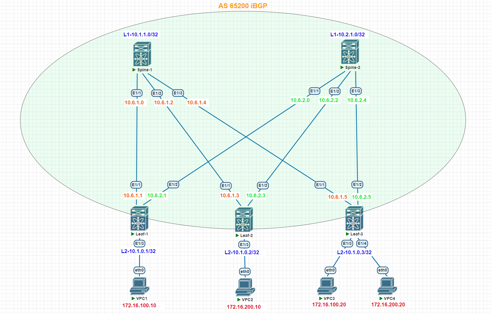

# Домашнее задание №6

## Overlay. VxLAN EVPN L3

### Задача:

Настроить маршрутизацию в рамках Overlay между клиентами
- Настроите каждого клиента в своем VNI
- Настроите маршрутизацию между клиентами.

## Выполнение:

### Схема сети



### Конфигурация оборудования

- #### [leaf-1](config/leaf-1.conf)

```
cfs eth distribute
nv overlay evpn
feature ospf
feature bgp
feature fabric forwarding
feature interface-vlan
feature vn-segment-vlan-based
feature bfd
clock timezone MSK 3 0
feature nv overlay

fabric forwarding anycast-gateway-mac 0000.dead.beef

vlan 1,100,200,2000
vlan 100
  name Hosts
  vn-segment 100
vlan 200
  name Servers
  vn-segment 200
vlan 2000
  name VRF_MAIN_VXLAN_FORWARD
  vn-segment 2000

vrf context main
  vni 2000
  rd auto
  address-family ipv4 unicast
    route-target both auto
    route-target both auto evpn
vrf context management

interface Vlan100
  no shutdown
  vrf member main
  no ip redirects
  ip address 172.16.100.1/24
  no ipv6 redirects
  fabric forwarding mode anycast-gateway

interface Vlan200
  no shutdown
  vrf member main
  no ip redirects
  ip address 172.16.200.1/24
  no ipv6 redirects
  fabric forwarding mode anycast-gateway

interface Vlan2000
  no shutdown
  mtu 9216
  vrf member main
  no ip redirects
  ip forward
  no ipv6 redirects

interface nve1
  no shutdown
  host-reachability protocol bgp
  advertise virtual-rmac
  source-interface loopback2
  member vni 100
    ingress-replication protocol bgp
  member vni 200
    ingress-replication protocol bgp
  member vni 2000 associate-vrf

interface Ethernet1/1
  description to-spine-1
  no switchport
  no ip redirects
  ip address 10.6.1.1/31
  ip ospf network point-to-point
  no ip ospf passive-interface
  ip router ospf UNDERLAY area 0.0.0.30
  no shutdown

interface Ethernet1/2
  description to-spine-2
  no switchport
  no ip redirects
  ip address 10.6.2.1/31
  ip ospf network point-to-point
  no ip ospf passive-interface
  ip router ospf UNDERLAY area 0.0.0.30
  ip ospf bfd
  no shutdown

interface Ethernet1/3
  description VPC1
  switchport access vlan 100

interface mgmt0
  vrf member management

interface loopback2
  ip address 10.1.0.1/32
  ip router ospf UNDERLAY area 0.0.0.30
icam monitor scale

line console
line vty
router ospf UNDERLAY
  bfd
  router-id 10.1.0.1
router bgp 65200
  router-id 10.1.0.1
  address-family ipv4 unicast
    maximum-paths 2
  address-family l2vpn evpn
    advertise-pip
  template peer RR
    bfd
    remote-as 65200
    log-neighbor-changes
    update-source loopback2
    address-family l2vpn evpn
      send-community
      send-community extended
  neighbor 10.1.1.0
    inherit peer RR
    address-family l2vpn evpn
  neighbor 10.2.1.0
    inherit peer RR
    address-family l2vpn evpn
  vrf main
    address-family ipv4 unicast
      advertise l2vpn evpn
      maximum-paths 2
evpn
  vni 100 l2
    rd auto
    route-target import auto
    route-target export auto
  vni 200 l2
    rd auto
    route-target import auto
    route-target export auto
```

- #### [leaf-2](config/leaf-2.conf)

```
nv overlay evpn
feature ospf
feature bgp
feature fabric forwarding
feature interface-vlan
feature vn-segment-vlan-based
feature bfd
clock timezone MSK 3 0
feature nv overlay

fabric forwarding anycast-gateway-mac 0000.dead.beef
vlan 1,100,200,2000
vlan 100
  name Hosts
  vn-segment 100
vlan 200
  name Servers
  vn-segment 200
vlan 2000
  name VRF_MAIN_VXLAN_FORWARD
  vn-segment 2000

vrf context main
  vni 2000
  rd auto
  address-family ipv4 unicast
    route-target both auto
    route-target both auto evpn
vrf context management

interface Vlan1

interface Vlan100
  no shutdown
  vrf member main
  no ip redirects
  ip address 172.16.100.1/24
  no ipv6 redirects
  fabric forwarding mode anycast-gateway

interface Vlan200
  no shutdown
  vrf member main
  no ip redirects
  ip address 172.16.200.1/24
  no ipv6 redirects
  fabric forwarding mode anycast-gateway

interface Vlan2000
  no shutdown
  mtu 9216
  vrf member main
  no ip redirects
  ip forward
  no ipv6 redirects

interface nve1
  no shutdown
  host-reachability protocol bgp
  advertise virtual-rmac
  source-interface loopback2
  member vni 100
    ingress-replication protocol bgp
  member vni 200
    ingress-replication protocol bgp
  member vni 2000 associate-vrf

interface Ethernet1/1
  description to-spine-1
  no switchport
  no ip redirects
  ip address 10.6.1.3/31
  ip ospf network point-to-point
  no ip ospf passive-interface
  ip router ospf UNDERLAY area 0.0.0.30
  no shutdown

interface Ethernet1/2
  description to-spine-2
  no switchport
  no ip redirects
  ip address 10.6.2.3/31
  ip ospf network point-to-point
  no ip ospf passive-interface
  ip router ospf UNDERLAY area 0.0.0.30
  no shutdown

interface Ethernet1/3
  description VPC2
  switchport access vlan 200

interface mgmt0
  vrf member management

interface loopback2
  ip address 10.1.0.2/32
  ip router ospf UNDERLAY area 0.0.0.30
icam monitor scale

line console
line vty
router ospf UNDERLAY
  bfd
  router-id 10.1.0.2
  passive-interface default
router bgp 65200
  router-id 10.1.0.2
  address-family ipv4 unicast
    maximum-paths 2
  address-family l2vpn evpn
    advertise-pip
  template peer RR
    bfd
    remote-as 65200
    log-neighbor-changes
    update-source loopback2
    address-family l2vpn evpn
      send-community
      send-community extended
  neighbor 10.1.1.0
    inherit peer RR
    address-family l2vpn evpn
  neighbor 10.2.1.0
    inherit peer RR
    address-family l2vpn evpn
  vrf main
    address-family ipv4 unicast
      advertise l2vpn evpn
      maximum-paths 2
evpn
  vni 100 l2
    rd auto
    route-target import auto
    route-target export auto
  vni 200 l2
    rd auto
    route-target import auto
    route-target export auto
```

- #### [leaf-3](config/leaf-3.conf)

```
nv overlay evpn
feature ospf
feature bgp
feature fabric forwarding
feature interface-vlan
feature vn-segment-vlan-based
feature bfd
clock timezone MSK 3 0
feature nv overlay


fabric forwarding anycast-gateway-mac 0000.dead.beef
vlan 1,100,200,2000
vlan 100
  name Hosts
  vn-segment 100
vlan 200
  name Servers
  vn-segment 200
vlan 2000
  name VRF_MAIN_VXLAN_FORWARD
  vn-segment 2000

vrf context main
  vni 2000
  rd auto
  address-family ipv4 unicast
    route-target both auto
    route-target both auto evpn
vrf context management

interface Vlan1

interface Vlan100
  no shutdown
  vrf member main
  no ip redirects
  ip address 172.16.100.1/24
  no ipv6 redirects
  fabric forwarding mode anycast-gateway

interface Vlan200
  no shutdown
  vrf member main
  no ip redirects
  ip address 172.16.200.1/24
  no ipv6 redirects
  fabric forwarding mode anycast-gateway

interface Vlan2000
  no shutdown
  mtu 9216
  vrf member main
  no ip redirects
  ip forward
  no ipv6 redirects

interface nve1
  no shutdown
  host-reachability protocol bgp
  advertise virtual-rmac
  source-interface loopback2
  member vni 100
    ingress-replication protocol bgp
  member vni 200
    ingress-replication protocol bgp
  member vni 2000 associate-vrf

interface Ethernet1/1
  description to-spine-1
  no switchport
  no ip redirects
  ip address 10.6.1.5/31
  ip ospf network point-to-point
  no ip ospf passive-interface
  ip router ospf UNDERLAY area 0.0.0.30
  no shutdown

interface Ethernet1/2
  description to-spine-2
  no switchport
  no ip redirects
  ip address 10.6.2.5/31
  ip ospf network point-to-point
  no ip ospf passive-interface
  ip router ospf UNDERLAY area 0.0.0.30
  no shutdown

interface Ethernet1/3
  description VPC3
  switchport access vlan 100

interface Ethernet1/4
  description VPC4
  switchport access vlan 200

interface mgmt0
  vrf member management

interface loopback2
  ip address 10.1.0.3/32
  ip router ospf UNDERLAY area 0.0.0.30
icam monitor scale

line console
line vty
router ospf UNDERLAY
  bfd
  router-id 10.1.0.3
  passive-interface default
router bgp 65200
  router-id 10.1.0.3
  address-family ipv4 unicast
    maximum-paths 2
  address-family l2vpn evpn
    advertise-pip
  template peer RR
    bfd
    remote-as 65200
    log-neighbor-changes
    update-source loopback2
    address-family l2vpn evpn
      send-community
      send-community extended
  neighbor 10.1.1.0
    inherit peer RR
    address-family l2vpn evpn
  neighbor 10.2.1.0
    inherit peer RR
    address-family l2vpn evpn
  vrf main
    address-family ipv4 unicast
      advertise l2vpn evpn
      maximum-paths 2
evpn
  vni 100 l2
    rd auto
    route-target import auto
    route-target export auto
  vni 200 l2
    rd auto
    route-target import auto
    route-target export auto
```
---

### Проверка связанности клиентов по L3

- #### leaf-1

```
Leaf-1# sh ip route vrf main
172.16.100.0/24, ubest/mbest: 1/0, attached
    *via 172.16.100.1, Vlan100, [0/0], 01:03:41, direct
172.16.100.1/32, ubest/mbest: 1/0, attached
    *via 172.16.100.1, Vlan100, [0/0], 01:03:41, local
172.16.100.10/32, ubest/mbest: 1/0, attached
    *via 172.16.100.10, Vlan100, [190/0], 00:36:40, hmm
172.16.100.20/32, ubest/mbest: 1/0
    *via 10.1.0.3%default, [200/0], 00:18:08, bgp-65200, internal, tag 65200, se
gid: 2000 tunnelid: 0xa010003 encap: VXLAN

172.16.200.0/24, ubest/mbest: 1/0, attached
    *via 172.16.200.1, Vlan200, [0/0], 01:03:41, direct
172.16.200.1/32, ubest/mbest: 1/0, attached
    *via 172.16.200.1, Vlan200, [0/0], 01:03:41, local
172.16.200.10/32, ubest/mbest: 1/0
    *via 10.1.0.2%default, [200/0], 00:18:08, bgp-65200, internal, tag 65200, se
gid: 2000 tunnelid: 0xa010002 encap: VXLAN

172.16.200.20/32, ubest/mbest: 1/0
    *via 10.1.0.3%default, [200/0], 00:18:08, bgp-65200, internal, tag 65200, se
gid: 2000 tunnelid: 0xa010003 encap: VXLAN


```
```
Leaf-1# show ip bgp vrf main
   Network            Next Hop            Metric     LocPrf     Weight Path
*>i172.16.100.20/32   10.1.0.3                          100          0 i
*>i172.16.200.10/32   10.1.0.2                          100          0 i
*>i172.16.200.20/32   10.1.0.3                          100          0 i


```
```
Leaf-1# sh bgp l2vpn evpn
   Network            Next Hop            Metric     LocPrf     Weight Path
Route Distinguisher: 10.1.0.1:32867    (L2VNI 100)
*>l[2]:[0]:[0]:[48]:[0050.7966.6821]:[0]:[0.0.0.0]/216
                      10.1.0.1                          100      32768 i
*>i[2]:[0]:[0]:[48]:[0050.7966.6828]:[0]:[0.0.0.0]/216
                      10.1.0.3                          100          0 i
*>l[2]:[0]:[0]:[48]:[0050.7966.6821]:[32]:[172.16.100.10]/272
                      10.1.0.1                          100      32768 i
*>i[2]:[0]:[0]:[48]:[0050.7966.6828]:[32]:[172.16.100.20]/272
                      10.1.0.3                          100          0 i
*>l[3]:[0]:[32]:[10.1.0.1]/88
                      10.1.0.1                          100      32768 i
*>i[3]:[0]:[32]:[10.1.0.2]/88
                      10.1.0.2                          100          0 i
*>i[3]:[0]:[32]:[10.1.0.3]/88
                      10.1.0.3                          100          0 i

Route Distinguisher: 10.1.0.1:32967    (L2VNI 200)
*>i[2]:[0]:[0]:[48]:[0050.7966.6827]:[0]:[0.0.0.0]/216
                      10.1.0.2                          100          0 i
*>i[2]:[0]:[0]:[48]:[0050.7966.6829]:[0]:[0.0.0.0]/216
                      10.1.0.3                          100          0 i
*>i[2]:[0]:[0]:[48]:[0050.7966.6827]:[32]:[172.16.200.10]/272
                      10.1.0.2                          100          0 i
*>i[2]:[0]:[0]:[48]:[0050.7966.6829]:[32]:[172.16.200.20]/272
                      10.1.0.3                          100          0 i
*>l[3]:[0]:[32]:[10.1.0.1]/88
                      10.1.0.1                          100      32768 i
*>i[3]:[0]:[32]:[10.1.0.2]/88
                      10.1.0.2                          100          0 i
*>i[3]:[0]:[32]:[10.1.0.3]/88
                      10.1.0.3                          100          0 i

Route Distinguisher: 10.1.0.2:3
* i[2]:[0]:[0]:[48]:[5000.2500.1b08]:[0]:[0.0.0.0]/216
                      10.1.0.2                          100          0 i
*>i                   10.1.0.2                          100          0 i

Route Distinguisher: 10.1.0.2:32867
* i[3]:[0]:[32]:[10.1.0.2]/88
                      10.1.0.2                          100          0 i
*>i                   10.1.0.2                          100          0 i

Route Distinguisher: 10.1.0.2:32967
*>i[2]:[0]:[0]:[48]:[0050.7966.6827]:[0]:[0.0.0.0]/216
                      10.1.0.2                          100          0 i
* i                   10.1.0.2                          100          0 i
*>i[2]:[0]:[0]:[48]:[0050.7966.6827]:[32]:[172.16.200.10]/272
                      10.1.0.2                          100          0 i
* i                   10.1.0.2                          100          0 i
* i[3]:[0]:[32]:[10.1.0.2]/88
                      10.1.0.2                          100          0 i
*>i                   10.1.0.2                          100          0 i

Route Distinguisher: 10.1.0.3:3
* i[2]:[0]:[0]:[48]:[5000.2600.1b08]:[0]:[0.0.0.0]/216
                      10.1.0.3                          100          0 i
*>i                   10.1.0.3                          100          0 i

Route Distinguisher: 10.1.0.3:32867
*>i[2]:[0]:[0]:[48]:[0050.7966.6828]:[0]:[0.0.0.0]/216
                      10.1.0.3                          100          0 i
* i                   10.1.0.3                          100          0 i
*>i[2]:[0]:[0]:[48]:[0050.7966.6828]:[32]:[172.16.100.20]/272
                      10.1.0.3                          100          0 i
* i                   10.1.0.3                          100          0 i
* i[3]:[0]:[32]:[10.1.0.3]/88
                      10.1.0.3                          100          0 i
*>i                   10.1.0.3                          100          0 i

Route Distinguisher: 10.1.0.3:32967
* i[2]:[0]:[0]:[48]:[0050.7966.6829]:[0]:[0.0.0.0]/216
                      10.1.0.3                          100          0 i
*>i                   10.1.0.3                          100          0 i
* i[2]:[0]:[0]:[48]:[0050.7966.6829]:[32]:[172.16.200.20]/272
                      10.1.0.3                          100          0 i
*>i                   10.1.0.3                          100          0 i
* i[3]:[0]:[32]:[10.1.0.3]/88
                      10.1.0.3                          100          0 i
*>i                   10.1.0.3                          100          0 i

Route Distinguisher: 10.1.0.1:3    (L3VNI 2000)
*>l[2]:[0]:[0]:[48]:[5000.2400.1b08]:[0]:[0.0.0.0]/216
                      10.1.0.1                          100      32768 i
*>i[2]:[0]:[0]:[48]:[5000.2500.1b08]:[0]:[0.0.0.0]/216
                      10.1.0.2                          100          0 i
*>i[2]:[0]:[0]:[48]:[5000.2600.1b08]:[0]:[0.0.0.0]/216
                      10.1.0.3                          100          0 i
*>i[2]:[0]:[0]:[48]:[0050.7966.6827]:[32]:[172.16.200.10]/272
                      10.1.0.2                          100          0 i
*>i[2]:[0]:[0]:[48]:[0050.7966.6828]:[32]:[172.16.100.20]/272
                      10.1.0.3                          100          0 i
*>i[2]:[0]:[0]:[48]:[0050.7966.6829]:[32]:[172.16.200.20]/272
                      10.1.0.3                          100          0 i


```
```
Leaf-1# sh ip arp vrf main
IP ARP Table for context main
Total number of entries: 1
Address         Age       MAC Address     Interface       Flags
172.16.100.10   00:05:07  0050.7966.6821  Vlan100

```
```
Leaf-1# sh ip arp vrf main
IP ARP Table for context main
Total number of entries: 1
Address         Age       MAC Address     Interface       Flags
172.16.100.10   00:05:07  0050.7966.6821  Vlan100

```
```  
Leaf-1# show nve vni
Codes: CP - Control Plane        DP - Data Plane
       UC - Unconfigured         SA - Suppress ARP
       SU - Suppress Unknown Unicast
       Xconn - Crossconnect
       MS-IR - Multisite Ingress Replication

Interface VNI      Multicast-group   State Mode Type [BD/VRF]      Flags
--------- -------- ----------------- ----- ---- ------------------ -----
nve1      100      UnicastBGP        Up    CP   L2 [100]
nve1      200      UnicastBGP        Up    CP   L2 [200]
nve1      2000     n/a               Up    CP   L3 [main]


```

- #### leaf-2

```
Leaf-2# sh ip route vrf main
172.16.100.0/24, ubest/mbest: 1/0, attached
    *via 172.16.100.1, Vlan100, [0/0], 01:03:12, direct
172.16.100.1/32, ubest/mbest: 1/0, attached
    *via 172.16.100.1, Vlan100, [0/0], 01:03:12, local
172.16.100.10/32, ubest/mbest: 1/0
    *via 10.1.0.1%default, [200/0], 00:19:07, bgp-65200, internal, tag 65200, se
gid: 2000 tunnelid: 0xa010001 encap: VXLAN

172.16.100.20/32, ubest/mbest: 1/0
    *via 10.1.0.3%default, [200/0], 00:57:04, bgp-65200, internal, tag 65200, se
gid: 2000 tunnelid: 0xa010003 encap: VXLAN

172.16.200.0/24, ubest/mbest: 1/0, attached
    *via 172.16.200.1, Vlan200, [0/0], 01:03:11, direct
172.16.200.1/32, ubest/mbest: 1/0, attached
    *via 172.16.200.1, Vlan200, [0/0], 01:03:11, local
172.16.200.10/32, ubest/mbest: 1/0, attached
    *via 172.16.200.10, Vlan200, [190/0], 00:58:27, hmm
172.16.200.20/32, ubest/mbest: 1/0
    *via 10.1.0.3%default, [200/0], 00:56:34, bgp-65200, internal, tag 65200, se
gid: 2000 tunnelid: 0xa010003 encap: VXLAN

```
```
Leaf-2# sh bgp l2vpn evpn
   Network            Next Hop            Metric     LocPrf     Weight Path
Route Distinguisher: 10.1.0.1:3
*>i[2]:[0]:[0]:[48]:[5000.2400.1b08]:[0]:[0.0.0.0]/216
                      10.1.0.1                          100          0 i
* i                   10.1.0.1                          100          0 i

Route Distinguisher: 10.1.0.1:32867
* i[2]:[0]:[0]:[48]:[0050.7966.6821]:[0]:[0.0.0.0]/216
                      10.1.0.1                          100          0 i
*>i                   10.1.0.1                          100          0 i
* i[2]:[0]:[0]:[48]:[0050.7966.6821]:[32]:[172.16.100.10]/272
                      10.1.0.1                          100          0 i
*>i                   10.1.0.1                          100          0 i
*>i[3]:[0]:[32]:[10.1.0.1]/88
                      10.1.0.1                          100          0 i
* i                   10.1.0.1                          100          0 i

Route Distinguisher: 10.1.0.1:32967
*>i[3]:[0]:[32]:[10.1.0.1]/88
                      10.1.0.1                          100          0 i
* i                   10.1.0.1                          100          0 i

Route Distinguisher: 10.1.0.2:32867    (L2VNI 100)
*>i[2]:[0]:[0]:[48]:[0050.7966.6821]:[0]:[0.0.0.0]/216
                      10.1.0.1                          100          0 i
*>i[2]:[0]:[0]:[48]:[0050.7966.6828]:[0]:[0.0.0.0]/216
                      10.1.0.3                          100          0 i
*>i[2]:[0]:[0]:[48]:[0050.7966.6821]:[32]:[172.16.100.10]/272
                      10.1.0.1                          100          0 i
*>i[2]:[0]:[0]:[48]:[0050.7966.6828]:[32]:[172.16.100.20]/272
                      10.1.0.3                          100          0 i
*>i[3]:[0]:[32]:[10.1.0.1]/88
                      10.1.0.1                          100          0 i
*>l[3]:[0]:[32]:[10.1.0.2]/88
                      10.1.0.2                          100      32768 i
*>i[3]:[0]:[32]:[10.1.0.3]/88
                      10.1.0.3                          100          0 i

Route Distinguisher: 10.1.0.2:32967    (L2VNI 200)
*>l[2]:[0]:[0]:[48]:[0050.7966.6827]:[0]:[0.0.0.0]/216
                      10.1.0.2                          100      32768 i
*>i[2]:[0]:[0]:[48]:[0050.7966.6829]:[0]:[0.0.0.0]/216
                      10.1.0.3                          100          0 i
*>l[2]:[0]:[0]:[48]:[0050.7966.6827]:[32]:[172.16.200.10]/272
                      10.1.0.2                          100      32768 i
*>i[2]:[0]:[0]:[48]:[0050.7966.6829]:[32]:[172.16.200.20]/272
                      10.1.0.3                          100          0 i
*>i[3]:[0]:[32]:[10.1.0.1]/88
                      10.1.0.1                          100          0 i
*>l[3]:[0]:[32]:[10.1.0.2]/88
                      10.1.0.2                          100      32768 i
*>i[3]:[0]:[32]:[10.1.0.3]/88
                      10.1.0.3                          100          0 i

Route Distinguisher: 10.1.0.3:3
* i[2]:[0]:[0]:[48]:[5000.2600.1b08]:[0]:[0.0.0.0]/216
                      10.1.0.3                          100          0 i
*>i                   10.1.0.3                          100          0 i

Route Distinguisher: 10.1.0.3:32867
* i[2]:[0]:[0]:[48]:[0050.7966.6828]:[0]:[0.0.0.0]/216
                      10.1.0.3                          100          0 i
*>i                   10.1.0.3                          100          0 i
*>i[2]:[0]:[0]:[48]:[0050.7966.6828]:[32]:[172.16.100.20]/272
                      10.1.0.3                          100          0 i
* i                   10.1.0.3                          100          0 i
* i[3]:[0]:[32]:[10.1.0.3]/88
                      10.1.0.3                          100          0 i
*>i                   10.1.0.3                          100          0 i

Route Distinguisher: 10.1.0.3:32967
* i[2]:[0]:[0]:[48]:[0050.7966.6829]:[0]:[0.0.0.0]/216
                      10.1.0.3                          100          0 i
*>i                   10.1.0.3                          100          0 i
* i[2]:[0]:[0]:[48]:[0050.7966.6829]:[32]:[172.16.200.20]/272
                      10.1.0.3                          100          0 i
*>i                   10.1.0.3                          100          0 i
* i[3]:[0]:[32]:[10.1.0.3]/88
                      10.1.0.3                          100          0 i
*>i                   10.1.0.3                          100          0 i

Route Distinguisher: 10.1.0.2:3    (L3VNI 2000)
*>i[2]:[0]:[0]:[48]:[5000.2400.1b08]:[0]:[0.0.0.0]/216
                      10.1.0.1                          100          0 i
*>l[2]:[0]:[0]:[48]:[5000.2500.1b08]:[0]:[0.0.0.0]/216
                      10.1.0.2                          100      32768 i
*>i[2]:[0]:[0]:[48]:[5000.2600.1b08]:[0]:[0.0.0.0]/216
                      10.1.0.3                          100          0 i
*>i[2]:[0]:[0]:[48]:[0050.7966.6821]:[32]:[172.16.100.10]/272
                      10.1.0.1                          100          0 i
*>i[2]:[0]:[0]:[48]:[0050.7966.6828]:[32]:[172.16.100.20]/272
                      10.1.0.3                          100          0 i
*>i[2]:[0]:[0]:[48]:[0050.7966.6829]:[32]:[172.16.200.20]/272
                      10.1.0.3                          100          0 i


```
```
Leaf-2# show ip bgp vrf main
   Network            Next Hop            Metric     LocPrf     Weight Path
*>i172.16.100.10/32   10.1.0.1                          100          0 i
*>i172.16.100.20/32   10.1.0.3                          100          0 i
*>i172.16.200.20/32   10.1.0.3                          100          0 i

```
```
Leaf-2# sh ip arp vrf main
IP ARP Table for context main
Total number of entries: 1
Address         Age       MAC Address     Interface       Flags
172.16.200.10   00:18:16  0050.7966.6827  Vlan200

```
```
Leaf-2# sh interface nve 1
nve1 is up
admin state is up,  Hardware: NVE
  MTU 9216 bytes
  Encapsulation VXLAN
  Auto-mdix is turned off
  RX
    ucast: 127 pkts, 11942 bytes - mcast: 64 pkts, 4704 bytes
  TX
    ucast: 289 pkts, 38972 bytes - mcast: 0 pkts, 0 bytes

```
```  
Leaf-2# show nve vni
Interface VNI      Multicast-group   State Mode Type [BD/VRF]      Flags
--------- -------- ----------------- ----- ---- ------------------ -----
nve1      100      UnicastBGP        Up    CP   L2 [100]
nve1      200      UnicastBGP        Up    CP   L2 [200]
nve1      2000     n/a               Up    CP   L3 [main]

```

- #### leaf-3

```
Leaf-3# sh ip route vrf main
172.16.100.0/24, ubest/mbest: 1/0, attached
    *via 172.16.100.1, Vlan100, [0/0], 01:08:30, direct
172.16.100.1/32, ubest/mbest: 1/0, attached
    *via 172.16.100.1, Vlan100, [0/0], 01:08:30, local
172.16.100.10/32, ubest/mbest: 1/0
    *via 10.1.0.1%default, [200/0], 00:25:59, bgp-65200, internal, tag 65200, se
gid: 2000 tunnelid: 0xa010001 encap: VXLAN

172.16.100.20/32, ubest/mbest: 1/0, attached
    *via 172.16.100.20, Vlan100, [190/0], 01:03:57, hmm
172.16.200.0/24, ubest/mbest: 1/0, attached
    *via 172.16.200.1, Vlan200, [0/0], 01:08:29, direct
172.16.200.1/32, ubest/mbest: 1/0, attached
    *via 172.16.200.1, Vlan200, [0/0], 01:08:29, local
172.16.200.10/32, ubest/mbest: 1/0
    *via 10.1.0.2%default, [200/0], 01:05:19, bgp-65200, internal, tag 65200, se
gid: 2000 tunnelid: 0xa010002 encap: VXLAN

172.16.200.20/32, ubest/mbest: 1/0, attached
    *via 172.16.200.20, Vlan200, [190/0], 01:03:26, hmm

```
```
Leaf-3#  sh bgp l2vpn evpn
BGP routing table information for VRF default, address family L2VPN EVPN
BGP table version is 100, Local Router ID is 10.1.0.3
Status: s-suppressed, x-deleted, S-stale, d-dampened, h-history, *-valid, >-best
Path type: i-internal, e-external, c-confed, l-local, a-aggregate, r-redist, I-i
njected
Origin codes: i - IGP, e - EGP, ? - incomplete, | - multipath, & - backup, 2 - b
est2

   Network            Next Hop            Metric     LocPrf     Weight Path
Route Distinguisher: 10.1.0.1:3
* i[2]:[0]:[0]:[48]:[5000.2400.1b08]:[0]:[0.0.0.0]/216
                      10.1.0.1                          100          0 i
*>i                   10.1.0.1                          100          0 i

Route Distinguisher: 10.1.0.1:32867
* i[2]:[0]:[0]:[48]:[0050.7966.6821]:[0]:[0.0.0.0]/216
                      10.1.0.1                          100          0 i
*>i                   10.1.0.1                          100          0 i
* i[2]:[0]:[0]:[48]:[0050.7966.6821]:[32]:[172.16.100.10]/272
                      10.1.0.1                          100          0 i
*>i                   10.1.0.1                          100          0 i
* i[3]:[0]:[32]:[10.1.0.1]/88
                      10.1.0.1                          100          0 i
*>i                   10.1.0.1                          100          0 i

Route Distinguisher: 10.1.0.1:32967
* i[3]:[0]:[32]:[10.1.0.1]/88
                      10.1.0.1                          100          0 i
*>i                   10.1.0.1                          100          0 i

Route Distinguisher: 10.1.0.2:3
* i[2]:[0]:[0]:[48]:[5000.2500.1b08]:[0]:[0.0.0.0]/216
                      10.1.0.2                          100          0 i
*>i                   10.1.0.2                          100          0 i

Route Distinguisher: 10.1.0.2:32867
* i[3]:[0]:[32]:[10.1.0.2]/88
                      10.1.0.2                          100          0 i
*>i                   10.1.0.2                          100          0 i

Route Distinguisher: 10.1.0.2:32967
*>i[2]:[0]:[0]:[48]:[0050.7966.6827]:[0]:[0.0.0.0]/216
                      10.1.0.2                          100          0 i
* i                   10.1.0.2                          100          0 i
*>i[2]:[0]:[0]:[48]:[0050.7966.6827]:[32]:[172.16.200.10]/272
                      10.1.0.2                          100          0 i
* i                   10.1.0.2                          100          0 i
* i[3]:[0]:[32]:[10.1.0.2]/88
                      10.1.0.2                          100          0 i
*>i                   10.1.0.2                          100          0 i

Route Distinguisher: 10.1.0.3:32867    (L2VNI 100)
*>i[2]:[0]:[0]:[48]:[0050.7966.6821]:[0]:[0.0.0.0]/216
                      10.1.0.1                          100          0 i
*>l[2]:[0]:[0]:[48]:[0050.7966.6828]:[0]:[0.0.0.0]/216
                      10.1.0.3                          100      32768 i
*>i[2]:[0]:[0]:[48]:[0050.7966.6821]:[32]:[172.16.100.10]/272
                      10.1.0.1                          100          0 i
*>l[2]:[0]:[0]:[48]:[0050.7966.6828]:[32]:[172.16.100.20]/272
                      10.1.0.3                          100      32768 i
*>i[3]:[0]:[32]:[10.1.0.1]/88
                      10.1.0.1                          100          0 i
*>i[3]:[0]:[32]:[10.1.0.2]/88
                      10.1.0.2                          100          0 i
*>l[3]:[0]:[32]:[10.1.0.3]/88
                      10.1.0.3                          100      32768 i

Route Distinguisher: 10.1.0.3:32967    (L2VNI 200)
*>i[2]:[0]:[0]:[48]:[0050.7966.6827]:[0]:[0.0.0.0]/216
                      10.1.0.2                          100          0 i
*>l[2]:[0]:[0]:[48]:[0050.7966.6829]:[0]:[0.0.0.0]/216
                      10.1.0.3                          100      32768 i
*>i[2]:[0]:[0]:[48]:[0050.7966.6827]:[32]:[172.16.200.10]/272
                      10.1.0.2                          100          0 i
*>l[2]:[0]:[0]:[48]:[0050.7966.6829]:[32]:[172.16.200.20]/272
                      10.1.0.3                          100      32768 i
*>i[3]:[0]:[32]:[10.1.0.1]/88
                      10.1.0.1                          100          0 i
*>i[3]:[0]:[32]:[10.1.0.2]/88
                      10.1.0.2                          100          0 i
*>l[3]:[0]:[32]:[10.1.0.3]/88
                      10.1.0.3                          100      32768 i

Route Distinguisher: 10.1.0.3:3    (L3VNI 2000)
*>i[2]:[0]:[0]:[48]:[5000.2400.1b08]:[0]:[0.0.0.0]/216
                      10.1.0.1                          100          0 i
*>i[2]:[0]:[0]:[48]:[5000.2500.1b08]:[0]:[0.0.0.0]/216
                      10.1.0.2                          100          0 i
*>l[2]:[0]:[0]:[48]:[5000.2600.1b08]:[0]:[0.0.0.0]/216
                      10.1.0.3                          100      32768 i
*>i[2]:[0]:[0]:[48]:[0050.7966.6821]:[32]:[172.16.100.10]/272
                      10.1.0.1                          100          0 i
*>i[2]:[0]:[0]:[48]:[0050.7966.6827]:[32]:[172.16.200.10]/272
                      10.1.0.2                          100          0 i

```
```
Leaf-3# show ip bgp vrf main
   Network            Next Hop            Metric     LocPrf     Weight Path
*>i172.16.100.10/32   10.1.0.1                          100          0 i
*>i172.16.200.10/32   10.1.0.2                          100          0 i

```
```
Leaf-3# sh ip arp vrf main
IP ARP Table for context main
Total number of entries: 2
Address         Age       MAC Address     Interface       Flags
172.16.100.20   00:10:06  0050.7966.6828  Vlan100
172.16.200.20   00:10:06  0050.7966.6829  Vlan200

```
```
Leaf-3# sh interface nve1
nve1 is up
admin state is up,  Hardware: NVE
  MTU 9216 bytes
  Encapsulation VXLAN
  Auto-mdix is turned off
  RX
    ucast: 82 pkts, 7714 bytes - mcast: 93 pkts, 7110 bytes
  TX
    ucast: 291 pkts, 39716 bytes - mcast: 0 pkts, 0 bytes

```
```
Leaf-3# show nve vni
Interface VNI      Multicast-group   State Mode Type [BD/VRF]      Flags
--------- -------- ----------------- ----- ---- ------------------ -----
nve1      100      UnicastBGP        Up    CP   L2 [100]
nve1      200      UnicastBGP        Up    CP   L2 [200]
nve1      2000     n/a               Up    CP   L3 [main]

```

- #### VPCS1

```
VPCS1> ping 172.16.200.20
84 bytes from 172.16.200.20 icmp_seq=1 ttl=62 time=31.885 ms
84 bytes from 172.16.200.20 icmp_seq=2 ttl=62 time=23.090 ms

VPCS1> ping 172.16.200.10
84 bytes from 172.16.200.10 icmp_seq=1 ttl=62 time=77.416 ms
84 bytes from 172.16.200.10 icmp_seq=2 ttl=62 time=13.066 ms

VPCS1> ping 172.16.100.20
84 bytes from 172.16.100.20 icmp_seq=1 ttl=64 time=17.575 ms
84 bytes from 172.16.100.20 icmp_seq=2 ttl=64 time=12.068 ms


```

- #### VPCS4

```
VPCS4> ping 172.16.100.20
84 bytes from 172.16.100.20 icmp_seq=1 ttl=63 time=9.929 ms
84 bytes from 172.16.100.20 icmp_seq=2 ttl=63 time=5.354 ms

VPCS4> ping 172.16.100.10
84 bytes from 172.16.100.10 icmp_seq=1 ttl=62 time=29.647 ms
84 bytes from 172.16.100.10 icmp_seq=2 ttl=62 time=14.934 ms


```
