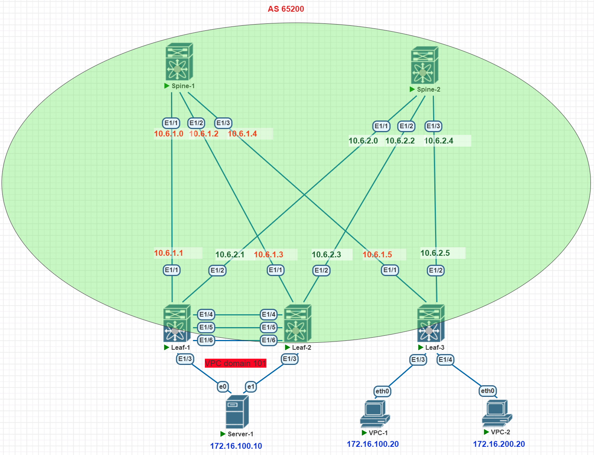

# Домашнее задание №7

## Настроить отказоустойчивое подключение клиентов с использованием EVPN Multihoming

### Задача:

- Подключить клиентов 2-я линками к различным Leaf
- Настроить агрегированный канал со стороны клиента 
- Настроите multihoming для работы в Overlay сети. Если используете Cisco NXOS - vPC, если иной вендор - то ESI LAG (либо MC-LAG с поддержкой VXLAN)
- Проверить связанность между клиентами

## Выполнение:

### Схема сети



### Конфигурация оборудования

- #### [leaf-1](config/leaf-1.conf)

```
cfs eth distribute
nv overlay evpn
feature ospf
feature bgp
feature fabric forwarding
feature interface-vlan
feature vn-segment-vlan-based
feature lacp
feature vpc
feature bfd
clock timezone MSK 3 0
feature nv overlay

no password strength-check
username admin password 5 $5$KKHKOP$HZju.WhjeHfDQWoywO8kKFJ5ab5xLYqU6qw0gJdUnE4
 role network-admin
ip domain-lookup
spanning-tree mode mst
copp profile strict

fabric forwarding anycast-gateway-mac 0000.dead.beef
vlan 1,100,200,2000
vlan 100
  name Hosts
  vn-segment 100
vlan 200
  name Servers
  vn-segment 200
vlan 2000
  name VRF_MAIN_VXLAN_FORWARD
  vn-segment 2000

spanning-tree port type edge bpduguard default
spanning-tree loopguard default
spanning-tree mst 0-1 priority 4096
spanning-tree mst configuration
  name N-Leafs101-102
  revision 1
  instance 1 vlan 1-4094
vrf context VPC
vrf context main
  vni 2000
  rd auto
  address-family ipv4 unicast
    route-target both auto
    route-target both auto evpn
vrf context management
vpc domain 101
  peer-switch
  role priority 100
  peer-keepalive destination 1.1.1.2 source 1.1.1.1 vrf VPC
  peer-gateway
  layer3 peer-router
  auto-recovery
  delay restore interface-vlan 100
  ip arp synchronize


interface Vlan1
  no ip redirects
  no ipv6 redirects

interface Vlan100
  no shutdown
  vrf member main
  no ip redirects
  ip address 172.16.100.1/24
  no ipv6 redirects
  fabric forwarding mode anycast-gateway

interface Vlan200
  no shutdown
  vrf member main
  no ip redirects
  ip address 172.16.200.1/24
  no ipv6 redirects
  fabric forwarding mode anycast-gateway

interface Vlan2000
  no shutdown
  mtu 9216
  vrf member main
  no ip redirects
  ip forward
  no ipv6 redirects

interface port-channel1
  description vpc-per-link
  switchport mode trunk
  spanning-tree port type network
  vpc peer-link

interface port-channel101
  switchport access vlan 100
  vpc 101

interface nve1
  no shutdown
  host-reachability protocol bgp
  advertise virtual-rmac
  source-interface loopback2
  member vni 100
    ingress-replication protocol bgp
  member vni 200
    ingress-replication protocol bgp
  member vni 2000 associate-vrf

interface Ethernet1/1
  description to-spine-1
  no switchport
  no ip redirects
  ip address 10.6.1.1/31
  ip ospf network point-to-point
  no ip ospf passive-interface
  ip router ospf UNDERLAY area 0.0.0.30
  no shutdown

interface Ethernet1/2
  description to-spine-2
  no switchport
  no ip redirects
  ip address 10.6.2.1/31
  ip ospf network point-to-point
  no ip ospf passive-interface
  ip router ospf UNDERLAY area 0.0.0.30
  ip ospf bfd
  no shutdown

interface Ethernet1/3
  description VPC1
  switchport access vlan 100
  spanning-tree guard root
  channel-group 101 mode active

interface Ethernet1/4
  description vpc-per-link
  switchport mode trunk
  channel-group 1 mode active

interface Ethernet1/5
  description vpc-per-link
  switchport mode trunk
  channel-group 1 mode active

interface Ethernet1/6
  description vpc-keepalive
  no switchport
  vrf member VPC
  ip address 1.1.1.1/30
  no shutdown

interface mgmt0
  vrf member management

interface loopback2
  description VTEP
  ip address 10.1.0.1/32
  ip address 10.6.255.200/32 secondary
  ip router ospf UNDERLAY area 0.0.0.30
icam monitor scale

line console
line vty
router ospf UNDERLAY
  bfd
  router-id 10.1.0.1
router bgp 65200
  router-id 10.1.0.1
  address-family ipv4 unicast
    maximum-paths 2
  address-family l2vpn evpn
    advertise-pip
  template peer RR
    bfd
    remote-as 65200
    log-neighbor-changes
    update-source loopback2
    address-family l2vpn evpn
      send-community
      send-community extended
  neighbor 10.1.1.0
    inherit peer RR
    address-family l2vpn evpn
  neighbor 10.2.1.0
    inherit peer RR
    address-family l2vpn evpn
  vrf main
    address-family ipv4 unicast
      advertise l2vpn evpn
      maximum-paths 2
evpn
  vni 100 l2
    rd auto
    route-target import auto
    route-target export auto
  vni 200 l2
    rd auto
    route-target import auto
    route-target export auto

```

- #### [leaf-2](config/leaf-2.conf)

```
cfs eth distribute
nv overlay evpn
feature ospf
feature bgp
feature fabric forwarding
feature interface-vlan
feature vn-segment-vlan-based
feature lacp
feature vpc
feature bfd
clock timezone MSK 3 0
feature nv overlay

no password strength-check
username admin password 5 $5$KIOBMB$/BR2tcIpAyJuzrRj/KMxrGo5rFx9.mAPt0SKsyc8YU/
 role network-admin
ip domain-lookup
spanning-tree mode mst
copp profile strict

fabric forwarding anycast-gateway-mac 0000.dead.beef
vlan 1,100,200,2000
vlan 100
  name Hosts
  vn-segment 100
vlan 200
  name Servers
  vn-segment 200
vlan 2000
  name VRF_MAIN_VXLAN_FORWARD
  vn-segment 2000

spanning-tree port type edge bpduguard default
spanning-tree loopguard default
spanning-tree mst 0-1 priority 4096
spanning-tree mst configuration
  name N-Leafs101-102
  revision 1
  instance 1 vlan 1-4094
vrf context VPC
vrf context main
  vni 2000
  rd auto
  address-family ipv4 unicast
    route-target both auto
    route-target both auto evpn
vrf context management
vpc domain 101
  peer-switch
  role priority 50
  peer-keepalive destination 1.1.1.1 source 1.1.1.2 vrf VPC
  peer-gateway
  layer3 peer-router
  auto-recovery
  delay restore interface-vlan 100
  ip arp synchronize


interface Vlan1
  no ip redirects
  no ipv6 redirects

interface Vlan100
  no shutdown
  vrf member main
  no ip redirects
  ip address 172.16.100.1/24
  no ipv6 redirects
  fabric forwarding mode anycast-gateway

interface Vlan200
  no shutdown
  vrf member main
  no ip redirects
  ip address 172.16.200.1/24
  no ipv6 redirects
  fabric forwarding mode anycast-gateway

interface Vlan2000
  no shutdown
  mtu 9216
  vrf member main
  no ip redirects
  ip forward
  no ipv6 redirects

interface port-channel1
  description vpc-per-link
  switchport mode trunk
  spanning-tree port type network
  vpc peer-link

interface port-channel101
  switchport access vlan 100
  vpc 101

interface nve1
  no shutdown
  host-reachability protocol bgp
  advertise virtual-rmac
  source-interface loopback2
  member vni 100
    ingress-replication protocol bgp
  member vni 200
    ingress-replication protocol bgp
  member vni 2000 associate-vrf

interface Ethernet1/1
  description to-spine-1
  no switchport
  no ip redirects
  ip address 10.6.1.3/31
  ip ospf network point-to-point
  no ip ospf passive-interface
  ip router ospf UNDERLAY area 0.0.0.30
  no shutdown

interface Ethernet1/2
  description to-spine-2
  no switchport
  no ip redirects
  ip address 10.6.2.3/31
  ip ospf network point-to-point
  no ip ospf passive-interface
  ip router ospf UNDERLAY area 0.0.0.30
  no shutdown

interface Ethernet1/3
  description VPC1
  switchport access vlan 100
  spanning-tree guard root
  channel-group 101 mode active

interface Ethernet1/4
  description vpc-per-link
  switchport mode trunk
  channel-group 1 mode active

interface Ethernet1/5
  description vpc-per-link
  switchport mode trunk
  channel-group 1 mode active

interface Ethernet1/6
  description vpc-keepalive
  no switchport
  vrf member VPC
  ip address 1.1.1.2/30
  no shutdown

interface mgmt0
  vrf member management

interface loopback2
  description VTEP
  ip address 10.1.0.2/32
  ip address 10.6.255.200/32 secondary
  ip router ospf UNDERLAY area 0.0.0.30
icam monitor scale

line console
line vty
router ospf UNDERLAY
  bfd
  router-id 10.1.0.2
  passive-interface default
router bgp 65200
  router-id 10.1.0.2
  address-family ipv4 unicast
    maximum-paths 2
  address-family l2vpn evpn
    advertise-pip
  template peer RR
    bfd
    remote-as 65200
    log-neighbor-changes
    update-source loopback2
    address-family l2vpn evpn
      send-community
      send-community extended
  neighbor 10.1.1.0
    inherit peer RR
    address-family l2vpn evpn
  neighbor 10.2.1.0
    inherit peer RR
    address-family l2vpn evpn
  vrf main
    address-family ipv4 unicast
      advertise l2vpn evpn
      maximum-paths 2
evpn
  vni 100 l2
    rd auto
    route-target import auto
    route-target export auto
  vni 200 l2
    rd auto
    route-target import auto
    route-target export auto

```

- #### [leaf-3](config/leaf-3.conf)

```
vlan 13,23

vrf instance OTUS-PROD

interface Ethernet3
   description to-clien-5
   switchport access vlan 13

interface Ethernet4
   description to-clien-6
   switchport access vlan 23

interface Vlan13
   vrf OTUS-PROD
   ip address virtual 192.168.13.254/24

interface Vlan23
   vrf OTUS-PROD
   ip address virtual 192.168.23.254/24

interface Vxlan1
   vxlan source-interface Loopback100
   vxlan udp-port 4789
   vxlan vlan 13 vni 10013
   vxlan vlan 23 vni 10023
   vxlan vrf OTUS-PROD vni 10001

ip virtual-router mac-address 00:00:00:00:00:03

ip routing vrf OTUS-PROD

router bgp 65003

   vlan 13
      rd 65003:10013
      route-target both 13:13
      redistribute learned
   !
   vlan 23
      rd 65003:10023
      route-target both 23:23
      redistribute learned

   vrf OTUS-PROD
      rd 65003:10001
      route-target import evpn 10001:10001
      route-target export evpn 10001:10001
      redistribute connected
```

- #### [server-1](config/server-1.conf)

```
vlan 13,23

interface Port-Channel5
   switchport trunk allowed vlan 13,23
   switchport mode trunk

interface Ethernet1
   channel-group 5 mode active

interface Ethernet2
   channel-group 5 mode active

interface Vlan13
   ip address 192.168.13.13/24

interface Vlan23
   ip address 192.168.23.13/24

ip routing
```
---

### Проверка связанности клиентов по L3

- #### leaf-1

```
leaf-1#sh mlag
MLAG Configuration:
domain-id                          :               mlag1
local-interface                    :            Vlan4094
peer-address                       :        10.100.100.1
peer-link                          :       Port-Channel1
peer-config                        :          consistent

MLAG Status:
state                              :              Active
negotiation status                 :           Connected
peer-link status                   :                  Up
local-int status                   :                  Up
system-id                          :   52:00:00:5b:6f:f5
dual-primary detection             :            Disabled
dual-primary interface errdisabled :               False

MLAG Ports:
Disabled                           :                   0
Configured                         :                   0
Inactive                           :                   0
Active-partial                     :                   0
Active-full                        :                   1
```
```
leaf-2#sh mlag interfaces detail
                                                            local/remote
   mlag             state       local       remote        oper        config       last change    changes
---------- ----------------- ----------- ------------ ----------- ------------- ----------------- -------
      5       active-full         Po5          Po5       up/up       ena/ena       0:26:56 ago          8
```
```
leaf-1#sh port-channel 5 detailed
Port Channel Port-Channel5 (Fallback State: Unconfigured):
Minimum links: unconfigured
Minimum speed: unconfigured
Current weight/Max weight: 1/16
  Active Ports:
       Port                Time Became Active       Protocol       Mode      Weight
    ------------------- ------------------------ -------------- ------------ ------
       Ethernet5           19:29:00                 LACP           Active      1
       PeerEthernet5       19:29:01                 LACP           Active      0

```
```
leaf-1#sh bgp evpn
BGP routing table information for VRF default
Router identifier 10.1.0.1, local AS number 65001
Route status codes: s - suppressed, * - valid, > - active, E - ECMP head, e - ECMP
                    S - Stale, c - Contributing to ECMP, b - backup
                    % - Pending BGP convergence
Origin codes: i - IGP, e - EGP, ? - incomplete
AS Path Attributes: Or-ID - Originator ID, C-LST - Cluster List, LL Nexthop - Link Local Nexthop

          Network                Next Hop              Metric  LocPref Weight  Path
 * >Ec   RD: 65003:10013 mac-ip 0050.7966.6807
                                 10.100.0.3            -       100     0       65000 65003 i
 *  ec   RD: 65003:10013 mac-ip 0050.7966.6807
                                 10.100.0.3            -       100     0       65000 65003 i
 * >Ec   RD: 65003:10013 mac-ip 0050.7966.6807 192.168.13.23
                                 10.100.0.3            -       100     0       65000 65003 i
 *  ec   RD: 65003:10013 mac-ip 0050.7966.6807 192.168.13.23
                                 10.100.0.3            -       100     0       65000 65003 i
 * >Ec   RD: 65003:10023 mac-ip 0050.7966.680b
                                 10.100.0.3            -       100     0       65000 65003 i
 *  ec   RD: 65003:10023 mac-ip 0050.7966.680b
                                 10.100.0.3            -       100     0       65000 65003 i
 * >Ec   RD: 65003:10023 mac-ip 0050.7966.680b 192.168.23.23
                                 10.100.0.3            -       100     0       65000 65003 i
 *  ec   RD: 65003:10023 mac-ip 0050.7966.680b 192.168.23.23
                                 10.100.0.3            -       100     0       65000 65003 i
 * >     RD: 65001:10013 mac-ip 5000.006f.20c3
                                 -                     -       -       0       i
 * >     RD: 65001:10023 mac-ip 5000.006f.20c3
                                 -                     -       -       0       i
 * >     RD: 65001:10013 imet 10.100.0.1
                                 -                     -       -       0       i
 * >     RD: 65001:10023 imet 10.100.0.1
                                 -                     -       -       0       i
 * >Ec   RD: 65003:10013 imet 10.100.0.3
                                 10.100.0.3            -       100     0       65000 65003 i
 *  ec   RD: 65003:10013 imet 10.100.0.3
                                 10.100.0.3            -       100     0       65000 65003 i
 * >Ec   RD: 65003:10023 imet 10.100.0.3
                                 10.100.0.3            -       100     0       65000 65003 i
 *  ec   RD: 65003:10023 imet 10.100.0.3
                                 10.100.0.3            -       100     0       65000 65003 i
 * >     RD: 65001:10001 ip-prefix 192.168.13.0/24
                                 -                     -       -       0       i
 * >Ec   RD: 65003:10001 ip-prefix 192.168.13.0/24
                                 10.100.0.3            -       100     0       65000 65003 i
 *  ec   RD: 65003:10001 ip-prefix 192.168.13.0/24
                                 10.100.0.3            -       100     0       65000 65003 i
 * >     RD: 65001:10001 ip-prefix 192.168.23.0/24
                                 -                     -       -       0       i
 * >Ec   RD: 65003:10001 ip-prefix 192.168.23.0/24
                                 10.100.0.3            -       100     0       65000 65003 i
 *  ec   RD: 65003:10001 ip-prefix 192.168.23.0/24
                                 10.100.0.3            -       100     0       65000 65003 i

```
```
leaf-1#sh ip route vrf OTUS-PROD

 B E      192.168.13.23/32 [200/0] via VTEP 10.100.0.3 VNI 10001 router-mac 50:00:00:c3:da:3f local-interface Vxlan1
 C        192.168.13.0/24 is directly connected, Vlan13
 B E      192.168.23.23/32 [200/0] via VTEP 10.100.0.3 VNI 10001 router-mac 50:00:00:c3:da:3f local-interface Vxlan1
 C        192.168.23.0/24 is directly connected, Vlan23
```
```
leaf-1#show vxlan address-table
          Vxlan Mac Address Table
----------------------------------------------------------------------

VLAN  Mac Address     Type      Prt  VTEP             Moves   Last Move
----  -----------     ----      ---  ----             -----   ---------
  13  0050.7966.6807  EVPN      Vx1  10.100.0.3       1       0:03:02 ago
  23  0050.7966.680b  EVPN      Vx1  10.100.0.3       1       0:03:06 ago
4092  5000.00c3.da3f  EVPN      Vx1  10.100.0.3       1       0:41:58 ago
Total Remote Mac Addresses for this criterion: 3

```
```
leaf-1#sh interfaces vxlan 1
Vxlan1 is up, line protocol is up (connected)
  Hardware is Vxlan
  Source interface is Loopback100 and is active with 10.100.0.1
  Virtual VTEP source interface is 'Loopback100'
  Replication/Flood Mode is headend with Flood List Source: EVPN
  Remote MAC learning via EVPN
  VNI mapping to VLANs
  Static VLAN to VNI mapping is
    [13, 10013]       [23, 10023]
  Dynamic VLAN to VNI mapping for 'evpn' is
    [4092, 10001]
  Note: All Dynamic VLANs used by VCS are internal VLANs.
        Use 'show vxlan vni' for details.
  Static VRF to VNI mapping is
   [OTUS-PROD, 10001]
  Headend replication flood vtep list is:
    13 10.100.0.3
    23 10.100.0.3
  MLAG Shared Router MAC is 0000.0000.0000
```
```  
leaf-1#show vxlan vni
VNI to VLAN Mapping for Vxlan1
VNI         VLAN       Source       Interface           802.1Q Tag
----------- ---------- ------------ ------------------- ----------
10013       13         static       Port-Channel5       13
                                    Vxlan1              13
10023       23         static       Port-Channel5       23
                                    Vxlan1              23

VNI to dynamic VLAN Mapping for Vxlan1
VNI         VLAN       VRF             Source
----------- ---------- --------------- ------------
10001       4092       OTUS-PROD       evpn
```

- #### leaf-2

```
leaf-2#sh mlag
MLAG Configuration:
domain-id                          :               mlag1
local-interface                    :            Vlan4094
peer-address                       :        10.100.100.0
peer-link                          :       Port-Channel1
peer-config                        :          consistent

MLAG Status:
state                              :              Active
negotiation status                 :           Connected
peer-link status                   :                  Up
local-int status                   :                  Up
system-id                          :   52:00:00:5b:6f:f5
dual-primary detection             :            Disabled
dual-primary interface errdisabled :               False

MLAG Ports:
Disabled                           :                   0
Configured                         :                   0
Inactive                           :                   0
Active-partial                     :                   0
Active-full                        :                   1
```
```
leaf-2#sh mlag interfaces detail
                                                            local/remote
   mlag             state       local       remote        oper        config       last change    changes
---------- ----------------- ----------- ------------ ----------- ------------- ----------------- -------
      5       active-full         Po5          Po5       up/up       ena/ena       0:26:56 ago          8
```
```
leaf-2#sh port-channel 5 detailed
Port Channel Port-Channel5 (Fallback State: Unconfigured):
Minimum links: unconfigured
Minimum speed: unconfigured
Current weight/Max weight: 1/16
  Active Ports:
       Port                Time Became Active       Protocol       Mode      Weight
    ------------------- ------------------------ -------------- ------------ ------
       Ethernet5           19:29:01                 LACP           Active      1
       PeerEthernet5       19:29:00                 LACP           Active      0
```
```
leaf-2#sh bgp evpn
BGP routing table information for VRF default
Router identifier 10.1.0.2, local AS number 65001
Route status codes: s - suppressed, * - valid, > - active, E - ECMP head, e - ECMP
                    S - Stale, c - Contributing to ECMP, b - backup
                    % - Pending BGP convergence
Origin codes: i - IGP, e - EGP, ? - incomplete
AS Path Attributes: Or-ID - Originator ID, C-LST - Cluster List, LL Nexthop - Link Local Nexthop

          Network                Next Hop              Metric  LocPref Weight  Path
 * >Ec   RD: 65003:10013 mac-ip 0050.7966.6807
                                 10.100.0.3            -       100     0       65000 65003 i
 *  ec   RD: 65003:10013 mac-ip 0050.7966.6807
                                 10.100.0.3            -       100     0       65000 65003 i
 * >Ec   RD: 65003:10013 mac-ip 0050.7966.6807 192.168.13.23
                                 10.100.0.3            -       100     0       65000 65003 i
 *  ec   RD: 65003:10013 mac-ip 0050.7966.6807 192.168.13.23
                                 10.100.0.3            -       100     0       65000 65003 i
 * >Ec   RD: 65003:10023 mac-ip 0050.7966.680b
                                 10.100.0.3            -       100     0       65000 65003 i
 *  ec   RD: 65003:10023 mac-ip 0050.7966.680b
                                 10.100.0.3            -       100     0       65000 65003 i
 * >Ec   RD: 65003:10023 mac-ip 0050.7966.680b 192.168.23.23
                                 10.100.0.3            -       100     0       65000 65003 i
 *  ec   RD: 65003:10023 mac-ip 0050.7966.680b 192.168.23.23
                                 10.100.0.3            -       100     0       65000 65003 i
 * >     RD: 65001:10013 mac-ip 5000.006f.20c3
                                 -                     -       -       0       i
 * >     RD: 65001:10023 mac-ip 5000.006f.20c3
                                 -                     -       -       0       i
 * >     RD: 65001:10013 imet 10.100.0.1
                                 -                     -       -       0       i
 * >     RD: 65001:10023 imet 10.100.0.1
                                 -                     -       -       0       i
 * >Ec   RD: 65003:10013 imet 10.100.0.3
                                 10.100.0.3            -       100     0       65000 65003 i
 *  ec   RD: 65003:10013 imet 10.100.0.3
                                 10.100.0.3            -       100     0       65000 65003 i
 * >Ec   RD: 65003:10023 imet 10.100.0.3
                                 10.100.0.3            -       100     0       65000 65003 i
 *  ec   RD: 65003:10023 imet 10.100.0.3
                                 10.100.0.3            -       100     0       65000 65003 i
 * >     RD: 65001:10001 ip-prefix 192.168.13.0/24
                                 -                     -       -       0       i
 * >Ec   RD: 65003:10001 ip-prefix 192.168.13.0/24
                                 10.100.0.3            -       100     0       65000 65003 i
 *  ec   RD: 65003:10001 ip-prefix 192.168.13.0/24
                                 10.100.0.3            -       100     0       65000 65003 i
 * >     RD: 65001:10001 ip-prefix 192.168.23.0/24
                                 -                     -       -       0       i
 * >Ec   RD: 65003:10001 ip-prefix 192.168.23.0/24
                                 10.100.0.3            -       100     0       65000 65003 i
 *  ec   RD: 65003:10001 ip-prefix 192.168.23.0/24
                                 10.100.0.3            -       100     0       65000 65003 i
```
```
leaf-2#sh ip route vrf OTUS-PROD

 B E      192.168.13.23/32 [200/0] via VTEP 10.100.0.3 VNI 10001 router-mac 50:00:00:c3:da:3f local-interface Vxlan1
 C        192.168.13.0/24 is directly connected, Vlan13
 B E      192.168.23.23/32 [200/0] via VTEP 10.100.0.3 VNI 10001 router-mac 50:00:00:c3:da:3f local-interface Vxlan1
 C        192.168.23.0/24 is directly connected, Vlan23
```
```
leaf-2#show vxlan address-table
          Vxlan Mac Address Table
----------------------------------------------------------------------

VLAN  Mac Address     Type      Prt  VTEP             Moves   Last Move
----  -----------     ----      ---  ----             -----   ---------
  13  0050.7966.6807  EVPN      Vx1  10.100.0.3       1       0:03:07 ago
  23  0050.7966.680b  EVPN      Vx1  10.100.0.3       1       0:03:11 ago
4092  5000.00c3.da3f  EVPN      Vx1  10.100.0.3       1       0:42:03 ago
Total Remote Mac Addresses for this criterion: 3
```
```
leaf-2#sh interfaces vxlan 1
Vxlan1 is up, line protocol is up (connected)
  Hardware is Vxlan
  Source interface is Loopback100 and is active with 10.100.0.1
  Virtual VTEP source interface is 'Loopback100'
  Replication/Flood Mode is headend with Flood List Source: EVPN
  Remote MAC learning via EVPN
  VNI mapping to VLANs
  Static VLAN to VNI mapping is
    [13, 10013]       [23, 10023]
  Dynamic VLAN to VNI mapping for 'evpn' is
    [4092, 10001]
  Note: All Dynamic VLANs used by VCS are internal VLANs.
        Use 'show vxlan vni' for details.
  Static VRF to VNI mapping is
   [OTUS-PROD, 10001]
  Headend replication flood vtep list is:
    13 10.100.0.3
    23 10.100.0.3
  MLAG Shared Router MAC is 0000.0000.0000
```
```  
leaf-2#show vxlan vni
VNI to VLAN Mapping for Vxlan1
VNI         VLAN       Source       Interface           802.1Q Tag
----------- ---------- ------------ ------------------- ----------
10013       13         static       Port-Channel5       13
                                    Vxlan1              13
10023       23         static       Port-Channel5       23
                                    Vxlan1              23

VNI to dynamic VLAN Mapping for Vxlan1
VNI         VLAN       VRF             Source
----------- ---------- --------------- ------------
10001       4092       OTUS-PROD       evpn
```

- #### leaf-3

```
leaf-3#sh ip route vrf OTUS-PROD

 C        192.168.13.0/24 is directly connected, Vlan13
 C        192.168.23.0/24 is directly connected, Vlan23
```
```
leaf-3#sh bgp evpn route-type mac-ip
BGP routing table information for VRF default
Router identifier 10.1.0.3, local AS number 65003
Route status codes: s - suppressed, * - valid, > - active, E - ECMP head, e - ECMP
                    S - Stale, c - Contributing to ECMP, b - backup
                    % - Pending BGP convergence
Origin codes: i - IGP, e - EGP, ? - incomplete
AS Path Attributes: Or-ID - Originator ID, C-LST - Cluster List, LL Nexthop - Link Local Nexthop

          Network                Next Hop              Metric  LocPref Weight  Path
 * >     RD: 65003:10013 mac-ip 0050.7966.6807
                                 -                     -       -       0       i
 * >     RD: 65003:10013 mac-ip 0050.7966.6807 192.168.13.23
                                 -                     -       -       0       i
 * >     RD: 65003:10023 mac-ip 0050.7966.680b
                                 -                     -       -       0       i
 * >     RD: 65003:10023 mac-ip 0050.7966.680b 192.168.23.23
                                 -                     -       -       0       i
 * >Ec   RD: 65001:10013 mac-ip 5000.006f.20c3
                                 10.100.0.1            -       100     0       65000 65001 i
 *  ec   RD: 65001:10013 mac-ip 5000.006f.20c3
                                 10.100.0.1            -       100     0       65000 65001 i
 * >Ec   RD: 65001:10023 mac-ip 5000.006f.20c3
                                 10.100.0.1            -       100     0       65000 65001 i
 *  ec   RD: 65001:10023 mac-ip 5000.006f.20c3
                                 10.100.0.1            -       100     0       65000 65001 i
 * >Ec   RD: 65001:10013 imet 10.100.0.1
                                 10.100.0.1            -       100     0       65000 65001 i
 *  ec   RD: 65001:10013 imet 10.100.0.1
                                 10.100.0.1            -       100     0       65000 65001 i
 * >Ec   RD: 65001:10023 imet 10.100.0.1
                                 10.100.0.1            -       100     0       65000 65001 i
 *  ec   RD: 65001:10023 imet 10.100.0.1
                                 10.100.0.1            -       100     0       65000 65001 i
 * >     RD: 65003:10013 imet 10.100.0.3
                                 -                     -       -       0       i
 * >     RD: 65003:10023 imet 10.100.0.3
                                 -                     -       -       0       i
 * >Ec   RD: 65001:10001 ip-prefix 192.168.13.0/24
                                 10.100.0.1            -       100     0       65000 65001 i
 *  ec   RD: 65001:10001 ip-prefix 192.168.13.0/24
                                 10.100.0.1            -       100     0       65000 65001 i
 * >     RD: 65003:10001 ip-prefix 192.168.13.0/24
                                 -                     -       -       0       i
 * >Ec   RD: 65001:10001 ip-prefix 192.168.23.0/24
                                 10.100.0.1            -       100     0       65000 65001 i
 *  ec   RD: 65001:10001 ip-prefix 192.168.23.0/24
                                 10.100.0.1            -       100     0       65000 65001 i
 * >     RD: 65003:10001 ip-prefix 192.168.23.0/24
                                 -                     -       -       0       i
```
```
leaf-3#show vxlan address-table
          Vxlan Mac Address Table
----------------------------------------------------------------------

VLAN  Mac Address     Type      Prt  VTEP             Moves   Last Move
----  -----------     ----      ---  ----             -----   ---------
  13  5000.006f.20c3  EVPN      Vx1  10.100.0.1       1       0:03:28 ago
  23  5000.006f.20c3  EVPN      Vx1  10.100.0.1       1       0:09:28 ago
4094  5000.00be.a1e3  EVPN      Vx1  10.100.0.1       1       0:48:20 ago
Total Remote Mac Addresses for this criterion: 3
```
```
leaf-3#sh interfaces vxlan 1
Vxlan1 is up, line protocol is up (connected)
  Hardware is Vxlan
  Source interface is Loopback100 and is active with 10.100.0.3
  Replication/Flood Mode is headend with Flood List Source: EVPN
  Remote MAC learning via EVPN
  VNI mapping to VLANs
  Static VLAN to VNI mapping is
    [13, 10013]       [23, 10023]
  Dynamic VLAN to VNI mapping for 'evpn' is
    [4094, 10001]
  Note: All Dynamic VLANs used by VCS are internal VLANs.
        Use 'show vxlan vni' for details.
  Static VRF to VNI mapping is
   [OTUS-PROD, 10001]
  Headend replication flood vtep list is:
    13 10.100.0.1
    23 10.100.0.1
  Shared Router MAC is 0000.0000.0000
```
```
leaf-3#show vxlan vni
VNI to VLAN Mapping for Vxlan1
VNI         VLAN       Source       Interface       802.1Q Tag
----------- ---------- ------------ --------------- ----------
10013       13         static       Ethernet3       untagged
                                    Vxlan1          13
10023       23         static       Ethernet4       untagged
                                    Vxlan1          23

VNI to dynamic VLAN Mapping for Vxlan1
VNI         VLAN       VRF             Source
----------- ---------- --------------- ------------
10001       4094       OTUS-PROD       evpn
```

- #### server-1

```
server-1#sh port-channel 5 detailed
Port Channel Port-Channel5 (Fallback State: Unconfigured):
Minimum links: unconfigured
Minimum speed: unconfigured
Current weight/Max weight: 2/16
  Active Ports:
       Port            Time Became Active       Protocol       Mode      Weight
    --------------- ------------------------ -------------- ------------ ------
       Ethernet1       19:29:01                 LACP           Active      1
       Ethernet2       19:29:01                 LACP           Active      1
```

- #### client-5

```
client-5> ping 192.168.13.13 -c 2

84 bytes from 192.168.13.13 icmp_seq=1 ttl=64 time=16.972 ms
84 bytes from 192.168.13.13 icmp_seq=2 ttl=64 time=19.694 ms

client-5> ping 192.168.23.13 -c 2

84 bytes from 192.168.23.13 icmp_seq=1 ttl=64 time=18.810 ms
84 bytes from 192.168.23.13 icmp_seq=2 ttl=64 time=18.078 ms

client-5> ping 192.168.23.23 -c 2

84 bytes from 192.168.23.23 icmp_seq=1 ttl=63 time=20.676 ms
84 bytes from 192.168.23.23 icmp_seq=2 ttl=63 time=5.268 ms

```

- #### client-6

```
client-6> ping 192.168.13.13 -c 2

84 bytes from 192.168.13.13 icmp_seq=1 ttl=64 time=17.158 ms
84 bytes from 192.168.13.13 icmp_seq=2 ttl=64 time=20.698 ms

client-6> ping 192.168.23.13 -c 2

84 bytes from 192.168.23.13 icmp_seq=1 ttl=64 time=17.195 ms
84 bytes from 192.168.23.13 icmp_seq=2 ttl=64 time=17.211 ms

client-6> ping 192.168.13.23 -c 2

84 bytes from 192.168.13.23 icmp_seq=1 ttl=63 time=5.679 ms
84 bytes from 192.168.13.23 icmp_seq=2 ttl=63 time=4.960 ms
```
