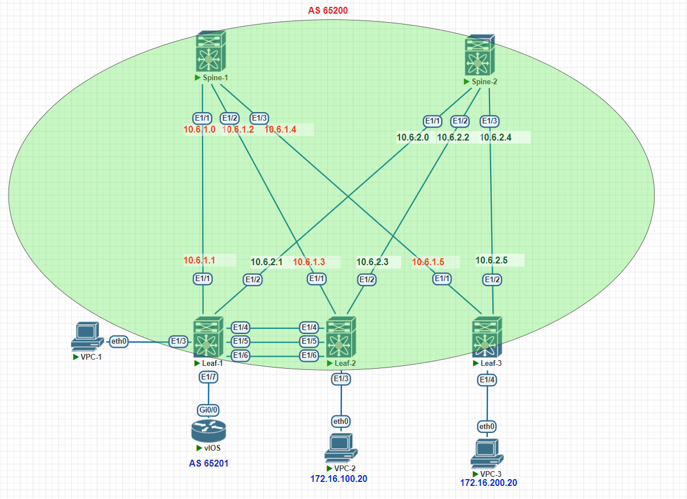

# Домашнее задание №8

## Реализовать передачу суммарных префиксов через EVPN route-type 5

### Задача:

- Анонсировать суммарные префиксы клиентов в Overlay сеть
- Настроить маршрутизацию между клиентами через суммарный префикс
- Проверить связанность между клиентами
- Зафиксируете в документации - план работы, адресное пространство, схему сети, настройки сетевого оборудования

## Выполнение:

### Схема сети



### Конфигурация оборудования

- #### [leaf-1](config/leaf-1.conf)

```
Leaf-1# sh run

cfs eth distribute
nv overlay evpn
feature ospf
feature bgp
feature fabric forwarding
feature interface-vlan
feature vn-segment-vlan-based
feature lacp
feature vpc
feature lldp
feature bfd
clock timezone MSK 3 0
feature nv overlay

spanning-tree mode mst

fabric forwarding anycast-gateway-mac 0000.dead.beef
vlan 1,100,200,900,999-1000,2000
vlan 100
  name Hosts
  vn-segment 100
vlan 200
  name Servers
  vn-segment 200
vlan 900
  name DMZ
  vn-segment 900
vlan 999
  name link_to_r2
vlan 1000
  name router-link
vlan 2000
  name VRF_MAIN_VXLAN_FORWARD
  vn-segment 2000

spanning-tree port type edge bpduguard default
spanning-tree loopguard default
spanning-tree mst 0-1 priority 4096
spanning-tree mst configuration
  name N-Leafs101-102
  revision 1
  instance 1 vlan 1-4094
ip prefix-list VXLAN-TO-EXT seq 5 permit 0.0.0.0/0 le 31
route-map PERMIT permit 10
vrf context DMZ
  vni 900
  rd auto
  address-family ipv4 unicast
    route-target both auto
    route-target both auto evpn
vrf context VPC
vrf context main
  vni 2000
  rd auto
  address-family ipv4 unicast
    route-target both auto
    route-target both auto evpn
vrf context management
vpc domain 101
  peer-switch
  role priority 100
  peer-keepalive destination 1.1.1.2 source 1.1.1.1 vrf VPC
  peer-gateway
  layer3 peer-router
  auto-recovery
  delay restore interface-vlan 100
  ip arp synchronize


interface Vlan1
  vrf member main
  no ip redirects
  no ipv6 redirects

interface Vlan100
  no shutdown
  vrf member DMZ
  no ip redirects
  ip address 172.16.100.1/24
  no ipv6 redirects
  fabric forwarding mode anycast-gateway

interface Vlan200
  no shutdown
  vrf member main
  no ip redirects
  ip address 172.16.200.1/24
  no ipv6 redirects
  fabric forwarding mode anycast-gateway

interface Vlan900
  no shutdown
  mtu 9216
  vrf member DMZ
  no ip redirects
  no ipv6 redirects

interface Vlan999
  description SVI_LINK_ROUTER
  no shutdown
  vrf member DMZ
  no ip redirects
  ip address 172.18.2.2/29
  no ipv6 redirects

interface Vlan1000
  description SVI_LINK_ROUTER
  no shutdown
  vrf member main
  no ip redirects
  ip address 172.17.2.2/29
  no ipv6 redirects

interface Vlan2000
  no shutdown
  mtu 9216
  vrf member main
  no ip redirects
  ip forward
  no ipv6 redirects

interface port-channel1
  description vpc-per-link
  switchport mode trunk
  spanning-tree port type network
  vpc peer-link

interface nve1
  no shutdown
  host-reachability protocol bgp
  advertise virtual-rmac
  source-interface loopback2
  member vni 100
    ingress-replication protocol bgp
  member vni 200
    ingress-replication protocol bgp
  member vni 900 associate-vrf
  member vni 2000 associate-vrf

interface Ethernet1/1
  description to-spine-1
  no switchport
  no ip redirects
  ip address 10.6.1.1/31
  ip ospf network point-to-point
  no ip ospf passive-interface
  ip router ospf UNDERLAY area 0.0.0.30
  no shutdown

interface Ethernet1/2
  description to-spine-2
  no switchport
  no ip redirects
  ip address 10.6.2.1/31
  ip ospf network point-to-point
  no ip ospf passive-interface
  ip router ospf UNDERLAY area 0.0.0.30
  ip ospf bfd
  no shutdown

interface Ethernet1/3
  description VPC1
  switchport access vlan 100

interface Ethernet1/4
  description vpc-per-link
  switchport mode trunk
  channel-group 1 mode active

interface Ethernet1/5
  description vpc-per-link
  switchport mode trunk
  channel-group 1 mode active

interface Ethernet1/6
  description vpc-keepalive
  no switchport
  vrf member VPC
  ip address 1.1.1.1/30
  no shutdown

interface Ethernet1/7
  description LINK_TO_ROUTER
  switchport mode trunk
  switchport trunk allowed vlan 999-1000

interface loopback2
  description VTEP
  ip address 10.1.0.1/32
  ip address 10.6.255.200/32 secondary
  ip router ospf UNDERLAY area 0.0.0.30
icam monitor scale

line console
line vty
router ospf UNDERLAY
  bfd
  router-id 10.1.0.1
router bgp 65200
  router-id 10.1.0.1
  address-family ipv4 unicast
    maximum-paths 2
  address-family l2vpn evpn
    advertise-pip
  template peer OVERLAY_LOCAL
    remote-as 65201
    log-neighbor-changes
    address-family ipv4 unicast
      route-map PERMIT out
      soft-reconfiguration inbound always
    address-family l2vpn evpn
  template peer RR
    bfd
    remote-as 65200
    log-neighbor-changes
    update-source loopback2
    address-family l2vpn evpn
      send-community
      send-community extended
  neighbor 10.1.1.0
    inherit peer RR
    address-family l2vpn evpn
  neighbor 10.2.1.0
    inherit peer RR
    address-family l2vpn evpn
  vrf DMZ
    address-family ipv4 unicast
      advertise l2vpn evpn
      redistribute direct route-map PERMIT
      maximum-paths 2
    neighbor 172.18.2.1
      inherit peer OVERLAY_LOCAL
      remote-as 65201
      address-family ipv4 unicast
        send-community
        send-community extended
        prefix-list VXLAN-TO-EXT out
  vrf main
    address-family ipv4 unicast
      advertise l2vpn evpn
      redistribute direct route-map PERMIT
      maximum-paths 2
    neighbor 172.17.2.1
      inherit peer OVERLAY_LOCAL
      remote-as 65201
      address-family ipv4 unicast
        send-community
        send-community extended
        no prefix-list VXLAN-TO-EXT out
evpn
  vni 100 l2
    rd auto
    route-target import auto
    route-target export auto
  vni 200 l2
    rd auto
    route-target import auto
    route-target export auto

```

- #### [leaf-2](config/leaf-2.conf)

```
Leaf-2# sh run

cfs eth distribute
nv overlay evpn
feature ospf
feature bgp
feature fabric forwarding
feature interface-vlan
feature vn-segment-vlan-based
feature lacp
feature vpc
feature bfd
clock timezone MSK 3 0
feature nv overlay

spanning-tree mode mst

fabric forwarding anycast-gateway-mac 0000.dead.beef
vlan 1,100,200,900,999-1000,2000
vlan 100
  name Hosts
  vn-segment 100
vlan 200
  name Servers
  vn-segment 200
vlan 900
  name DMZ
  vn-segment 900
vlan 999
  name link_to_r2
vlan 1000
  name to_router
vlan 2000
  name VRF_MAIN_VXLAN_FORWARD
  vn-segment 2000

spanning-tree port type edge bpduguard default
spanning-tree loopguard default
spanning-tree mst 0-1 priority 4096
spanning-tree mst configuration
  name N-Leafs101-102
  revision 1
  instance 1 vlan 1-4094
ip prefix-list VXLAN-TO-EXT seq 5 permit 0.0.0.0/0 le 31
route-map PERMIT permit 10
vrf context DMZ
  vni 900
  rd auto
  address-family ipv4 unicast
    route-target both auto
    route-target both auto evpn
vrf context VPC
vrf context main
  vni 2000
  rd auto
  address-family ipv4 unicast
    route-target both auto
    route-target both auto evpn
vrf context management
vpc domain 101
  peer-switch
  role priority 50
  peer-keepalive destination 1.1.1.1 source 1.1.1.2 vrf VPC
  peer-gateway
  layer3 peer-router
  auto-recovery
  delay restore interface-vlan 100
  ip arp synchronize


interface Vlan1
  vrf member main
  no ip redirects
  no ipv6 redirects

interface Vlan100
  no shutdown
  vrf member DMZ
  no ip redirects
  ip address 172.16.100.1/24
  no ipv6 redirects
  fabric forwarding mode anycast-gateway

interface Vlan200
  no shutdown
  vrf member main
  no ip redirects
  ip address 172.16.200.1/24
  no ipv6 redirects
  fabric forwarding mode anycast-gateway

interface Vlan900
  no shutdown
  mtu 9216
  vrf member DMZ
  no ip redirects
  no ipv6 redirects

interface Vlan999
  description SVI_LINK_ROUTER
  no shutdown
  vrf member DMZ
  no ip redirects
  ip address 172.18.2.3/29
  no ipv6 redirects

interface Vlan1000
  description SVI_LINK_ROUTER
  no shutdown
  vrf member main
  no ip redirects
  ip address 172.17.2.3/29
  no ipv6 redirects

interface Vlan2000
  no shutdown
  mtu 9216
  vrf member main
  no ip redirects
  ip forward
  no ipv6 redirects

interface port-channel1
  description vpc-per-link
  switchport mode trunk
  spanning-tree port type network
  vpc peer-link

interface nve1
  no shutdown
  host-reachability protocol bgp
  advertise virtual-rmac
  source-interface loopback2
  member vni 100
    ingress-replication protocol bgp
  member vni 200
    ingress-replication protocol bgp
  member vni 900 associate-vrf
  member vni 2000 associate-vrf

interface Ethernet1/1
  description to-spine-1
  no switchport
  no ip redirects
  ip address 10.6.1.3/31
  ip ospf network point-to-point
  no ip ospf passive-interface
  ip router ospf UNDERLAY area 0.0.0.30
  no shutdown

interface Ethernet1/2
  description to-spine-2
  no switchport
  no ip redirects
  ip address 10.6.2.3/31
  ip ospf network point-to-point
  no ip ospf passive-interface
  ip router ospf UNDERLAY area 0.0.0.30
  no shutdown

interface Ethernet1/3
  description VPC1
  switchport access vlan 200

interface Ethernet1/4
  description vpc-per-link
  switchport mode trunk
  channel-group 1 mode active

interface Ethernet1/5
  description vpc-per-link
  switchport mode trunk
  channel-group 1 mode active

interface Ethernet1/6
  description vpc-keepalive
  no switchport
  vrf member VPC
  ip address 1.1.1.2/30
  no shutdown

interface loopback2
  description VTEP
  ip address 10.1.0.2/32
  ip address 10.6.255.200/32 secondary
  ip router ospf UNDERLAY area 0.0.0.30
icam monitor scale

line console
line vty
router ospf UNDERLAY
  bfd
  router-id 10.1.0.2
  passive-interface default
router bgp 65200
  router-id 10.1.0.2
  address-family ipv4 unicast
    maximum-paths 2
  address-family l2vpn evpn
    advertise-pip
  template peer OVERLAY_LOCAL
    remote-as 65201
    log-neighbor-changes
    address-family ipv4 unicast
      route-reflector-client
      route-map PERMIT out
      soft-reconfiguration inbound always
  template peer RR
    bfd
    remote-as 65200
    log-neighbor-changes
    update-source loopback2
    address-family l2vpn evpn
      send-community
      send-community extended
  neighbor 10.1.1.0
    inherit peer RR
    address-family l2vpn evpn
  neighbor 10.2.1.0
    inherit peer RR
    address-family l2vpn evpn
  vrf DMZ
    address-family ipv4 unicast
      advertise l2vpn evpn
      redistribute direct route-map PERMIT
      maximum-paths 2
    neighbor 172.18.2.1
      inherit peer OVERLAY_LOCAL
      remote-as 65201
      address-family ipv4 unicast
        send-community
        send-community extended
  vrf main
    address-family ipv4 unicast
      advertise l2vpn evpn
      redistribute direct route-map PERMIT
      maximum-paths 2
    neighbor 172.17.2.1
      inherit peer OVERLAY_LOCAL
      remote-as 65201
      address-family ipv4 unicast
        send-community
        send-community extended
evpn
  vni 100 l2
    rd auto
    route-target import auto
    route-target export auto
  vni 200 l2
    rd auto
    route-target import auto
    route-target export auto

```

- #### [leaf-3](config/leaf-3.conf)

```
nv overlay evpn
feature ospf
feature bgp
feature fabric forwarding
feature interface-vlan
feature vn-segment-vlan-based
feature bfd
clock timezone MSK 3 0
feature nv overlay

fabric forwarding anycast-gateway-mac 0000.dead.beef
vlan 1,100,200,900,999-1000,2000
vlan 100
  name Hosts
  vn-segment 100
vlan 200
  name Servers
  vn-segment 200
vlan 900
  name DMZ
  vn-segment 900
vlan 1000
  name link_to_router
vlan 2000
  name VRF_MAIN_VXLAN_FORWARD
  vn-segment 2000

ip prefix-list VXLAN-TO-EXT seq 5 permit 0.0.0.0/0 le 31
route-map PERMIT permit 10
vrf context DMZ
  vni 900
  rd auto
  address-family ipv4 unicast
    route-target both auto
    route-target both auto evpn
vrf context main
  vni 2000
  rd auto
  address-family ipv4 unicast
    route-target both auto
    route-target both auto evpn
vrf context management


interface Vlan1
  vrf member main
  no ip redirects
  no ipv6 redirects

interface Vlan100
  no shutdown
  vrf member DMZ
  no ip redirects
  ip address 172.16.100.1/24
  no ipv6 redirects
  fabric forwarding mode anycast-gateway

interface Vlan200
  no shutdown
  vrf member main
  no ip redirects
  ip address 172.16.200.1/24
  no ipv6 redirects
  fabric forwarding mode anycast-gateway

interface Vlan900
  no shutdown
  mtu 9216
  vrf member DMZ
  no ip redirects
  no ipv6 redirects

interface Vlan999
  description SVI_LINK_ROUTER
  no shutdown
  vrf member DMZ
  no ip redirects
  ip address 172.18.2.4/29
  no ipv6 redirects

interface Vlan1000
  description SVI_LINK_ROUTER
  no shutdown
  vrf member main
  no ip redirects
  ip address 172.17.2.4/29
  no ipv6 redirects

interface Vlan2000
  no shutdown
  mtu 9216
  vrf member main
  no ip redirects
  ip forward
  no ipv6 redirects

interface nve1
  no shutdown
  host-reachability protocol bgp
  advertise virtual-rmac
  source-interface loopback2
  member vni 100
    ingress-replication protocol bgp
  member vni 200
    ingress-replication protocol bgp
  member vni 900 associate-vrf
  member vni 2000 associate-vrf

interface Ethernet1/1
  description to-spine-1
  no switchport
  no ip redirects
  ip address 10.6.1.5/31
  ip ospf network point-to-point
  no ip ospf passive-interface
  ip router ospf UNDERLAY area 0.0.0.30
  no shutdown

interface Ethernet1/2
  description to-spine-2
  no switchport
  no ip redirects
  ip address 10.6.2.5/31
  ip ospf network point-to-point
  no ip ospf passive-interface
  ip router ospf UNDERLAY area 0.0.0.30
  no shutdown

interface Ethernet1/4
  description VPC4
  switchport access vlan 200

interface mgmt0
  vrf member management

interface loopback2
  ip address 10.1.0.3/32
  ip router ospf UNDERLAY area 0.0.0.30
icam monitor scale

line console
line vty
router ospf UNDERLAY
  bfd
  router-id 10.1.0.3
  passive-interface default
router bgp 65200
  router-id 10.1.0.3
  address-family ipv4 unicast
    maximum-paths 2
  address-family l2vpn evpn
    advertise-pip
  template peer OVERLAY_LOCAL
    remote-as 65201
    log-neighbor-changes
    address-family ipv4 unicast
      route-map PERMIT out
      soft-reconfiguration inbound always
  template peer RR
    bfd
    remote-as 65200
    log-neighbor-changes
    update-source loopback2
    address-family l2vpn evpn
      send-community
      send-community extended
  neighbor 10.1.1.0
    inherit peer RR
    address-family l2vpn evpn
  neighbor 10.2.1.0
    inherit peer RR
    address-family l2vpn evpn
  vrf DMZ
    address-family ipv4 unicast
      advertise l2vpn evpn
      redistribute direct route-map PERMIT
      maximum-paths 2
  vrf main
    address-family ipv4 unicast
      advertise l2vpn evpn
      redistribute direct route-map PERMIT
      maximum-paths 2
evpn
  vni 100 l2
    rd auto
    route-target import auto
    route-target export auto
  vni 200 l2
    rd auto
    route-target import auto
    route-target export auto

```

- #### [router](config/router.conf)

```
interface Loopback1
 ip address 8.8.8.8 255.255.255.255
!
interface Loopback2
 ip address 8.8.4.4 255.255.255.255
!
interface GigabitEthernet0/0
 no ip address
 duplex full
 speed auto
 media-type rj45
!
interface GigabitEthernet0/0.999
 encapsulation dot1Q 999
 ip address 172.18.2.1 255.255.255.248
!
interface GigabitEthernet0/0.1000
 encapsulation dot1Q 1000
 ip address 172.17.2.1 255.255.255.248
!
interface GigabitEthernet0/1
 no ip address
 shutdown
 duplex auto
 speed auto
 media-type rj45
!
interface GigabitEthernet0/2
 no ip address
 shutdown
 duplex auto
 speed auto
 media-type rj45
!
interface GigabitEthernet0/3
 no ip address
 shutdown
 duplex auto
 speed auto
 media-type rj45
!
router bgp 65201
 bgp router-id 172.18.255.1
 bgp log-neighbor-changes
 neighbor 172.17.2.2 remote-as 65200
 neighbor 172.17.2.3 remote-as 65200
 neighbor 172.17.2.4 remote-as 65200
 neighbor 172.18.2.2 remote-as 65200
 neighbor 172.18.2.3 remote-as 65200
 neighbor 172.18.2.4 remote-as 65200
 !
 address-family ipv4
  network 8.8.8.8 mask 255.255.255.255
  redistribute static
  neighbor 172.17.2.2 activate
  neighbor 172.17.2.2 default-originate
  neighbor 172.17.2.3 activate
  neighbor 172.17.2.3 default-originate
  neighbor 172.17.2.4 activate
  neighbor 172.17.2.4 default-originate
  neighbor 172.18.2.2 activate
  neighbor 172.18.2.2 default-originate
  neighbor 172.18.2.3 activate
  neighbor 172.18.2.3 default-originate
  neighbor 172.18.2.4 activate
  neighbor 172.18.2.4 default-originate
 exit-address-family
!
ip forward-protocol nd
!
!
no ip http server
no ip http secure-server
ip route 0.0.0.0 0.0.0.0 Null0

```
---

### Проверка связанности клиентов по L3

- #### leaf-1

```
Leaf-1# sh ip route vrf main
0.0.0.0/0, ubest/mbest: 1/0
    *via 172.17.2.1, [20/0], 02:12:26, bgp-65200, external, tag 65201
8.8.8.8/32, ubest/mbest: 1/0
    *via 172.17.2.1, [20/0], 02:12:26, bgp-65200, external, tag 65201
172.16.200.0/24, ubest/mbest: 1/0, attached
    *via 172.16.200.1, Vlan200, [0/0], 02:23:25, direct
172.16.200.1/32, ubest/mbest: 1/0, attached
    *via 172.16.200.1, Vlan200, [0/0], 02:23:25, local
172.16.200.40/32, ubest/mbest: 1/0, attached
    *via 172.16.200.40, Vlan200, [190/0], 01:21:48, hmm
172.17.2.0/29, ubest/mbest: 1/0, attached
    *via 172.17.2.2, Vlan1000, [0/0], 03:11:23, direct
172.17.2.2/32, ubest/mbest: 1/0, attached
    *via 172.17.2.2, Vlan1000, [0/0], 03:11:23, local

Leaf-1# sh ip route vrf DMZ
0.0.0.0/0, ubest/mbest: 1/0
    *via 172.18.2.1, [20/0], 02:12:40, bgp-65200, external, tag 65201
8.8.8.8/32, ubest/mbest: 1/0
    *via 172.18.2.1, [20/0], 02:12:40, bgp-65200, external, tag 65201
172.16.100.0/24, ubest/mbest: 1/0, attached
    *via 172.16.100.1, Vlan100, [0/0], 02:13:48, direct
172.16.100.1/32, ubest/mbest: 1/0, attached
    *via 172.16.100.1, Vlan100, [0/0], 02:13:48, local
172.16.100.30/32, ubest/mbest: 1/0, attached
    *via 172.16.100.30, Vlan100, [190/0], 01:27:22, hmm
172.18.2.0/29, ubest/mbest: 1/0, attached
    *via 172.18.2.2, Vlan999, [0/0], 02:30:03, direct
172.18.2.2/32, ubest/mbest: 1/0, attached
    *via 172.18.2.2, Vlan999, [0/0], 02:30:03, local


```
```
Leaf-1# sh bgp l2vpn evpn
   Network            Next Hop            Metric     LocPrf     Weight Path
Route Distinguisher: 10.1.0.1:32867    (L2VNI 100)
*>l[2]:[0]:[0]:[48]:[0050.7966.6807]:[0]:[0.0.0.0]/216
                      10.6.255.200                      100      32768 i
*>l[2]:[0]:[0]:[48]:[0050.7966.6810]:[0]:[0.0.0.0]/216
                      10.6.255.200                      100      32768 i
*>l[2]:[0]:[0]:[48]:[5ea4.c2b6.6e04]:[0]:[0.0.0.0]/216
                      10.6.255.200                      100      32768 i
*>l[2]:[0]:[0]:[48]:[0050.7966.6807]:[32]:[172.16.100.20]/272
                      10.6.255.200                      100      32768 i
*>l[2]:[0]:[0]:[48]:[0050.7966.6810]:[32]:[172.16.100.30]/272
                      10.6.255.200                      100      32768 i
*>i[3]:[0]:[32]:[10.1.0.3]/88
                      10.1.0.3                          100          0 i
*>l[3]:[0]:[32]:[10.6.255.200]/88
                      10.6.255.200                      100      32768 i

Route Distinguisher: 10.1.0.1:32967    (L2VNI 200)
*>i[2]:[0]:[0]:[48]:[0050.7966.6808]:[0]:[0.0.0.0]/216
                      10.1.0.3                          100          0 i
*>i[2]:[0]:[0]:[48]:[0050.7966.6808]:[32]:[172.16.200.20]/272
                      10.1.0.3                          100          0 i
*>i[3]:[0]:[32]:[10.1.0.3]/88
                      10.1.0.3                          100          0 i
*>l[3]:[0]:[32]:[10.6.255.200]/88
                      10.6.255.200                      100      32768 i

Route Distinguisher: 10.1.0.2:4
*>i[5]:[0]:[0]:[0]:[0.0.0.0]/224
                      10.1.0.2                          100          0 65201 i
* i                   10.1.0.2                          100          0 65201 i
* i[5]:[0]:[0]:[24]:[172.16.100.0]/224
                      10.1.0.2                 0        100          0 ?
*>i                   10.1.0.2                 0        100          0 ?
* i[5]:[0]:[0]:[24]:[172.16.200.0]/224
                      10.1.0.2                 0        100          0 ?
*>i                   10.1.0.2                 0        100          0 ?
* i[5]:[0]:[0]:[29]:[172.17.2.0]/224
                      10.1.0.2                 0        100          0 ?
*>i                   10.1.0.2                 0        100          0 ?
* i[5]:[0]:[0]:[32]:[8.8.8.8]/224
                      10.1.0.2                 0        100          0 65201 i
*>i                   10.1.0.2                 0        100          0 65201 i

Route Distinguisher: 10.1.0.3:3
*>i[2]:[0]:[0]:[48]:[5000.0500.1b08]:[0]:[0.0.0.0]/216
                      10.1.0.3                          100          0 i
* i                   10.1.0.3                          100          0 i
* i[5]:[0]:[0]:[24]:[172.16.100.0]/224
                      10.1.0.3                 0        100          0 ?
*>i                   10.1.0.3                 0        100          0 ?
* i[5]:[0]:[0]:[24]:[172.16.200.0]/224
                      10.1.0.3                 0        100          0 ?
*>i                   10.1.0.3                 0        100          0 ?

Route Distinguisher: 10.1.0.3:32867
*>i[3]:[0]:[32]:[10.1.0.3]/88
                      10.1.0.3                          100          0 i
* i                   10.1.0.3                          100          0 i

Route Distinguisher: 10.1.0.3:32967
*>i[2]:[0]:[0]:[48]:[0050.7966.6808]:[0]:[0.0.0.0]/216
                      10.1.0.3                          100          0 i
* i                   10.1.0.3                          100          0 i
*>i[2]:[0]:[0]:[48]:[0050.7966.6808]:[32]:[172.16.200.20]/272
                      10.1.0.3                          100          0 i
* i                   10.1.0.3                          100          0 i
*>i[3]:[0]:[32]:[10.1.0.3]/88
                      10.1.0.3                          100          0 i
* i                   10.1.0.3                          100          0 i

Route Distinguisher: 10.1.0.1:4    (L3VNI 2000)
*>l[2]:[0]:[0]:[48]:[5000.0300.1b08]:[0]:[0.0.0.0]/216
                      10.6.255.200                      100      32768 i
*>i[2]:[0]:[0]:[48]:[5000.0500.1b08]:[0]:[0.0.0.0]/216
                      10.1.0.3                          100          0 i
*>i[2]:[0]:[0]:[48]:[0050.7966.6808]:[32]:[172.16.200.20]/272
                      10.1.0.3                          100          0 i
* i[5]:[0]:[0]:[0]:[0.0.0.0]/224
                      10.1.0.2                          100          0 65201 i
*>l                   10.1.0.1                                       0 65201 i
* i[5]:[0]:[0]:[24]:[172.16.100.0]/224
                      10.1.0.3                 0        100          0 ?
* i                   10.1.0.2                 0        100          0 ?
*>l                   10.1.0.1                 0        100      32768 ?
* i[5]:[0]:[0]:[24]:[172.16.200.0]/224
                      10.1.0.3                 0        100          0 ?
* i                   10.1.0.2                 0        100          0 ?
*>l                   10.1.0.1                 0        100      32768 ?
* i[5]:[0]:[0]:[29]:[172.17.2.0]/224
                      10.1.0.2                 0        100          0 ?
*>l                   10.1.0.1                 0        100      32768 ?
* i[5]:[0]:[0]:[32]:[8.8.8.8]/224
                      10.1.0.2                 0        100          0 65201 i
*>l                   10.1.0.1                 0                     0 65201 i

```
```
Leaf-1# sh nve peers
Interface Peer-IP                                 State LearnType Uptime   Route
r-Mac
--------- --------------------------------------  ----- --------- -------- -----
------------
nve1      10.1.0.2                                Up    CP        01:58:02 5000.
0400.1b08
nve1      10.1.0.3                                Up    CP        06:21:09 5000.
0500.1b08


```
```  
Leaf-1# show nve vni
Codes: CP - Control Plane        DP - Data Plane
       UC - Unconfigured         SA - Suppress ARP
       SU - Suppress Unknown Unicast
       Xconn - Crossconnect
       MS-IR - Multisite Ingress Replication

Interface VNI      Multicast-group   State Mode Type [BD/VRF]      Flags
--------- -------- ----------------- ----- ---- ------------------ -----
nve1      100      UnicastBGP        Up    CP   L2 [100]
nve1      200      UnicastBGP        Up    CP   L2 [200]
nve1      2000     n/a               Up    CP   L3 [main]

```

- #### leaf-2

```
Leaf-2# sh ip route vrf main
0.0.0.0/0, ubest/mbest: 1/0
    *via 172.17.2.1, [20/0], 00:43:59, bgp-65200, external, tag 65201
8.8.8.8/32, ubest/mbest: 1/0
    *via 172.17.2.1, [20/0], 00:44:54, bgp-65200, external, tag 65201
172.16.100.0/24, ubest/mbest: 1/0, attached
    *via 172.16.100.1, Vlan100, [0/0], 09:23:23, direct
172.16.100.1/32, ubest/mbest: 1/0, attached
    *via 172.16.100.1, Vlan100, [0/0], 09:23:23, local
172.16.100.20/32, ubest/mbest: 1/0, attached
    *via 172.16.100.20, Vlan100, [190/0], 01:36:50, hmm
172.16.100.30/32, ubest/mbest: 1/0, attached
    *via 172.16.100.30, Vlan100, [190/0], 02:07:18, hmm
172.16.200.0/24, ubest/mbest: 1/0, attached
    *via 172.16.200.1, Vlan200, [0/0], 09:23:23, direct
172.16.200.1/32, ubest/mbest: 1/0, attached
    *via 172.16.200.1, Vlan200, [0/0], 09:23:23, local
172.16.200.20/32, ubest/mbest: 1/0
    *via 10.1.0.3%default, [200/0], 08:29:21, bgp-65200, internal, tag 65200, se
gid: 2000 tunnelid: 0xa010003 encap: VXLAN

172.17.2.0/29, ubest/mbest: 1/0, attached
    *via 172.17.2.3, Vlan1000, [0/0], 00:45:21, direct
172.17.2.3/32, ubest/mbest: 1/0, attached
    *via 172.17.2.3, Vlan1000, [0/0], 00:45:21, local

```
```
Leaf-2# sh bgp l2vpn evpn
   Network            Next Hop            Metric     LocPrf     Weight Path
Route Distinguisher: 10.1.0.1:4
*>i[5]:[0]:[0]:[0]:[0.0.0.0]/224
                      10.1.0.1                          100          0 65201 i
* i                   10.1.0.1                          100          0 65201 i
* i[5]:[0]:[0]:[24]:[172.16.100.0]/224
                      10.1.0.1                 0        100          0 ?
*>i                   10.1.0.1                 0        100          0 ?
* i[5]:[0]:[0]:[24]:[172.16.200.0]/224
                      10.1.0.1                 0        100          0 ?
*>i                   10.1.0.1                 0        100          0 ?
* i[5]:[0]:[0]:[29]:[172.17.2.0]/224
                      10.1.0.1                 0        100          0 ?
*>i                   10.1.0.1                 0        100          0 ?
*>i[5]:[0]:[0]:[32]:[8.8.8.8]/224
                      10.1.0.1                 0        100          0 65201 i
* i                   10.1.0.1                 0        100          0 65201 i

Route Distinguisher: 10.1.0.2:32867    (L2VNI 100)
*>l[2]:[0]:[0]:[48]:[0050.7966.6807]:[0]:[0.0.0.0]/216
                      10.6.255.200                      100      32768 i
*>l[2]:[0]:[0]:[48]:[0050.7966.6810]:[0]:[0.0.0.0]/216
                      10.6.255.200                      100      32768 i
*>l[2]:[0]:[0]:[48]:[0050.7966.6807]:[32]:[172.16.100.20]/272
                      10.6.255.200                      100      32768 i
*>l[2]:[0]:[0]:[48]:[0050.7966.6810]:[32]:[172.16.100.30]/272
                      10.6.255.200                      100      32768 i
*>i[3]:[0]:[32]:[10.1.0.3]/88
                      10.1.0.3                          100          0 i
*>l[3]:[0]:[32]:[10.6.255.200]/88
                      10.6.255.200                      100      32768 i

Route Distinguisher: 10.1.0.2:32967    (L2VNI 200)
*>i[2]:[0]:[0]:[48]:[0050.7966.6808]:[0]:[0.0.0.0]/216
                      10.1.0.3                          100          0 i
*>i[2]:[0]:[0]:[48]:[0050.7966.6808]:[32]:[172.16.200.20]/272
                      10.1.0.3                          100          0 i
*>i[3]:[0]:[32]:[10.1.0.3]/88
                      10.1.0.3                          100          0 i
*>l[3]:[0]:[32]:[10.6.255.200]/88
                      10.6.255.200                      100      32768 i

Route Distinguisher: 10.1.0.3:3
*>i[2]:[0]:[0]:[48]:[5000.0500.1b08]:[0]:[0.0.0.0]/216
                      10.1.0.3                          100          0 i
* i                   10.1.0.3                          100          0 i
* i[5]:[0]:[0]:[24]:[172.16.100.0]/224
                      10.1.0.3                 0        100          0 ?
*>i                   10.1.0.3                 0        100          0 ?
* i[5]:[0]:[0]:[24]:[172.16.200.0]/224
                      10.1.0.3                 0        100          0 ?
*>i                   10.1.0.3                 0        100          0 ?

Route Distinguisher: 10.1.0.3:32867
*>i[3]:[0]:[32]:[10.1.0.3]/88
                      10.1.0.3                          100          0 i
* i                   10.1.0.3                          100          0 i

Route Distinguisher: 10.1.0.3:32967
*>i[2]:[0]:[0]:[48]:[0050.7966.6808]:[0]:[0.0.0.0]/216
                      10.1.0.3                          100          0 i
* i                   10.1.0.3                          100          0 i
*>i[2]:[0]:[0]:[48]:[0050.7966.6808]:[32]:[172.16.200.20]/272
                      10.1.0.3                          100          0 i
* i                   10.1.0.3                          100          0 i
*>i[3]:[0]:[32]:[10.1.0.3]/88
                      10.1.0.3                          100          0 i
* i                   10.1.0.3                          100          0 i

Route Distinguisher: 10.1.0.2:4    (L3VNI 2000)
*>l[2]:[0]:[0]:[48]:[5000.0400.1b08]:[0]:[0.0.0.0]/216
                      10.6.255.200                      100      32768 i
*>i[2]:[0]:[0]:[48]:[5000.0500.1b08]:[0]:[0.0.0.0]/216
                      10.1.0.3                          100          0 i
*>i[2]:[0]:[0]:[48]:[0050.7966.6808]:[32]:[172.16.200.20]/272
                      10.1.0.3                          100          0 i
*>l[5]:[0]:[0]:[0]:[0.0.0.0]/224
                      10.1.0.2                                       0 65201 i
* i                   10.1.0.1                          100          0 65201 i
* i[5]:[0]:[0]:[24]:[172.16.100.0]/224
                      10.1.0.3                 0        100          0 ?
*>l                   10.1.0.2                 0        100      32768 ?
* i                   10.1.0.1                 0        100          0 ?
* i[5]:[0]:[0]:[24]:[172.16.200.0]/224
                      10.1.0.3                 0        100          0 ?
*>l                   10.1.0.2                 0        100      32768 ?
* i                   10.1.0.1                 0        100          0 ?
*>l[5]:[0]:[0]:[29]:[172.17.2.0]/224
                      10.1.0.2                 0        100      32768 ?
* i                   10.1.0.1                 0        100          0 ?
*>l[5]:[0]:[0]:[32]:[8.8.8.8]/224
                      10.1.0.2                 0                     0 65201 i
* i                   10.1.0.1                 0        100          0 65201 i

```
```
Leaf-2# sh nve peers
Interface Peer-IP                                 State LearnType Uptime   Route
r-Mac
--------- --------------------------------------  ----- --------- -------- -----
------------
nve1      10.1.0.1                                Up    CP        06:21:07 5000.
0300.1b08
nve1      10.1.0.3                                Up    CP        09:03:25 5000.
0500.1b08

```
```  
Leaf-2# show nve vni
Codes: CP - Control Plane        DP - Data Plane
       UC - Unconfigured         SA - Suppress ARP
       SU - Suppress Unknown Unicast
       Xconn - Crossconnect
       MS-IR - Multisite Ingress Replication

Interface VNI      Multicast-group   State Mode Type [BD/VRF]      Flags
--------- -------- ----------------- ----- ---- ------------------ -----
nve1      100      UnicastBGP        Up    CP   L2 [100]
nve1      200      UnicastBGP        Up    CP   L2 [200]
nve1      2000     n/a               Up    CP   L3 [main]

```

- #### leaf-3

```
Leaf-3# sh ip route vrf main

0.0.0.0/0, ubest/mbest: 1/0
    *via 10.1.0.1%default, [200/0], 01:02:09, bgp-65200, internal, tag 65201, se
gid: 2000 tunnelid: 0xa010001 encap: VXLAN
8.8.8.8/32, ubest/mbest: 1/0
    *via 10.1.0.1%default, [200/0], 01:02:09, bgp-65200, internal, tag 65201, se
gid: 2000 tunnelid: 0xa010001 encap: VXLAN
172.16.100.0/24, ubest/mbest: 1/0, attached
    *via 172.16.100.1, Vlan100, [0/0], 09:09:15, direct
172.16.100.1/32, ubest/mbest: 1/0, attached
    *via 172.16.100.1, Vlan100, [0/0], 09:09:15, local
172.16.100.20/32, ubest/mbest: 1/0
    *via 10.6.255.200%default, [200/0], 01:38:34, bgp-65200, internal, tag 65200
, segid: 2000 tunnelid: 0xa06ffc8 encap: VXLAN
172.16.100.30/32, ubest/mbest: 1/0
    *via 10.6.255.200%default, [200/0], 02:09:02, bgp-65200, internal, tag 65200
, segid: 2000 tunnelid: 0xa06ffc8 encap: VXLAN

172.16.200.0/24, ubest/mbest: 1/0, attached
    *via 172.16.200.1, Vlan200, [0/0], 09:09:15, direct
172.16.200.1/32, ubest/mbest: 1/0, attached
    *via 172.16.200.1, Vlan200, [0/0], 09:09:15, local
172.16.200.20/32, ubest/mbest: 1/0, attached
    *via 172.16.200.20, Vlan200, [190/0], 08:31:05, hmm
172.17.2.0/29, ubest/mbest: 1/0
    *via 10.1.0.1%default, [200/0], 01:02:45, bgp-65200, internal, tag 65200, se
gid: 2000 tunnelid: 0xa010001 encap: VXLAN

```
```
Leaf-3# sh bgp l2vpn evpn
   Network            Next Hop            Metric     LocPrf     Weight Path
Route Distinguisher: 10.1.0.1:4
* i[2]:[0]:[0]:[48]:[5000.0300.1b08]:[0]:[0.0.0.0]/216
                      10.6.255.200                      100          0 i
*>i                   10.6.255.200                      100          0 i
*>i[5]:[0]:[0]:[0]:[0.0.0.0]/224
                      10.1.0.1                          100          0 65201 i
* i                   10.1.0.1                          100          0 65201 i
* i[5]:[0]:[0]:[24]:[172.16.100.0]/224
                      10.1.0.1                 0        100          0 ?
*>i                   10.1.0.1                 0        100          0 ?
* i[5]:[0]:[0]:[24]:[172.16.200.0]/224
                      10.1.0.1                 0        100          0 ?
*>i                   10.1.0.1                 0        100          0 ?
* i[5]:[0]:[0]:[29]:[172.17.2.0]/224
                      10.1.0.1                 0        100          0 ?
*>i                   10.1.0.1                 0        100          0 ?
*>i[5]:[0]:[0]:[32]:[8.8.8.8]/224
                      10.1.0.1                 0        100          0 65201 i
* i                   10.1.0.1                 0        100          0 65201 i

Route Distinguisher: 10.1.0.1:32867
* i[2]:[0]:[0]:[48]:[0050.7966.6807]:[0]:[0.0.0.0]/216
                      10.6.255.200                      100          0 i
*>i                   10.6.255.200                      100          0 i
* i[2]:[0]:[0]:[48]:[0050.7966.6810]:[0]:[0.0.0.0]/216
                      10.6.255.200                      100          0 i
*>i                   10.6.255.200                      100          0 i
*>i[2]:[0]:[0]:[48]:[0050.7966.6807]:[32]:[172.16.100.20]/272
                      10.6.255.200                      100          0 i
* i                   10.6.255.200                      100          0 i
* i[2]:[0]:[0]:[48]:[0050.7966.6810]:[32]:[172.16.100.30]/272
                      10.6.255.200                      100          0 i
*>i                   10.6.255.200                      100          0 i
*>i[3]:[0]:[32]:[10.6.255.200]/88
                      10.6.255.200                      100          0 i
* i                   10.6.255.200                      100          0 i

Route Distinguisher: 10.1.0.1:32967
*>i[3]:[0]:[32]:[10.6.255.200]/88
                      10.6.255.200                      100          0 i
* i                   10.6.255.200                      100          0 i

Route Distinguisher: 10.1.0.2:4
* i[2]:[0]:[0]:[48]:[5000.0400.1b08]:[0]:[0.0.0.0]/216
                      10.6.255.200                      100          0 i
*>i                   10.6.255.200                      100          0 i
*>i[5]:[0]:[0]:[0]:[0.0.0.0]/224
                      10.1.0.2                          100          0 65201 i
* i                   10.1.0.2                          100          0 65201 i
* i[5]:[0]:[0]:[24]:[172.16.100.0]/224
                      10.1.0.2                 0        100          0 ?
*>i                   10.1.0.2                 0        100          0 ?
* i[5]:[0]:[0]:[24]:[172.16.200.0]/224
                      10.1.0.2                 0        100          0 ?
*>i                   10.1.0.2                 0        100          0 ?
* i[5]:[0]:[0]:[29]:[172.17.2.0]/224
                      10.1.0.2                 0        100          0 ?
*>i                   10.1.0.2                 0        100          0 ?
* i[5]:[0]:[0]:[32]:[8.8.8.8]/224
                      10.1.0.2                 0        100          0 65201 i
*>i                   10.1.0.2                 0        100          0 65201 i

Route Distinguisher: 10.1.0.2:32867
*>i[2]:[0]:[0]:[48]:[0050.7966.6807]:[0]:[0.0.0.0]/216
                      10.6.255.200                      100          0 i
* i                   10.6.255.200                      100          0 i
* i[2]:[0]:[0]:[48]:[0050.7966.6810]:[0]:[0.0.0.0]/216
                      10.6.255.200                      100          0 i
*>i                   10.6.255.200                      100          0 i
*>i[2]:[0]:[0]:[48]:[0050.7966.6807]:[32]:[172.16.100.20]/272
                      10.6.255.200                      100          0 i
* i                   10.6.255.200                      100          0 i
* i[2]:[0]:[0]:[48]:[0050.7966.6810]:[32]:[172.16.100.30]/272
                      10.6.255.200                      100          0 i
*>i                   10.6.255.200                      100          0 i
* i[3]:[0]:[32]:[10.6.255.200]/88
                      10.6.255.200                      100          0 i
*>i                   10.6.255.200                      100          0 i

Route Distinguisher: 10.1.0.2:32967
* i[3]:[0]:[32]:[10.6.255.200]/88
                      10.6.255.200                      100          0 i
*>i                   10.6.255.200                      100          0 i

Route Distinguisher: 10.1.0.3:32867    (L2VNI 100)
*>i[2]:[0]:[0]:[48]:[0050.7966.6807]:[0]:[0.0.0.0]/216
                      10.6.255.200                      100          0 i
* i                   10.6.255.200                      100          0 i
* i[2]:[0]:[0]:[48]:[0050.7966.6810]:[0]:[0.0.0.0]/216
                      10.6.255.200                      100          0 i
*>i                   10.6.255.200                      100          0 i
*>i[2]:[0]:[0]:[48]:[0050.7966.6807]:[32]:[172.16.100.20]/272
                      10.6.255.200                      100          0 i
* i                   10.6.255.200                      100          0 i
*>i[2]:[0]:[0]:[48]:[0050.7966.6810]:[32]:[172.16.100.30]/272
                      10.6.255.200                      100          0 i
* i                   10.6.255.200                      100          0 i
*>l[3]:[0]:[32]:[10.1.0.3]/88
                      10.1.0.3                          100      32768 i
*>i[3]:[0]:[32]:[10.6.255.200]/88
                      10.6.255.200                      100          0 i
* i                   10.6.255.200                      100          0 i

Route Distinguisher: 10.1.0.3:32967    (L2VNI 200)
*>l[2]:[0]:[0]:[48]:[0050.7966.6808]:[0]:[0.0.0.0]/216
                      10.1.0.3                          100      32768 i
*>l[2]:[0]:[0]:[48]:[0050.7966.6808]:[32]:[172.16.200.20]/272
                      10.1.0.3                          100      32768 i
*>l[3]:[0]:[32]:[10.1.0.3]/88
                      10.1.0.3                          100      32768 i
*>i[3]:[0]:[32]:[10.6.255.200]/88
                      10.6.255.200                      100          0 i
* i                   10.6.255.200                      100          0 i

Route Distinguisher: 10.1.0.3:3    (L3VNI 2000)
*>i[2]:[0]:[0]:[48]:[5000.0300.1b08]:[0]:[0.0.0.0]/216
                      10.6.255.200                      100          0 i
*>i[2]:[0]:[0]:[48]:[5000.0400.1b08]:[0]:[0.0.0.0]/216
                      10.6.255.200                      100          0 i
*>l[2]:[0]:[0]:[48]:[5000.0500.1b08]:[0]:[0.0.0.0]/216
                      10.1.0.3                          100      32768 i
*>i[2]:[0]:[0]:[48]:[0050.7966.6807]:[32]:[172.16.100.20]/272
                      10.6.255.200                      100          0 i
* i                   10.6.255.200                      100          0 i
*>i[2]:[0]:[0]:[48]:[0050.7966.6810]:[32]:[172.16.100.30]/272
                      10.6.255.200                      100          0 i
* i                   10.6.255.200                      100          0 i
* i[5]:[0]:[0]:[0]:[0.0.0.0]/224
                      10.1.0.2                          100          0 65201 i
*>i                   10.1.0.1                          100          0 65201 i
*>l[5]:[0]:[0]:[24]:[172.16.100.0]/224
                      10.1.0.3                 0        100      32768 ?
* i                   10.1.0.2                 0        100          0 ?
* i                   10.1.0.1                 0        100          0 ?
*>l[5]:[0]:[0]:[24]:[172.16.200.0]/224
                      10.1.0.3                 0        100      32768 ?
* i                   10.1.0.2                 0        100          0 ?
* i                   10.1.0.1                 0        100          0 ?
* i[5]:[0]:[0]:[29]:[172.17.2.0]/224
                      10.1.0.2                 0        100          0 ?
*>i                   10.1.0.1                 0        100          0 ?
* i[5]:[0]:[0]:[32]:[8.8.8.8]/224
                      10.1.0.2                 0        100          0 65201 i
*>i                   10.1.0.1                 0        100          0 65201 i

```
```
Leaf-3# sh nve peers
Interface Peer-IP                                 State LearnType Uptime   Route
r-Mac
--------- --------------------------------------  ----- --------- -------- -----
------------
nve1      10.1.0.1                                Up    CP        06:23:46 5000.
0300.1b08
nve1      10.1.0.2                                Up    CP        02:01:56 5000.
0400.1b08
nve1      10.6.255.200                            Up    CP        09:06:04 0200.
0a06.ffc8

```
```
Leaf-3# show nve vni
Interface VNI      Multicast-group   State Mode Type [BD/VRF]      Flags
--------- -------- ----------------- ----- ---- ------------------ -----
nve1      100      UnicastBGP        Up    CP   L2 [100]
nve1      200      UnicastBGP        Up    CP   L2 [200]
nve1      2000     n/a               Up    CP   L3 [main]

```

- #### VPC-1

```
VPCS-1> ping 8.8.8.8
84 bytes from 8.8.8.8 icmp_seq=1 ttl=254 time=16.042 ms
84 bytes from 8.8.8.8 icmp_seq=2 ttl=254 time=12.088 ms
84 bytes from 8.8.8.8 icmp_seq=3 ttl=254 time=13.999 ms
84 bytes from 8.8.8.8 icmp_seq=4 ttl=254 time=11.256 ms
84 bytes from 8.8.8.8 icmp_seq=5 ttl=254 time=9.745 ms

```

- #### VPC-2

```
VPCS-2> ping 8.8.8.8
84 bytes from 8.8.8.8 icmp_seq=1 ttl=254 time=12.358 ms
84 bytes from 8.8.8.8 icmp_seq=2 ttl=254 time=355.811 ms
84 bytes from 8.8.8.8 icmp_seq=3 ttl=254 time=6.270 ms
84 bytes from 8.8.8.8 icmp_seq=4 ttl=254 time=10.399 ms
84 bytes from 8.8.8.8 icmp_seq=5 ttl=254 time=6.149 ms
```

```

