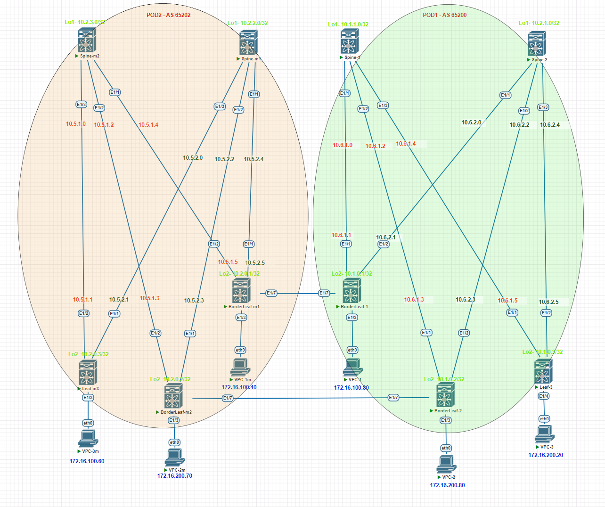

# Проектная работа

## Тема: Построение фабрики VXLAN/EVPN для двух POD с использованием технологии multisite

### Цели:

- Построение двух POD VXLAN/EVPN
- Подключение резервного ЦОД с использованием технологии “multisite”

## План:

- Разработка отказоустойчивой и масштабируемой топологии CLOS
- Проектирование DCI с помощью “multisite”
- Проектирование адресного пространства
- Проектирование Underlay и Overlay сетей

### [Презинтация проекта](file/presentation.pptx)

### Схема проектируемой сети



### Конфигурация оборудования

#### POD 1
- [POD1-Spine-1](config/POD-1-Spine-1.conf)
- [POD1-Spine-2](config/POD-1-Spine-2.conf)
- [POD1-BorderLeaf-1](config/POD-1-Leaf-1.conf)
- [POD1-BorderLeaf-2](config/POD-1-Leaf-2.conf)
- [POD1-Leaf-3](config/POD-1-Leaf-3.conf)

#### POD 2
- [POD2-Spine-m1](config/POD-2-Spine-m1.conf)
- [POD2-Spine-m2](config/POD-2-Spine-m2.conf)
- [POD2-BorderLeaf-m1](config/POD-2-Leaf-m1.conf)
- [POD2-BorderLeaf-m2](config/POD-2-Leaf-m2.conf)
- [POD2-Leaf-m3](config/POD-2-Leaf-m3.conf)


### Проверка (Underlay. POD 1)
```
Spine-1# sh ip ospf neighbors
 OSPF Process ID UNDERLAY VRF default
 Total number of neighbors: 3
 Neighbor ID     Pri State            Up Time  Address         Interface
 10.1.0.1          1 FULL/ -          00:01:52 10.6.1.1        Eth1/1
 10.1.0.2          1 FULL/ -          00:01:53 10.6.1.3        Eth1/2
 10.1.0.3          1 FULL/ -          00:01:54 10.6.1.5        Eth1/3


```
```
Spine-2# sh ip ospf neighbors
 OSPF Process ID UNDERLAY VRF default
 Total number of neighbors: 3
 Neighbor ID     Pri State            Up Time  Address         Interface
 10.1.0.1          1 FULL/ -          00:02:12 10.6.2.1        Eth1/1
 10.1.0.2          1 FULL/ -          00:02:07 10.6.2.3        Eth1/2
 10.1.0.3          1 FULL/ -          00:02:12 10.6.2.5        Eth1/3


```
### Проверка (Overlay. POD 1)
```
Spine-1# sh bgp l2vpn evpn summary
Neighbor        V    AS MsgRcvd MsgSent   TblVer  InQ OutQ Up/Down  State/PfxRcd
10.1.0.1        4 65200     132      99      128    0    0 01:28:02 11
10.1.0.2        4 65200       8       9      128    0    0 00:02:57 0
10.1.0.3        4 65200      10       8      128    0    0 00:01:55 3
10.2.1.0        4 65200     132      96      128    0    0 01:27:45 10


```

```
Spine-2# sh bgp l2vpn evpn summary
Neighbor        V    AS MsgRcvd MsgSent   TblVer  InQ OutQ Up/Down  State/PfxRcd
10.1.0.1        4 65200     132      99      157    0    0 01:28:20 11
10.1.0.2        4 65200       8       9      157    0    0 00:02:55 0
10.1.0.3        4 65200      11       8      157    0    0 00:02:39 3
10.1.1.0        4 65200     131      97      157    0    0 01:28:07 10

```
```

```
### Проверка (Route. BorderLeaf-1 POD 1)
```
Leaf-1# show bgp l2vpn evpn route-type 4
BGP routing table information for VRF default, address family L2VPN EVPN
Route Distinguisher: 10.1.0.2:27001
BGP routing table entry for [4]:[0300.0000.00fe.b000.0309]:[32]:[10.1.0.2]/136,
version 451
Paths: (1 available, best #1)
Flags: (0x000002) (high32 00000000) on xmit-list, is not in l2rib/evpn, is not i
n HW

  Advertised path-id 1
  Path type: internal, path is valid, is best path, no labeled nexthop
             Imported to 1 destination(s)
             Imported paths list: esi_0300.0000.00fe.b000.0309
  AS-Path: NONE, path sourced internal to AS
    10.1.0.2 (metric 81) from 10.1.1.0 (10.1.1.0)
      Origin IGP, MED not set, localpref 100, weight 0
      Extcommunity: ENCAP:8 RT:0000.0000.feb0
      Originator: 10.1.0.2 Cluster list: 10.1.1.0

  Path-id 1 advertised to peers:
    10.2.0.1

Route Distinguisher: 10.1.0.1:27001   (ES [0300.0000.00fe.b000.0309 0])
BGP routing table entry for [4]:[0300.0000.00fe.b000.0309]:[32]:[10.1.0.1]/136,
version 409
Paths: (1 available, best #1)
Flags: (0x000002) (high32 00000000) on xmit-list, is not in l2rib/evpn

  Advertised path-id 1
  Path type: local, path is valid, is best path, no labeled nexthop
  AS-Path: NONE, path locally originated
    10.1.0.1 (metric 0) from 0.0.0.0 (10.1.0.1)
      Origin IGP, MED not set, localpref 100, weight 32768
      Extcommunity: ENCAP:8 RT:0000.0000.feb0

  Path-id 1 advertised to peers:
    10.1.1.0           10.2.0.1
BGP routing table entry for [4]:[0300.0000.00fe.b000.0309]:[32]:[10.1.0.2]/136,
version 452
Paths: (1 available, best #1)
Flags: (0x000012) (high32 00000000) on xmit-list, is in l2rib/evpn, is not in HW

  Advertised path-id 1
  Path type: internal, path is valid, is best path, no labeled nexthop
             Imported from 10.1.0.2:27001:[4]:[0300.0000.00fe.b000.0309]:[32]:[1
0.1.0.2]/136
  AS-Path: NONE, path sourced internal to AS
    10.1.0.2 (metric 81) from 10.1.1.0 (10.1.1.0)
      Origin IGP, MED not set, localpref 100, weight 0
      Extcommunity: ENCAP:8 RT:0000.0000.feb0
      Originator: 10.1.0.2 Cluster list: 10.1.1.0

  Path-id 1 advertised to peers:
    10.2.0.1

```
```
Leaf-1# sh bgp l2vpn evpn summary
Neighbor        V    AS MsgRcvd MsgSent   TblVer  InQ OutQ Up/Down  State/PfxRcd
10.1.1.0        4 65200     298     249      506    0    0 00:50:29 6
10.2.0.1        4 65202     297     232      506    0    0 00:50:29 11
10.2.1.0        4 65200     113     106      117    0    0 01:34:54 3

Neighbor        T    AS PfxRcd     Type-2     Type-3     Type-4     Type-5
10.1.1.0        I 65200 6          3          2          1          0
10.2.0.1        E 65202 11         9          2          0          0
10.2.1.0        I 65200 3          1          2          0          0

```
```
Leaf-1# sh bgp l2vpn evpn
   Network            Next Hop            Metric     LocPrf     Weight Path
Route Distinguisher: 65202:100
*>e[2]:[0]:[0]:[48]:[5000.0d00.1b08]:[0]:[0.0.0.0]/216
                      20.20.20.20           2000                     0 65202 i

Route Distinguisher: 65202:200
*>e[2]:[0]:[0]:[48]:[0050.7966.6811]:[0]:[0.0.0.0]/216
                      20.20.20.20           2000                     0 65202 i
*>e[2]:[0]:[0]:[48]:[5000.0d00.1b08]:[0]:[0.0.0.0]/216
                      20.20.20.20           2000                     0 65202 i
*>e[2]:[0]:[0]:[48]:[0050.7966.6811]:[32]:[172.16.200.70]/272
                      20.20.20.20           2000                     0 65202 i

Route Distinguisher: 10.1.0.1:32867    (L2VNI 100)
*>e[2]:[0]:[0]:[48]:[0050.7966.680f]:[0]:[0.0.0.0]/216
                      10.2.0.1                                       0 65202 i
*>l[2]:[0]:[0]:[48]:[0050.7966.6810]:[0]:[0.0.0.0]/216
                      10.1.0.1                          100      32768 i
*>i[2]:[0]:[0]:[48]:[5000.0400.1b08]:[0]:[0.0.0.0]/216
                      10.1.0.2                          100          0 i
*>e[2]:[0]:[0]:[48]:[5000.0d00.1b08]:[0]:[0.0.0.0]/216
                      20.20.20.20           2000                     0 65202 i
*>e[2]:[0]:[0]:[48]:[5000.1300.1b08]:[0]:[0.0.0.0]/216
                      10.2.0.1                                       0 65202 i
*>l[2]:[0]:[0]:[48]:[5000.1400.1b08]:[0]:[0.0.0.0]/216
                      10.1.0.1                          100      32768 i
*>e[2]:[0]:[0]:[48]:[0050.7966.680f]:[32]:[172.16.100.40]/272
                      10.2.0.1                                       0 65202 i
*>l[2]:[0]:[0]:[48]:[0050.7966.6810]:[32]:[172.16.100.10]/272
                      10.1.0.1                          100      32768 i
*>l[2]:[0]:[0]:[48]:[0050.7966.6810]:[32]:[172.16.100.30]/272
                      10.1.0.1                          100      32768 i
*>l[2]:[0]:[0]:[48]:[0050.7966.6810]:[32]:[172.16.100.50]/272
                      10.1.0.1                          100      32768 i
*>l[2]:[0]:[0]:[48]:[0050.7966.6810]:[32]:[172.16.100.80]/272
                      10.1.0.1                          100      32768 i
*>l[2]:[0]:[0]:[48]:[0050.7966.6810]:[32]:[172.16.100.90]/272
                      10.1.0.1                          100      32768 i
*>l[2]:[0]:[0]:[48]:[0050.7966.6810]:[32]:[172.16.100.99]/272
                      10.1.0.1                          100      32768 i
*>l[2]:[0]:[0]:[48]:[0050.7966.6810]:[32]:[172.16.100.100]/272
                      10.1.0.1                          100      32768 i
*>l[3]:[0]:[32]:[10.1.0.1]/88
                      10.1.0.1                          100      32768 i
*>i[3]:[0]:[32]:[10.1.0.2]/88
                      10.1.0.2                          100          0 i
*>e[3]:[0]:[32]:[10.2.0.1]/88
                      10.2.0.1                                       0 65202 i

Route Distinguisher: 10.1.0.1:32967    (L2VNI 200)
*>e[2]:[0]:[0]:[48]:[0050.7966.6811]:[0]:[0.0.0.0]/216
                      20.20.20.20           2000                     0 65202 i
*>i[2]:[0]:[0]:[48]:[5000.0400.1b08]:[0]:[0.0.0.0]/216
                      10.1.0.2                          100          0 i
*>e[2]:[0]:[0]:[48]:[5000.0d00.1b08]:[0]:[0.0.0.0]/216
                      20.20.20.20           2000                     0 65202 i
*>e[2]:[0]:[0]:[48]:[5000.1300.1b08]:[0]:[0.0.0.0]/216
                      10.2.0.1                                       0 65202 i
*>l[2]:[0]:[0]:[48]:[5000.1400.1b08]:[0]:[0.0.0.0]/216
                      10.1.0.1                          100      32768 i
*>e[2]:[0]:[0]:[48]:[0050.7966.6811]:[32]:[172.16.200.70]/272
                      20.20.20.20           2000                     0 65202 i
*>l[3]:[0]:[32]:[10.1.0.1]/88
                      10.1.0.1                          100      32768 i
*>i[3]:[0]:[32]:[10.1.0.2]/88
                      10.1.0.2                          100          0 i
*>e[3]:[0]:[32]:[10.2.0.1]/88
                      10.2.0.1                                       0 65202 i

Route Distinguisher: 10.1.0.2:4
*>i[2]:[0]:[0]:[48]:[5000.0400.1b08]:[0]:[0.0.0.0]/216
                      10.1.0.2                          100          0 i

Route Distinguisher: 10.1.0.2:27001
*>i[4]:[0300.0000.00fe.b000.0309]:[32]:[10.1.0.2]/136
                      10.1.0.2                          100          0 i

Route Distinguisher: 10.1.0.2:32867
*>i[2]:[0]:[0]:[48]:[5000.0400.1b08]:[0]:[0.0.0.0]/216
                      10.1.0.2                          100          0 i
*>i[3]:[0]:[32]:[10.1.0.2]/88
                      10.1.0.2                          100          0 i

Route Distinguisher: 10.1.0.2:32967
*>i[2]:[0]:[0]:[48]:[5000.0400.1b08]:[0]:[0.0.0.0]/216
                      10.1.0.2                          100          0 i
*>i[3]:[0]:[32]:[10.1.0.2]/88
                      10.1.0.2                          100          0 i

Route Distinguisher: 10.2.0.1:3
*>e[2]:[0]:[0]:[48]:[5000.1300.1b08]:[0]:[0.0.0.0]/216
                      10.2.0.1                                       0 65202 i

Route Distinguisher: 10.2.0.1:32867
*>e[2]:[0]:[0]:[48]:[0050.7966.680f]:[0]:[0.0.0.0]/216
                      10.2.0.1                                       0 65202 i
*>e[2]:[0]:[0]:[48]:[5000.1300.1b08]:[0]:[0.0.0.0]/216
                      10.2.0.1                                       0 65202 i
*>e[2]:[0]:[0]:[48]:[0050.7966.680f]:[32]:[172.16.100.40]/272
                      10.2.0.1                                       0 65202 i
*>e[3]:[0]:[32]:[10.2.0.1]/88
                      10.2.0.1                                       0 65202 i

Route Distinguisher: 10.2.0.1:32967
*>e[2]:[0]:[0]:[48]:[5000.1300.1b08]:[0]:[0.0.0.0]/216
                      10.2.0.1                                       0 65202 i
*>e[3]:[0]:[32]:[10.2.0.1]/88
                      10.2.0.1                                       0 65202 i

Route Distinguisher: 10.1.0.1:27001   (ES [0300.0000.00fe.b000.0309 0])
*>l[4]:[0300.0000.00fe.b000.0309]:[32]:[10.1.0.1]/136
                      10.1.0.1                          100      32768 i
*>i[4]:[0300.0000.00fe.b000.0309]:[32]:[10.1.0.2]/136
                      10.1.0.2                          100          0 i

Route Distinguisher: 10.1.0.1:4    (L3VNI 2000)
*>i[2]:[0]:[0]:[48]:[5000.0400.1b08]:[0]:[0.0.0.0]/216
                      10.1.0.2                          100          0 i
*>e[2]:[0]:[0]:[48]:[5000.1300.1b08]:[0]:[0.0.0.0]/216
                      10.2.0.1                                       0 65202 i
*>l[2]:[0]:[0]:[48]:[5000.1400.1b08]:[0]:[0.0.0.0]/216
                      10.1.0.1                          100      32768 i
*>e[2]:[0]:[0]:[48]:[0050.7966.680f]:[32]:[172.16.100.40]/272
                      10.2.0.1                                       0 65202 i
*>e[2]:[0]:[0]:[48]:[0050.7966.6811]:[32]:[172.16.200.70]/272
                      20.20.20.20           2000                     0 65202 i


```
```
Leaf-1# sh ip route vrf main
172.16.100.0/24, ubest/mbest: 1/0, attached
    *via 172.16.100.1, Vlan100, [0/0], 04:32:12, direct
172.16.100.1/32, ubest/mbest: 1/0, attached
    *via 172.16.100.1, Vlan100, [0/0], 04:32:12, local
172.16.100.10/32, ubest/mbest: 1/0, attached
    *via 172.16.100.10, Vlan100, [190/0], 00:06:36, hmm
172.16.100.30/32, ubest/mbest: 1/0, attached
    *via 172.16.100.30, Vlan100, [190/0], 00:06:45, hmm
172.16.100.40/32, ubest/mbest: 1/0
    *via 10.2.0.1%default, [20/0], 00:49:02, bgp-65200, external, tag 65202, seg
id: 2000 tunnelid: 0xa020001 encap: VXLAN

172.16.100.50/32, ubest/mbest: 1/0, attached
    *via 172.16.100.50, Vlan100, [190/0], 00:07:19, hmm
172.16.100.80/32, ubest/mbest: 1/0, attached
    *via 172.16.100.80, Vlan100, [190/0], 00:07:34, hmm
172.16.100.90/32, ubest/mbest: 1/0, attached
    *via 172.16.100.90, Vlan100, [190/0], 00:07:14, hmm
172.16.100.99/32, ubest/mbest: 1/0, attached
    *via 172.16.100.99, Vlan100, [190/0], 00:06:28, hmm
172.16.100.100/32, ubest/mbest: 1/0, attached
    *via 172.16.100.100, Vlan100, [190/0], 00:07:07, hmm
172.16.200.0/24, ubest/mbest: 1/0, attached
    *via 172.16.200.1, Vlan200, [0/0], 04:32:12, direct
172.16.200.1/32, ubest/mbest: 1/0, attached
    *via 172.16.200.1, Vlan200, [0/0], 04:32:12, local
172.16.200.70/32, ubest/mbest: 1/0
    *via 20.20.20.20%default, [20/2000], 00:49:02, bgp-65200, external, tag 6520
2, segid: 2000 tunnelid: 0x14141414 encap: VXLAN


```
### Проверка (Route. BorderLeaf-2 POD 1)
```
Leaf-2# sh nve peers
Interface Peer-IP                                 State LearnType Uptime   Route
r-Mac
--------- --------------------------------------  ----- --------- -------- -----
------------
nve1      10.1.0.1                                Up    CP        01:07:31 5000.
1400.1b08
nve1      10.2.0.2                                Up    CP        01:11:57 5000.
0d00.1b08
nve1      30.30.30.30                             Up    CP        01:05:40 0200.
1e1e.1e1e

```
```
Leaf-2# show bgp l2vpn evpn route-type 4
BGP routing table information for VRF default, address family L2VPN EVPN
Route Distinguisher: 10.1.0.1:27001
BGP routing table entry for [4]:[0300.0000.00fe.b000.0309]:[32]:[10.1.0.1]/136,
version 541
Paths: (1 available, best #1)
Flags: (0x000002) (high32 00000000) on xmit-list, is not in l2rib/evpn, is not i
n HW

  Advertised path-id 1
  Path type: internal, path is valid, is best path, no labeled nexthop
             Imported to 1 destination(s)
             Imported paths list: esi_0300.0000.00fe.b000.0309
  AS-Path: NONE, path sourced internal to AS
    10.1.0.1 (metric 81) from 10.1.1.0 (10.1.1.0)
      Origin IGP, MED not set, localpref 100, weight 0
      Extcommunity: ENCAP:8 RT:0000.0000.feb0
      Originator: 10.1.0.1 Cluster list: 10.1.1.0

  Path-id 1 advertised to peers:
    10.2.0.2

Route Distinguisher: 10.1.0.2:27001   (ES [0300.0000.00fe.b000.0309 0])
BGP routing table entry for [4]:[0300.0000.00fe.b000.0309]:[32]:[10.1.0.1]/136,
version 542
Paths: (1 available, best #1)
Flags: (0x000012) (high32 00000000) on xmit-list, is in l2rib/evpn, is not in HW

  Advertised path-id 1
  Path type: internal, path is valid, is best path, no labeled nexthop
             Imported from 10.1.0.1:27001:[4]:[0300.0000.00fe.b000.0309]:[32]:[1
0.1.0.1]/136
  AS-Path: NONE, path sourced internal to AS
    10.1.0.1 (metric 81) from 10.1.1.0 (10.1.1.0)
      Origin IGP, MED not set, localpref 100, weight 0
      Extcommunity: ENCAP:8 RT:0000.0000.feb0
      Originator: 10.1.0.1 Cluster list: 10.1.1.0

  Path-id 1 advertised to peers:
    10.2.0.2
BGP routing table entry for [4]:[0300.0000.00fe.b000.0309]:[32]:[10.1.0.2]/136,
version 507
Paths: (1 available, best #1)
Flags: (0x000002) (high32 00000000) on xmit-list, is not in l2rib/evpn

  Advertised path-id 1
  Path type: local, path is valid, is best path, no labeled nexthop
  AS-Path: NONE, path locally originated
    10.1.0.2 (metric 0) from 0.0.0.0 (10.1.0.2)
      Origin IGP, MED not set, localpref 100, weight 32768
      Extcommunity: ENCAP:8 RT:0000.0000.feb0

  Path-id 1 advertised to peers:
    10.1.1.0           10.2.0.2


```
```
Leaf-2# sh bgp l2vpn evpn summary
Neighbor        V    AS MsgRcvd MsgSent   TblVer  InQ OutQ Up/Down  State/PfxRcd
10.1.1.0        4 65200     371     306      625    0    0 00:23:17 14
10.2.0.2        4 65202     419     307      625    0    0 00:23:18 11
10.2.1.0        4 65200      61      39       94    0    0 00:03:39 3

Neighbor        T    AS PfxRcd     Type-2     Type-3     Type-4     Type-5
10.1.1.0        I 65200 14         11         2          1          0
10.2.0.2        E 65202 11         9          2          0          0
10.2.1.0        I 65200 3          1          2          0          0

```
```
Leaf-2# sh bgp l2vpn evpn
   Network            Next Hop            Metric     LocPrf     Weight Path
Route Distinguisher: 65202:100
*>e[2]:[0]:[0]:[48]:[0050.7966.680f]:[0]:[0.0.0.0]/216
                      30.30.30.30           2000                     0 65202 i
*>e[2]:[0]:[0]:[48]:[5000.1300.1b08]:[0]:[0.0.0.0]/216
                      30.30.30.30           2000                     0 65202 i
*>e[2]:[0]:[0]:[48]:[0050.7966.680f]:[32]:[172.16.100.40]/272
                      30.30.30.30           2000                     0 65202 i

Route Distinguisher: 65202:200
*>e[2]:[0]:[0]:[48]:[5000.1300.1b08]:[0]:[0.0.0.0]/216
                      30.30.30.30           2000                     0 65202 i

Route Distinguisher: 10.1.0.1:4
*>i[2]:[0]:[0]:[48]:[5000.1400.1b08]:[0]:[0.0.0.0]/216
                      10.1.0.1                          100          0 i

Route Distinguisher: 10.1.0.1:27001
*>i[4]:[0300.0000.00fe.b000.0309]:[32]:[10.1.0.1]/136
                      10.1.0.1                          100          0 i

Route Distinguisher: 10.1.0.1:32867
*>i[2]:[0]:[0]:[48]:[0050.7966.6810]:[0]:[0.0.0.0]/216
                      10.1.0.1                          100          0 i
*>i[2]:[0]:[0]:[48]:[5000.1400.1b08]:[0]:[0.0.0.0]/216
                      10.1.0.1                          100          0 i
*>i[2]:[0]:[0]:[48]:[0050.7966.6810]:[32]:[172.16.100.10]/272
                      10.1.0.1                          100          0 i
*>i[2]:[0]:[0]:[48]:[0050.7966.6810]:[32]:[172.16.100.30]/272
                      10.1.0.1                          100          0 i
*>i[2]:[0]:[0]:[48]:[0050.7966.6810]:[32]:[172.16.100.50]/272
                      10.1.0.1                          100          0 i
*>i[2]:[0]:[0]:[48]:[0050.7966.6810]:[32]:[172.16.100.80]/272
                      10.1.0.1                          100          0 i
*>i[2]:[0]:[0]:[48]:[0050.7966.6810]:[32]:[172.16.100.90]/272
                      10.1.0.1                          100          0 i
*>i[2]:[0]:[0]:[48]:[0050.7966.6810]:[32]:[172.16.100.99]/272
                      10.1.0.1                          100          0 i
*>i[2]:[0]:[0]:[48]:[0050.7966.6810]:[32]:[172.16.100.100]/272
                      10.1.0.1                          100          0 i
*>i[3]:[0]:[32]:[10.1.0.1]/88
                      10.1.0.1                          100          0 i

Route Distinguisher: 10.1.0.1:32967
*>i[2]:[0]:[0]:[48]:[5000.1400.1b08]:[0]:[0.0.0.0]/216
                      10.1.0.1                          100          0 i
*>i[3]:[0]:[32]:[10.1.0.1]/88
                      10.1.0.1                          100          0 i

Route Distinguisher: 10.1.0.2:32867    (L2VNI 100)
*>e[2]:[0]:[0]:[48]:[0050.7966.680f]:[0]:[0.0.0.0]/216
                      30.30.30.30           2000                     0 65202 i
*>i[2]:[0]:[0]:[48]:[0050.7966.6810]:[0]:[0.0.0.0]/216
                      10.1.0.1                          100          0 i
*>l[2]:[0]:[0]:[48]:[5000.0400.1b08]:[0]:[0.0.0.0]/216
                      10.1.0.2                          100      32768 i
*>e[2]:[0]:[0]:[48]:[5000.0d00.1b08]:[0]:[0.0.0.0]/216
                      10.2.0.2                                       0 65202 i
*>e[2]:[0]:[0]:[48]:[5000.1300.1b08]:[0]:[0.0.0.0]/216
                      30.30.30.30           2000                     0 65202 i
*>i[2]:[0]:[0]:[48]:[5000.1400.1b08]:[0]:[0.0.0.0]/216
                      10.1.0.1                          100          0 i
*>e[2]:[0]:[0]:[48]:[0050.7966.680f]:[32]:[172.16.100.40]/272
                      30.30.30.30           2000                     0 65202 i
*>i[2]:[0]:[0]:[48]:[0050.7966.6810]:[32]:[172.16.100.10]/272
                      10.1.0.1                          100          0 i
*>i[2]:[0]:[0]:[48]:[0050.7966.6810]:[32]:[172.16.100.30]/272
                      10.1.0.1                          100          0 i
*>i[2]:[0]:[0]:[48]:[0050.7966.6810]:[32]:[172.16.100.50]/272
                      10.1.0.1                          100          0 i
*>i[2]:[0]:[0]:[48]:[0050.7966.6810]:[32]:[172.16.100.80]/272
                      10.1.0.1                          100          0 i
*>i[2]:[0]:[0]:[48]:[0050.7966.6810]:[32]:[172.16.100.90]/272
                      10.1.0.1                          100          0 i
*>i[2]:[0]:[0]:[48]:[0050.7966.6810]:[32]:[172.16.100.99]/272
                      10.1.0.1                          100          0 i
*>i[2]:[0]:[0]:[48]:[0050.7966.6810]:[32]:[172.16.100.100]/272
                      10.1.0.1                          100          0 i
*>i[3]:[0]:[32]:[10.1.0.1]/88
                      10.1.0.1                          100          0 i
*>l[3]:[0]:[32]:[10.1.0.2]/88
                      10.1.0.2                          100      32768 i
*>e[3]:[0]:[32]:[10.2.0.2]/88
                      10.2.0.2                                       0 65202 i

Route Distinguisher: 10.1.0.2:32967    (L2VNI 200)
*>e[2]:[0]:[0]:[48]:[0050.7966.6811]:[0]:[0.0.0.0]/216
                      10.2.0.2                                       0 65202 i
*>l[2]:[0]:[0]:[48]:[5000.0400.1b08]:[0]:[0.0.0.0]/216
                      10.1.0.2                          100      32768 i
*>e[2]:[0]:[0]:[48]:[5000.0d00.1b08]:[0]:[0.0.0.0]/216
                      10.2.0.2                                       0 65202 i
*>e[2]:[0]:[0]:[48]:[5000.1300.1b08]:[0]:[0.0.0.0]/216
                      30.30.30.30           2000                     0 65202 i
*>i[2]:[0]:[0]:[48]:[5000.1400.1b08]:[0]:[0.0.0.0]/216
                      10.1.0.1                          100          0 i
*>e[2]:[0]:[0]:[48]:[0050.7966.6811]:[32]:[172.16.200.70]/272
                      10.2.0.2                                       0 65202 i
*>i[3]:[0]:[32]:[10.1.0.1]/88
                      10.1.0.1                          100          0 i
*>l[3]:[0]:[32]:[10.1.0.2]/88
                      10.1.0.2                          100      32768 i
*>e[3]:[0]:[32]:[10.2.0.2]/88
                      10.2.0.2                                       0 65202 i

Route Distinguisher: 10.2.0.2:3
*>e[2]:[0]:[0]:[48]:[5000.0d00.1b08]:[0]:[0.0.0.0]/216
                      10.2.0.2                                       0 65202 i

Route Distinguisher: 10.2.0.2:32867
*>e[2]:[0]:[0]:[48]:[5000.0d00.1b08]:[0]:[0.0.0.0]/216
                      10.2.0.2                                       0 65202 i
*>e[3]:[0]:[32]:[10.2.0.2]/88
                      10.2.0.2                                       0 65202 i

Route Distinguisher: 10.2.0.2:32967
*>e[2]:[0]:[0]:[48]:[0050.7966.6811]:[0]:[0.0.0.0]/216
                      10.2.0.2                                       0 65202 i
*>e[2]:[0]:[0]:[48]:[5000.0d00.1b08]:[0]:[0.0.0.0]/216
                      10.2.0.2                                       0 65202 i
*>e[2]:[0]:[0]:[48]:[0050.7966.6811]:[32]:[172.16.200.70]/272
                      10.2.0.2                                       0 65202 i
*>e[3]:[0]:[32]:[10.2.0.2]/88
                      10.2.0.2                                       0 65202 i

Route Distinguisher: 10.1.0.2:27001   (ES [0300.0000.00fe.b000.0309 0])
*>i[4]:[0300.0000.00fe.b000.0309]:[32]:[10.1.0.1]/136
                      10.1.0.1                          100          0 i
*>l[4]:[0300.0000.00fe.b000.0309]:[32]:[10.1.0.2]/136
                      10.1.0.2                          100      32768 i

Route Distinguisher: 10.1.0.2:4    (L3VNI 2000)
*>l[2]:[0]:[0]:[48]:[5000.0400.1b08]:[0]:[0.0.0.0]/216
                      10.1.0.2                          100      32768 i
*>e[2]:[0]:[0]:[48]:[5000.0d00.1b08]:[0]:[0.0.0.0]/216
                      10.2.0.2                                       0 65202 i
*>i[2]:[0]:[0]:[48]:[5000.1400.1b08]:[0]:[0.0.0.0]/216
                      10.1.0.1                          100          0 i
*>e[2]:[0]:[0]:[48]:[0050.7966.680f]:[32]:[172.16.100.40]/272
                      30.30.30.30           2000                     0 65202 i
*>i[2]:[0]:[0]:[48]:[0050.7966.6810]:[32]:[172.16.100.10]/272
                      10.1.0.1                          100          0 i
*>i[2]:[0]:[0]:[48]:[0050.7966.6810]:[32]:[172.16.100.30]/272
                      10.1.0.1                          100          0 i
*>i[2]:[0]:[0]:[48]:[0050.7966.6810]:[32]:[172.16.100.50]/272
                      10.1.0.1                          100          0 i
*>i[2]:[0]:[0]:[48]:[0050.7966.6810]:[32]:[172.16.100.80]/272
                      10.1.0.1                          100          0 i
*>i[2]:[0]:[0]:[48]:[0050.7966.6810]:[32]:[172.16.100.90]/272
                      10.1.0.1                          100          0 i
*>i[2]:[0]:[0]:[48]:[0050.7966.6810]:[32]:[172.16.100.99]/272
                      10.1.0.1                          100          0 i
*>i[2]:[0]:[0]:[48]:[0050.7966.6810]:[32]:[172.16.100.100]/272
                      10.1.0.1                          100          0 i
*>e[2]:[0]:[0]:[48]:[0050.7966.6811]:[32]:[172.16.200.70]/272
                      10.2.0.2                                       0 65202 i

```
```
Leaf-2# sh ip route vrf main
172.16.100.0/24, ubest/mbest: 1/0, attached
    *via 172.16.100.1, Vlan100, [0/0], 06:12:33, direct, tag 65200
172.16.100.1/32, ubest/mbest: 1/0, attached
    *via 172.16.100.1, Vlan100, [0/0], 06:12:33, local, tag 65200
172.16.100.10/32, ubest/mbest: 1/0
    *via 10.1.0.1%default, [200/0], 00:18:05, bgp-65200, internal, tag 65200, se
gid: 2000 tunnelid: 0xa010001 encap: VXLAN

172.16.100.30/32, ubest/mbest: 1/0
    *via 10.1.0.1%default, [200/0], 00:18:14, bgp-65200, internal, tag 65200, se
gid: 2000 tunnelid: 0xa010001 encap: VXLAN

172.16.100.40/32, ubest/mbest: 1/0
    *via 30.30.30.30%default, [20/2000], 00:24:40, bgp-65200, external, tag 6520
2, segid: 2000 tunnelid: 0x1e1e1e1e encap: VXLAN

172.16.100.50/32, ubest/mbest: 1/0
    *via 10.1.0.1%default, [200/0], 00:18:48, bgp-65200, internal, tag 65200, se
gid: 2000 tunnelid: 0xa010001 encap: VXLAN

172.16.100.80/32, ubest/mbest: 1/0
    *via 10.1.0.1%default, [200/0], 00:19:03, bgp-65200, internal, tag 65200, se
gid: 2000 tunnelid: 0xa010001 encap: VXLAN

172.16.100.90/32, ubest/mbest: 1/0
    *via 10.1.0.1%default, [200/0], 00:18:43, bgp-65200, internal, tag 65200, se
gid: 2000 tunnelid: 0xa010001 encap: VXLAN

172.16.100.99/32, ubest/mbest: 1/0
    *via 10.1.0.1%default, [200/0], 00:17:57, bgp-65200, internal, tag 65200, se
gid: 2000 tunnelid: 0xa010001 encap: VXLAN

172.16.100.100/32, ubest/mbest: 1/0
    *via 10.1.0.1%default, [200/0], 00:18:34, bgp-65200, internal, tag 65200, se
gid: 2000 tunnelid: 0xa010001 encap: VXLAN

172.16.200.0/24, ubest/mbest: 1/0, attached
    *via 172.16.200.1, Vlan200, [0/0], 06:12:33, direct, tag 65200
172.16.200.1/32, ubest/mbest: 1/0, attached
    *via 172.16.200.1, Vlan200, [0/0], 06:12:33, local, tag 65200
172.16.200.70/32, ubest/mbest: 1/0
    *via 10.2.0.2%default, [20/0], 00:24:40, bgp-65200, external, tag 65202, seg
id: 2000 tunnelid: 0xa020002 encap: VXLAN

```
```


```
### Проверка (Underlay. POD 2)
```
Spine-m1# sh ip ospf neighbors
 OSPF Process ID UNDERLAY VRF default
 Total number of neighbors: 3
 Neighbor ID     Pri State            Up Time  Address         Interface
 10.2.0.1          1 FULL/ -          00:13:32 10.5.1.1        Eth1/1
 10.2.0.2          1 FULL/ -          00:04:48 10.5.1.3        Eth1/2
 10.2.0.3          1 FULL/ -          00:00:52 10.5.1.5        Eth1/3

```
```
Spine-m2# sh ip ospf neighbors
 OSPF Process ID UNDERLAY VRF default
 Total number of neighbors: 3
 Neighbor ID     Pri State            Up Time  Address         Interface
 10.2.0.1          1 FULL/ -          00:04:00 10.5.2.1        Eth1/1
 10.2.0.2          1 FULL/ -          00:03:56 10.5.2.3        Eth1/2
 10.2.0.3          1 FULL/ -          00:01:14 10.5.2.5        Eth1/3


```
### Проверка (Overlay. POD 2)
```
Spine-m1# sh bgp l2vpn evpn summary
Neighbor        V    AS MsgRcvd MsgSent   TblVer  InQ OutQ Up/Down  State/PfxRcd
10.2.0.1        4 65202     180     147      140    0    0 00:10:37 8
10.2.0.2        4 65202       9       9      140    0    0 00:03:36 0
10.2.0.3        4 65202      10       8      140    0    0 00:01:10 3
10.2.3.0        4 65202      20       9      140    0    0 00:03:46 11


```
```
Spine-m2# sh bgp l2vpn evpn summary
Neighbor        V    AS MsgRcvd MsgSent   TblVer  InQ OutQ Up/Down  State/PfxRcd
10.2.0.1        4 65202      17      10       49    0    0 00:03:43 8
10.2.0.2        4 65202      58      53       49    0    0 00:44:51 0
10.2.0.3        4 65202      59      55       49    0    0 00:01:27 3
10.2.2.0        4 65202      20       9       49    0    0 00:04:06 11


```
### Проверка (Route. BorderLeaf-1m POD 2)
```
```
```

Leaf-m1# show bgp l2vpn evpn route-type 4
BGP routing table information for VRF default, address family L2VPN EVPN
Route Distinguisher: 10.2.0.2:27001
BGP routing table entry for [4]:[0300.0000.00fe.b200.0309]:[32]:[10.2.0.2]/136,
version 66
Paths: (1 available, best #1)
Flags: (0x000002) (high32 00000000) on xmit-list, is not in l2rib/evpn, is not i
n HW

  Advertised path-id 1
  Path type: internal, path is valid, is best path, no labeled nexthop
             Imported to 1 destination(s)
             Imported paths list: esi_0300.0000.00fe.b200.0309
  AS-Path: NONE, path sourced internal to AS
    10.2.0.2 (metric 81) from 10.2.2.0 (10.2.2.0)
      Origin IGP, MED not set, localpref 100, weight 0
      Extcommunity: ENCAP:8 RT:0000.0000.feb2
      Originator: 10.2.0.2 Cluster list: 10.2.2.0

  Path-id 1 advertised to peers:
    10.1.0.1

Route Distinguisher: 10.2.0.1:27001   (ES [0300.0000.00fe.b200.0309 0])
BGP routing table entry for [4]:[0300.0000.00fe.b200.0309]:[32]:[10.2.0.1]/136,
version 14
Paths: (1 available, best #1)
Flags: (0x000002) (high32 00000000) on xmit-list, is not in l2rib/evpn

  Advertised path-id 1
  Path type: local, path is valid, is best path, no labeled nexthop
  AS-Path: NONE, path locally originated
    10.2.0.1 (metric 0) from 0.0.0.0 (10.2.0.1)
      Origin IGP, MED not set, localpref 100, weight 32768
      Extcommunity: ENCAP:8 RT:0000.0000.feb2

  Path-id 1 advertised to peers:
    10.1.0.1           10.2.2.0
BGP routing table entry for [4]:[0300.0000.00fe.b200.0309]:[32]:[10.2.0.2]/136,
version 67
Paths: (1 available, best #1)
Flags: (0x000012) (high32 00000000) on xmit-list, is in l2rib/evpn, is not in HW

  Advertised path-id 1
  Path type: internal, path is valid, is best path, no labeled nexthop
             Imported from 10.2.0.2:27001:[4]:[0300.0000.00fe.b200.0309]:[32]:[1
0.2.0.2]/136
  AS-Path: NONE, path sourced internal to AS
    10.2.0.2 (metric 81) from 10.2.2.0 (10.2.2.0)
      Origin IGP, MED not set, localpref 100, weight 0
      Extcommunity: ENCAP:8 RT:0000.0000.feb2
      Originator: 10.2.0.2 Cluster list: 10.2.2.0

  Path-id 1 advertised to peers:
    10.1.0.1


```
```
Leaf-m1# sh bgp l2vpn evpn summary
Neighbor        V    AS MsgRcvd MsgSent   TblVer  InQ OutQ Up/Down  State/PfxRcd
10.1.0.1        4 65200     323     238      314    0    0 01:08:09 9
10.2.2.0        4 65202     347     347      314    0    0 05:26:46 8
10.2.3.0        4 65202      23      11       78    0    0 00:05:29 3

Neighbor        T    AS PfxRcd     Type-2     Type-3     Type-4     Type-5
10.1.0.1        E 65200 9          7          2          0          0
10.2.2.0        I 65202 8          5          2          1          0
10.2.3.0        I 65202 3          1          2          0          0
```
```
Leaf-m1# sh bgp l2vpn evpn
BGP routing table information for VRF default, address family L2VPN EVPN
BGP table version is 314, Local Router ID is 10.2.0.1
Status: s-suppressed, x-deleted, S-stale, d-dampened, h-history, *-valid, >-best
Path type: i-internal, e-external, c-confed, l-local, a-aggregate, r-redist, I-i
njected
Origin codes: i - IGP, e - EGP, ? - incomplete, | - multipath, & - backup, 2 - b
est2

   Network            Next Hop            Metric     LocPrf     Weight Path
Route Distinguisher: 65200:100
*>e[2]:[0]:[0]:[48]:[5000.0400.1b08]:[0]:[0.0.0.0]/216
                      10.10.10.10           2000                     0 65200 i

Route Distinguisher: 65200:200
*>e[2]:[0]:[0]:[48]:[5000.0400.1b08]:[0]:[0.0.0.0]/216
                      10.10.10.10           2000                     0 65200 i

Route Distinguisher: 10.1.0.1:4
*>e[2]:[0]:[0]:[48]:[5000.1400.1b08]:[0]:[0.0.0.0]/216
                      10.1.0.1                                       0 65200 i

Route Distinguisher: 10.1.0.1:32867
*>e[2]:[0]:[0]:[48]:[0050.7966.6810]:[0]:[0.0.0.0]/216
                      10.1.0.1                                       0 65200 i
*>e[2]:[0]:[0]:[48]:[5000.1400.1b08]:[0]:[0.0.0.0]/216
                      10.1.0.1                                       0 65200 i
*>e[2]:[0]:[0]:[48]:[0050.7966.6810]:[32]:[172.16.100.80]/272
                      10.1.0.1                                       0 65200 i
*>e[3]:[0]:[32]:[10.1.0.1]/88
                      10.1.0.1                                       0 65200 i

Route Distinguisher: 10.1.0.1:32967
*>e[2]:[0]:[0]:[48]:[5000.1400.1b08]:[0]:[0.0.0.0]/216
                      10.1.0.1                                       0 65200 i
*>e[3]:[0]:[32]:[10.1.0.1]/88
                      10.1.0.1                                       0 65200 i

Route Distinguisher: 10.2.0.1:32867    (L2VNI 100)
*>l[2]:[0]:[0]:[48]:[0050.7966.680f]:[0]:[0.0.0.0]/216
                      10.2.0.1                          100      32768 i
*>e[2]:[0]:[0]:[48]:[0050.7966.6810]:[0]:[0.0.0.0]/216
                      10.1.0.1                                       0 65200 i
*>e[2]:[0]:[0]:[48]:[5000.0400.1b08]:[0]:[0.0.0.0]/216
                      10.10.10.10           2000                     0 65200 i
*>i[2]:[0]:[0]:[48]:[5000.0d00.1b08]:[0]:[0.0.0.0]/216
                      10.2.0.2                          100          0 i
*>l[2]:[0]:[0]:[48]:[5000.1300.1b08]:[0]:[0.0.0.0]/216
                      10.2.0.1                          100      32768 i
*>e[2]:[0]:[0]:[48]:[5000.1400.1b08]:[0]:[0.0.0.0]/216
                      10.1.0.1                                       0 65200 i
*>l[2]:[0]:[0]:[48]:[0050.7966.680f]:[32]:[172.16.100.40]/272
                      10.2.0.1                          100      32768 i
*>e[2]:[0]:[0]:[48]:[0050.7966.6810]:[32]:[172.16.100.80]/272
                      10.1.0.1                                       0 65200 i
*>e[3]:[0]:[32]:[10.1.0.1]/88
                      10.1.0.1                                       0 65200 i
*>l[3]:[0]:[32]:[10.2.0.1]/88
                      10.2.0.1                          100      32768 i
*>i[3]:[0]:[32]:[10.2.0.2]/88
                      10.2.0.2                          100          0 i

Route Distinguisher: 10.2.0.1:32967    (L2VNI 200)
*>i[2]:[0]:[0]:[48]:[0050.7966.6811]:[0]:[0.0.0.0]/216
                      10.2.0.2                          100          0 i
*>e[2]:[0]:[0]:[48]:[5000.0400.1b08]:[0]:[0.0.0.0]/216
                      10.10.10.10           2000                     0 65200 i
*>i[2]:[0]:[0]:[48]:[5000.0d00.1b08]:[0]:[0.0.0.0]/216
                      10.2.0.2                          100          0 i
*>l[2]:[0]:[0]:[48]:[5000.1300.1b08]:[0]:[0.0.0.0]/216
                      10.2.0.1                          100      32768 i
*>e[2]:[0]:[0]:[48]:[5000.1400.1b08]:[0]:[0.0.0.0]/216
                      10.1.0.1                                       0 65200 i
*>i[2]:[0]:[0]:[48]:[0050.7966.6811]:[32]:[172.16.200.70]/272
                      10.2.0.2                          100          0 i
*>e[3]:[0]:[32]:[10.1.0.1]/88
                      10.1.0.1                                       0 65200 i
*>l[3]:[0]:[32]:[10.2.0.1]/88
                      10.2.0.1                          100      32768 i
*>i[3]:[0]:[32]:[10.2.0.2]/88
                      10.2.0.2                          100          0 i

Route Distinguisher: 10.2.0.2:3
*>i[2]:[0]:[0]:[48]:[5000.0d00.1b08]:[0]:[0.0.0.0]/216
                      10.2.0.2                          100          0 i

Route Distinguisher: 10.2.0.2:27001
*>i[4]:[0300.0000.00fe.b200.0309]:[32]:[10.2.0.2]/136
                      10.2.0.2                          100          0 i

Route Distinguisher: 10.2.0.2:32867
*>i[2]:[0]:[0]:[48]:[5000.0d00.1b08]:[0]:[0.0.0.0]/216
                      10.2.0.2                          100          0 i
*>i[3]:[0]:[32]:[10.2.0.2]/88
                      10.2.0.2                          100          0 i

Route Distinguisher: 10.2.0.2:32967
*>i[2]:[0]:[0]:[48]:[0050.7966.6811]:[0]:[0.0.0.0]/216
                      10.2.0.2                          100          0 i
*>i[2]:[0]:[0]:[48]:[5000.0d00.1b08]:[0]:[0.0.0.0]/216
                      10.2.0.2                          100          0 i
*>i[2]:[0]:[0]:[48]:[0050.7966.6811]:[32]:[172.16.200.70]/272
                      10.2.0.2                          100          0 i
*>i[3]:[0]:[32]:[10.2.0.2]/88
                      10.2.0.2                          100          0 i

Route Distinguisher: 10.2.0.1:27001   (ES [0300.0000.00fe.b200.0309 0])
*>l[4]:[0300.0000.00fe.b200.0309]:[32]:[10.2.0.1]/136
                      10.2.0.1                          100      32768 i
*>i[4]:[0300.0000.00fe.b200.0309]:[32]:[10.2.0.2]/136
                      10.2.0.2                          100          0 i

Route Distinguisher: 10.2.0.1:3    (L3VNI 2000)
*>i[2]:[0]:[0]:[48]:[5000.0d00.1b08]:[0]:[0.0.0.0]/216
                      10.2.0.2                          100          0 i
*>l[2]:[0]:[0]:[48]:[5000.1300.1b08]:[0]:[0.0.0.0]/216
                      10.2.0.1                          100      32768 i
*>e[2]:[0]:[0]:[48]:[5000.1400.1b08]:[0]:[0.0.0.0]/216
                      10.1.0.1                                       0 65200 i
*>e[2]:[0]:[0]:[48]:[0050.7966.6810]:[32]:[172.16.100.80]/272
                      10.1.0.1                                       0 65200 i
*>i[2]:[0]:[0]:[48]:[0050.7966.6811]:[32]:[172.16.200.70]/272
                      10.2.0.2                          100          0 i
```
```
```
### Проверка (Route. BorderLeaf-2 POD 2)
```
Leaf-m2# sh nve peers
Interface Peer-IP                                 State LearnType Uptime   Route
r-Mac
--------- --------------------------------------  ----- --------- -------- -----
------------
nve1      10.1.0.2                                Up    CP        01:11:03 5000.
0400.1b08
nve1      10.2.0.1                                Up    CP        01:04:48 5000.
1300.1b08
nve1      10.2.0.3                                Up    CP        00:05:50 5000.
0e00.1b08
nve1      40.40.40.40                             Up    CP        01:09:28 0200.
2828.2828

```
```
Leaf-m2# show bgp l2vpn evpn route-type 4
BGP routing table information for VRF default, address family L2VPN EVPN
Route Distinguisher: 10.2.0.1:27001
BGP routing table entry for [4]:[0300.0000.00fe.b200.0309]:[32]:[10.2.0.1]/136,
version 69
Paths: (1 available, best #1)
Flags: (0x000002) (high32 00000000) on xmit-list, is not in l2rib/evpn, is not i
n HW

  Advertised path-id 1
  Path type: internal, path is valid, is best path, no labeled nexthop
             Imported to 1 destination(s)
             Imported paths list: esi_0300.0000.00fe.b200.0309
  AS-Path: NONE, path sourced internal to AS
    10.2.0.1 (metric 81) from 10.2.2.0 (10.2.2.0)
      Origin IGP, MED not set, localpref 100, weight 0
      Extcommunity: ENCAP:8 RT:0000.0000.feb2
      Originator: 10.2.0.1 Cluster list: 10.2.2.0

  Path-id 1 advertised to peers:
    10.1.0.2

Route Distinguisher: 10.2.0.2:27001   (ES [0300.0000.00fe.b200.0309 0])
BGP routing table entry for [4]:[0300.0000.00fe.b200.0309]:[32]:[10.2.0.1]/136,
version 70
Paths: (1 available, best #1)
Flags: (0x000012) (high32 00000000) on xmit-list, is in l2rib/evpn, is not in HW

  Advertised path-id 1
  Path type: internal, path is valid, is best path, no labeled nexthop
             Imported from 10.2.0.1:27001:[4]:[0300.0000.00fe.b200.0309]:[32]:[1
0.2.0.1]/136
  AS-Path: NONE, path sourced internal to AS
    10.2.0.1 (metric 81) from 10.2.2.0 (10.2.2.0)
      Origin IGP, MED not set, localpref 100, weight 0
      Extcommunity: ENCAP:8 RT:0000.0000.feb2
      Originator: 10.2.0.1 Cluster list: 10.2.2.0

  Path-id 1 advertised to peers:
    10.1.0.2
BGP routing table entry for [4]:[0300.0000.00fe.b200.0309]:[32]:[10.2.0.2]/136,
version 103
Paths: (1 available, best #1)
Flags: (0x000002) (high32 00000000) on xmit-list, is not in l2rib/evpn

  Advertised path-id 1
  Path type: local, path is valid, is best path, no labeled nexthop
  AS-Path: NONE, path locally originated
    10.2.0.2 (metric 0) from 0.0.0.0 (10.2.0.2)
      Origin IGP, MED not set, localpref 100, weight 32768
      Extcommunity: ENCAP:8 RT:0000.0000.feb2

  Path-id 1 advertised to peers:
    10.1.0.2           10.2.2.0


```
```
Leaf-m2# sh bgp l2vpn evpn summary
Neighbor        V    AS MsgRcvd MsgSent   TblVer  InQ OutQ Up/Down  State/PfxRcd
10.1.0.2        4 65200     511     316      481    0    0 00:40:33 9
10.2.2.0        4 65202     412     364      481    0    0 05:31:05 8
10.2.3.0        4 65202       0       0        0    0    0 06:29:42 0

Neighbor        T    AS PfxRcd     Type-2     Type-3     Type-4     Type-5
10.1.0.2        E 65200 9          7          2          0          0
10.2.2.0        I 65202 8          5          2          1          0
10.2.3.0        I 65202 1          0          0          0          0

```
```
Leaf-m2# sh bgp l2vpn evpn
BGP routing table information for VRF default, address family L2VPN EVPN
BGP table version is 481, Local Router ID is 10.2.0.2
Status: s-suppressed, x-deleted, S-stale, d-dampened, h-history, *-valid, >-best
Path type: i-internal, e-external, c-confed, l-local, a-aggregate, r-redist, I-i
njected
Origin codes: i - IGP, e - EGP, ? - incomplete, | - multipath, & - backup, 2 - b
est2

   Network            Next Hop            Metric     LocPrf     Weight Path
Route Distinguisher: 65200:100
*>e[2]:[0]:[0]:[48]:[0050.7966.6810]:[0]:[0.0.0.0]/216
                      40.40.40.40           2000                     0 65200 i
*>e[2]:[0]:[0]:[48]:[5000.1400.1b08]:[0]:[0.0.0.0]/216
                      40.40.40.40           2000                     0 65200 i
*>e[2]:[0]:[0]:[48]:[0050.7966.6810]:[32]:[172.16.100.80]/272
                      40.40.40.40           2000                     0 65200 i

Route Distinguisher: 65200:200
*>e[2]:[0]:[0]:[48]:[5000.1400.1b08]:[0]:[0.0.0.0]/216
                      40.40.40.40           2000                     0 65200 i

Route Distinguisher: 10.1.0.2:4
*>e[2]:[0]:[0]:[48]:[5000.0400.1b08]:[0]:[0.0.0.0]/216
                      10.1.0.2                                       0 65200 i

Route Distinguisher: 10.1.0.2:32867
*>e[2]:[0]:[0]:[48]:[5000.0400.1b08]:[0]:[0.0.0.0]/216
                      10.1.0.2                                       0 65200 i
*>e[3]:[0]:[32]:[10.1.0.2]/88
                      10.1.0.2                                       0 65200 i

Route Distinguisher: 10.1.0.2:32967
*>e[2]:[0]:[0]:[48]:[5000.0400.1b08]:[0]:[0.0.0.0]/216
                      10.1.0.2                                       0 65200 i
*>e[3]:[0]:[32]:[10.1.0.2]/88
                      10.1.0.2                                       0 65200 i

Route Distinguisher: 10.2.0.1:3
*>i[2]:[0]:[0]:[48]:[5000.1300.1b08]:[0]:[0.0.0.0]/216
                      10.2.0.1                          100          0 i

Route Distinguisher: 10.2.0.1:27001
*>i[4]:[0300.0000.00fe.b200.0309]:[32]:[10.2.0.1]/136
                      10.2.0.1                          100          0 i

Route Distinguisher: 10.2.0.1:32867
*>i[2]:[0]:[0]:[48]:[0050.7966.680f]:[0]:[0.0.0.0]/216
                      10.2.0.1                          100          0 i
*>i[2]:[0]:[0]:[48]:[5000.1300.1b08]:[0]:[0.0.0.0]/216
                      10.2.0.1                          100          0 i
*>i[2]:[0]:[0]:[48]:[0050.7966.680f]:[32]:[172.16.100.40]/272
                      10.2.0.1                          100          0 i
*>i[3]:[0]:[32]:[10.2.0.1]/88
                      10.2.0.1                          100          0 i

Route Distinguisher: 10.2.0.1:32967
*>i[2]:[0]:[0]:[48]:[5000.1300.1b08]:[0]:[0.0.0.0]/216
                      10.2.0.1                          100          0 i
*>i[3]:[0]:[32]:[10.2.0.1]/88
                      10.2.0.1                          100          0 i

Route Distinguisher: 10.2.0.2:32867    (L2VNI 100)
*>i[2]:[0]:[0]:[48]:[0050.7966.680f]:[0]:[0.0.0.0]/216
                      10.2.0.1                          100          0 i
*>e[2]:[0]:[0]:[48]:[0050.7966.6810]:[0]:[0.0.0.0]/216
                      40.40.40.40           2000                     0 65200 i
*>e[2]:[0]:[0]:[48]:[5000.0400.1b08]:[0]:[0.0.0.0]/216
                      10.1.0.2                                       0 65200 i
*>l[2]:[0]:[0]:[48]:[5000.0d00.1b08]:[0]:[0.0.0.0]/216
                      10.2.0.2                          100      32768 i
*>i[2]:[0]:[0]:[48]:[5000.1300.1b08]:[0]:[0.0.0.0]/216
                      10.2.0.1                          100          0 i
*>e[2]:[0]:[0]:[48]:[5000.1400.1b08]:[0]:[0.0.0.0]/216
                      40.40.40.40           2000                     0 65200 i
*>i[2]:[0]:[0]:[48]:[0050.7966.680f]:[32]:[172.16.100.40]/272
                      10.2.0.1                          100          0 i
*>e[2]:[0]:[0]:[48]:[0050.7966.6810]:[32]:[172.16.100.80]/272
                      40.40.40.40           2000                     0 65200 i
*>e[3]:[0]:[32]:[10.1.0.2]/88
                      10.1.0.2                                       0 65200 i
*>i[3]:[0]:[32]:[10.2.0.1]/88
                      10.2.0.1                          100          0 i
*>l[3]:[0]:[32]:[10.2.0.2]/88
                      10.2.0.2                          100      32768 i

Route Distinguisher: 10.2.0.2:32967    (L2VNI 200)
*>l[2]:[0]:[0]:[48]:[0050.7966.6811]:[0]:[0.0.0.0]/216
                      10.2.0.2                          100      32768 i
*>e[2]:[0]:[0]:[48]:[5000.0400.1b08]:[0]:[0.0.0.0]/216
                      10.1.0.2                                       0 65200 i
*>l[2]:[0]:[0]:[48]:[5000.0d00.1b08]:[0]:[0.0.0.0]/216
                      10.2.0.2                          100      32768 i
*>i[2]:[0]:[0]:[48]:[5000.1300.1b08]:[0]:[0.0.0.0]/216
                      10.2.0.1                          100          0 i
*>e[2]:[0]:[0]:[48]:[5000.1400.1b08]:[0]:[0.0.0.0]/216
                      40.40.40.40           2000                     0 65200 i
*>l[2]:[0]:[0]:[48]:[0050.7966.6811]:[32]:[172.16.200.70]/272
                      10.2.0.2                          100      32768 i
*>e[3]:[0]:[32]:[10.1.0.2]/88
                      10.1.0.2                                       0 65200 i
*>i[3]:[0]:[32]:[10.2.0.1]/88
                      10.2.0.1                          100          0 i
*>l[3]:[0]:[32]:[10.2.0.2]/88
                      10.2.0.2                          100      32768 i

Route Distinguisher: 10.2.0.2:27001   (ES [0300.0000.00fe.b200.0309 0])
*>i[4]:[0300.0000.00fe.b200.0309]:[32]:[10.2.0.1]/136
                      10.2.0.1                          100          0 i
*>l[4]:[0300.0000.00fe.b200.0309]:[32]:[10.2.0.2]/136
                      10.2.0.2                          100      32768 i

Route Distinguisher: 10.2.0.2:3    (L3VNI 2000)
*>e[2]:[0]:[0]:[48]:[5000.0400.1b08]:[0]:[0.0.0.0]/216
                      10.1.0.2                                       0 65200 i
*>l[2]:[0]:[0]:[48]:[5000.0d00.1b08]:[0]:[0.0.0.0]/216
                      10.2.0.2                          100      32768 i
*>i[2]:[0]:[0]:[48]:[5000.1300.1b08]:[0]:[0.0.0.0]/216
                      10.2.0.1                          100          0 i
*>i[2]:[0]:[0]:[48]:[0050.7966.680f]:[32]:[172.16.100.40]/272
                      10.2.0.1                          100          0 i
*>e[2]:[0]:[0]:[48]:[0050.7966.6810]:[32]:[172.16.100.80]/272
                      40.40.40.40           2000                     0 65200 i
```
```
Leaf-m2# sh ip route vrf main
172.16.100.0/24, ubest/mbest: 1/0, attached
    *via 172.16.100.1, Vlan100, [0/0], 06:30:31, direct
172.16.100.1/32, ubest/mbest: 1/0, attached
    *via 172.16.100.1, Vlan100, [0/0], 06:30:31, local
172.16.100.40/32, ubest/mbest: 1/0
    *via 10.2.0.1%default, [200/0], 03:30:50, bgp-65202, internal, tag 65202, se
gid: 2000 tunnelid: 0xa020001 encap: VXLAN

172.16.100.80/32, ubest/mbest: 1/0
    *via 40.40.40.40%default, [20/2000], 00:35:54, bgp-65202, external, tag 6520
0, segid: 2000 tunnelid: 0x28282828 encap: VXLAN

172.16.200.0/24, ubest/mbest: 1/0, attached
    *via 172.16.200.1, Vlan200, [0/0], 06:30:31, direct
172.16.200.1/32, ubest/mbest: 1/0, attached
    *via 172.16.200.1, Vlan200, [0/0], 06:30:31, local
172.16.200.70/32, ubest/mbest: 1/0, attached
    *via 172.16.200.70, Vlan200, [190/0], 05:30:02, hmm

```
```

```
```
```
### Проверка (Ping между POD)
```
VPC-1m> ping 172.16.100.80
84 bytes from 172.16.100.80 icmp_seq=1 ttl=64 time=53.116 ms
84 bytes from 172.16.100.80 icmp_seq=2 ttl=64 time=4.999 ms
84 bytes from 172.16.100.80 icmp_seq=3 ttl=64 time=45.125 ms
84 bytes from 172.16.100.80 icmp_seq=4 ttl=64 time=52.511 ms
84 bytes from 172.16.100.80 icmp_seq=5 ttl=64 time=852.990 ms

```
```
VPC-1> ping 172.16.100.40
84 bytes from 172.16.100.40 icmp_seq=1 ttl=64 time=134.979 ms
84 bytes from 172.16.100.40 icmp_seq=2 ttl=64 time=139.331 ms
84 bytes from 172.16.100.40 icmp_seq=3 ttl=64 time=85.325 ms
84 bytes from 172.16.100.40 icmp_seq=4 ttl=64 time=112.548 ms
84 bytes from 172.16.100.40 icmp_seq=5 ttl=64 time=50.337 ms


```
```
VPC-2> ping 172.16.200.70
84 bytes from 172.16.200.70 icmp_seq=1 ttl=64 time=181.955 ms
84 bytes from 172.16.200.70 icmp_seq=2 ttl=64 time=192.356 ms
84 bytes from 172.16.200.70 icmp_seq=3 ttl=64 time=41.977 ms
84 bytes from 172.16.200.70 icmp_seq=4 ttl=64 time=108.251 ms
84 bytes from 172.16.200.70 icmp_seq=5 ttl=64 time=6.664 ms

VPC-2> ping 172.16.100.40
84 bytes from 172.16.100.40 icmp_seq=1 ttl=61 time=500.594 ms
84 bytes from 172.16.100.40 icmp_seq=2 ttl=61 time=260.725 ms
84 bytes from 172.16.100.40 icmp_seq=3 ttl=61 time=279.015 ms
84 bytes from 172.16.100.40 icmp_seq=4 ttl=61 time=975.405 ms
84 bytes from 172.16.100.40 icmp_seq=5 ttl=61 time=499.015 ms

VPC3-m> ping 172.16.100.80
84 bytes from 172.16.100.80 icmp_seq=1 ttl=63 time=22.456 ms
84 bytes from 172.16.100.80 icmp_seq=2 ttl=63 time=66.907 ms
84 bytes from 172.16.100.80 icmp_seq=3 ttl=63 time=789.755 ms
84 bytes from 172.16.100.80 icmp_seq=4 ttl=63 time=554.016 ms
84 bytes from 172.16.100.80 icmp_seq=5 ttl=63 time=377.905 ms

```

