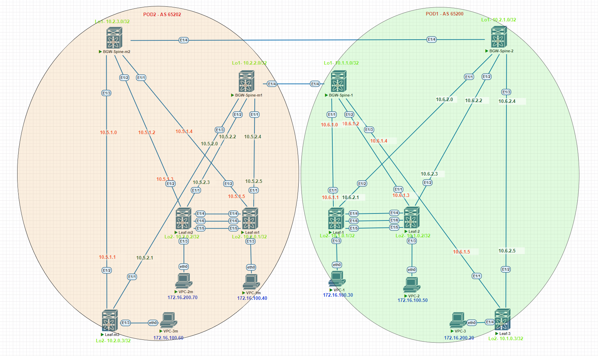

# Проектная работа

## Тема: Построение фабрики VXLAN/EVPN для двух POD с использованием технологии multisite

### Цели:

- Построение двух POD VXLAN/EVPN
- Подключение резервного ЦОД с использованием технологии “multisite”

## План:

- Разработка отказоустойчивой и масштабируемой топологии CLOS
- Проектирование DCI с помощью “multisite”
- Проектирование адресного пространства
- Проектирование Underlay и Overlay сетей

### [Презинтация проекта](file/presentation.pptx)

### Схема проектируемой сети



### Конфигурация оборудования

#### POD 1
- [POD1-BGW-Spine-1](config/POD-1-Spine-1.conf)
- [POD1-BGW-Spine-2](config/POD-1-Spine-2.conf)
- [POD1-Leaf-1](config/POD-1-Leaf-1.conf)
- [POD1-Leaf-2](config/POD-1-Leaf-2.conf)
- [POD1-Leaf-3](config/POD-1-Leaf-3.conf)

#### POD 2
- [POD2-BGW-Spine-m1](config/POD-2-Spine-m1.conf)
- [POD2-BGW-Spine-m2](config/POD-2-Spine-m2.conf)
- [POD2-Leaf-m1](config/POD-2-Leaf-m1.conf)
- [POD2-Leaf-m2](config/POD-2-Leaf-m2.conf)
- [dc02-bgw01](config/dc02-bgw01.conf)
- [dc02-bgw02](config/dc02-bgw02.conf)

### Проверка (Underlay. POD 1)
```
<dc01-sp01>disp ospf peer

 Area: 0.0.0.0
 Router ID       Address         Pri Dead-Time  State             Interface
 10.12.1.0       10.15.1.1       1   36         Full/ -           GE1/0
 10.12.3.0       10.15.1.5       1   32         Full/ -           GE3/0
 10.12.5.0       10.15.1.9       1   35         Full/ -           GE5/0
```
```
<dc01-sp02>disp ospf peer

 Area: 0.0.0.0
 Router ID       Address         Pri Dead-Time  State             Interface
 10.12.1.0       10.15.2.1       1   38         Full/ -           GE1/0
 10.12.3.0       10.15.2.5       1   32         Full/ -           GE3/0
 10.12.5.0       10.15.2.9       1   37         Full/ -           GE5/0
```
### Проверка (Overlay. POD 1)
```
<IRF-01>disp bgp peer l2vpn evpn

 BGP local router ID: 10.12.1.0
 Local AS number: 65100
 Total number of peers: 2                 Peers in established state: 2

  * - Dynamically created peer
  Peer                    AS  MsgRcvd  MsgSent OutQ PrefRcv Up/Down  State

  10.11.1.0            65100      138      122    0       5 01:05:32 Established
  10.11.2.0            65100      143      113    0       5 01:05:32 Established
```
```
<IRF-02>disp bgp peer l2vpn evpn

 BGP local router ID: 10.12.3.0
 Local AS number: 65100
 Total number of peers: 2                 Peers in established state: 2

  * - Dynamically created peer
  Peer                    AS  MsgRcvd  MsgSent OutQ PrefRcv Up/Down  State

  10.11.1.0            65100      503      361    0       8 04:13:17 Established
  10.11.2.0            65100      413      390    0       8 03:51:16 Established
```
```
<IRF-03>disp bgp peer l2vpn evpn

 BGP local router ID: 10.13.5.0
 Local AS number: 65100
 Total number of peers: 2                 Peers in established state: 2

  * - Dynamically created peer
  Peer                    AS  MsgRcvd  MsgSent OutQ PrefRcv Up/Down  State

  10.11.1.0            65100      155       93    0       6 01:09:16 Established
  10.11.2.0            65100      175       93    0       6 01:09:16 Established
```
### Проверка (Route. POD 1)
```
<IRF-01>disp ip routing-table vpn-instance PROD

Destinations : 14       Routes : 14

Destination/Mask   Proto   Pre Cost        NextHop         Interface
0.0.0.0/32         Direct  0   0           127.0.0.1       InLoop0
127.0.0.0/8        Direct  0   0           127.0.0.1       InLoop0
127.0.0.1/32       Direct  0   0           127.0.0.1       InLoop0
127.255.255.255/32 Direct  0   0           127.0.0.1       InLoop0
192.168.10.0/24    Direct  0   0           192.168.10.254  Vsi10
192.168.10.2/32    BGP     255 0           10.12.3.0       Vsi1
192.168.10.5/32    BGP     255 0           10.12.5.0       Vsi1
192.168.10.7/32    BGP     255 0           10.12.5.0       Vsi1
192.168.10.254/32  Direct  0   0           127.0.0.1       InLoop0
192.168.10.255/32  Direct  0   0           192.168.10.254  Vsi10
192.168.30.0/24    BGP     255 0           10.12.5.0       Vsi1
224.0.0.0/4        Direct  0   0           0.0.0.0         NULL0
224.0.0.0/24       Direct  0   0           0.0.0.0         NULL0
255.255.255.255/32 Direct  0   0           127.0.0.1       InLoop0
```
```
<IRF-01>disp ip routing-table vpn-instance DEV

Destinations : 13       Routes : 13

Destination/Mask   Proto   Pre Cost        NextHop         Interface
0.0.0.0/32         Direct  0   0           127.0.0.1       InLoop0
127.0.0.0/8        Direct  0   0           127.0.0.1       InLoop0
127.0.0.1/32       Direct  0   0           127.0.0.1       InLoop0
127.255.255.255/32 Direct  0   0           127.0.0.1       InLoop0
192.168.20.0/24    Direct  0   0           192.168.20.254  Vsi20
192.168.20.2/32    BGP     255 0           10.12.3.0       Vsi2
192.168.20.6/32    BGP     255 0           10.12.5.0       Vsi2
192.168.20.8/32    BGP     255 0           10.12.5.0       Vsi2
192.168.20.254/32  Direct  0   0           127.0.0.1       InLoop0
192.168.20.255/32  Direct  0   0           192.168.20.254  Vsi20
224.0.0.0/4        Direct  0   0           0.0.0.0         NULL0
224.0.0.0/24       Direct  0   0           0.0.0.0         NULL0
255.255.255.255/32 Direct  0   0           127.0.0.1       InLoop0
```
```
<IRF-01>dis bgp l2vpn evpn

 BGP local router ID is 10.12.1.0
 Status codes: * - valid, > - best, d - dampened, h - history,
               s - suppressed, S - stale, i - internal, e - external
               Origin: i - IGP, e - EGP, ? - incomplete

 Total number of routes from all PEs: 20

 Route distinguisher: 1:1010
 Total number of routes: 8

     Network            NextHop         MED        LocPrf     PrefVal Path/Ogn

* >  [2][0][48][cc3e-5f81-85b7][32][192.168.10.1]/136
                        0.0.0.0         0          100        32768   i
* >i [2][0][48][cc3e-5f82-332c][0][0.0.0.0]/104
                        10.12.3.0       0          100        0       i
*  i                    10.12.3.0       0          100        0       i
* >i [2][0][48][cc3e-5f82-332c][32][192.168.10.2]/136
                        10.12.3.0       0          100        0       i
*  i                    10.12.3.0       0          100        0       i
* >  [3][0][32][10.12.1.0]/80
                        0.0.0.0         0          100        32768   i
* >i [3][0][32][10.12.3.0]/80
                        10.12.3.0       0          100        0       i
*  i                    10.12.3.0       0          100        0       i

 Route distinguisher: 1:2010
 Total number of routes: 6

     Network            NextHop         MED        LocPrf     PrefVal Path/Ogn

* >  [2][0][48][cc3e-5f81-85b7][32][192.168.20.1]/136
                        0.0.0.0         0          100        32768   i
* >i [2][0][48][cc3e-5f82-332c][32][192.168.20.2]/136
                        10.12.3.0       0          100        0       i
*  i                    10.12.3.0       0          100        0       i
* >  [3][0][32][10.12.1.0]/80
                        0.0.0.0         0          100        32768   i
* >i [3][0][32][10.12.3.0]/80
                        10.12.3.0       0          100        0       i
*  i                    10.12.3.0       0          100        0       i

 Route distinguisher: 65100:1(PROD)
 Total number of routes: 8

     Network            NextHop         MED        LocPrf     PrefVal Path/Ogn

* >i [2][0][48][cc3e-5f82-332c][32][192.168.10.2]/136
                        10.12.3.0       0          100        0       i
* >  [5][0][24][192.168.10.0]/80
                        0.0.0.0         0          100        32768   i
* >i [5][0][24][192.168.30.0]/80
                        10.12.5.0                  100        0       65200i
*  i                    10.12.5.0                  100        0       65200i
* >i [5][0][32][192.168.10.5]/80
                        10.12.5.0                  100        0       65200i
*  i                    10.12.5.0                  100        0       65200i
* >i [5][0][32][192.168.10.7]/80
                        10.12.5.0                  100        0       65200i
*  i                    10.12.5.0                  100        0       65200i

 Route distinguisher: 65100:2(DEV)
 Total number of routes: 6

     Network            NextHop         MED        LocPrf     PrefVal Path/Ogn

* >i [2][0][48][cc3e-5f82-332c][32][192.168.20.2]/136
                        10.12.3.0       0          100        0       i
* >  [5][0][24][192.168.20.0]/80
                        0.0.0.0         0          100        32768   i
* >i [5][0][32][192.168.20.6]/80
                        10.12.5.0                  100        0       65200i
*  i                    10.12.5.0                  100        0       65200i
* >i [5][0][32][192.168.20.8]/80
                        10.12.5.0                  100        0       65200i
*  i                    10.12.5.0                  100        0       65200i
```
```
<IRF-03>disp bgp peer ipv4 vpn-instance PROD

 BGP local router ID: 10.13.5.1
 Local AS number: 65100
 Total number of peers: 1                 Peers in established state: 1

  * - Dynamically created peer
  Peer                    AS  MsgRcvd  MsgSent OutQ PrefRcv Up/Down  State

  10.23.1.1            65200      192      196    0       2 02:33:46 Established
<IRF-03>
<IRF-03>
<IRF-03>
<IRF-03>disp bgp peer ipv4 vpn-instance DEV

 BGP local router ID: 10.13.5.2
 Local AS number: 65100
 Total number of peers: 1                 Peers in established state: 1

  * - Dynamically created peer
  Peer                    AS  MsgRcvd  MsgSent OutQ PrefRcv Up/Down  State

  10.23.1.2            65200      181      184    0       2 02:30:01 Established
```
```
<server-01>ping -vpn-instance PROD 192.168.10.2
Ping 192.168.10.2 (192.168.10.2): 56 data bytes, press CTRL+C to break
56 bytes from 192.168.10.2: icmp_seq=0 ttl=253 time=6.729 ms
56 bytes from 192.168.10.2: icmp_seq=1 ttl=253 time=2.904 ms
56 bytes from 192.168.10.2: icmp_seq=2 ttl=253 time=3.650 ms
56 bytes from 192.168.10.2: icmp_seq=3 ttl=253 time=2.115 ms
56 bytes from 192.168.10.2: icmp_seq=4 ttl=253 time=2.893 ms

--- Ping statistics for 192.168.10.2 in VPN instance PROD ---
5 packet(s) transmitted, 5 packet(s) received, 0.0% packet loss
round-trip min/avg/max/std-dev = 2.115/3.658/6.729/1.610 ms


<server-01>ping -vpn-instance DEV 192.168.20.2
Ping 192.168.20.2 (192.168.20.2): 56 data bytes, press CTRL+C to break
56 bytes from 192.168.20.2: icmp_seq=0 ttl=253 time=3.569 ms
56 bytes from 192.168.20.2: icmp_seq=1 ttl=253 time=2.257 ms
56 bytes from 192.168.20.2: icmp_seq=2 ttl=253 time=1.925 ms
56 bytes from 192.168.20.2: icmp_seq=3 ttl=253 time=1.925 ms
56 bytes from 192.168.20.2: icmp_seq=4 ttl=253 time=2.471 ms

--- Ping statistics for 192.168.20.2 in VPN instance DEV ---
5 packet(s) transmitted, 5 packet(s) received, 0.0% packet loss
round-trip min/avg/max/std-dev = 1.925/2.429/3.569/0.606 ms
```
### Проверка (Underlay. POD 2)
```
dc02-sp01#show ip ospf neighbor
Neighbor ID     Instance VRF      Pri State                  Dead Time   Address         Interface
10.22.2.0       1        default  0   FULL                   00:00:32    10.25.1.3       Ethernet2
10.22.1.0       1        default  0   FULL                   00:00:29    10.25.1.1       Ethernet1
10.23.1.0       1        default  0   FULL                   00:00:33    10.25.1.5       Ethernet10
10.23.2.0       1        default  0   FULL                   00:00:30    10.25.1.7       Ethernet11
```
```
dc02-sp02#show ip ospf neighbor
Neighbor ID     Instance VRF      Pri State                  Dead Time   Address         Interface
10.22.2.0       1        default  0   FULL                   00:00:32    10.25.2.3       Ethernet2
10.22.1.0       1        default  0   FULL                   00:00:32    10.25.2.1       Ethernet1
10.23.1.0       1        default  0   FULL                   00:00:30    10.25.2.5       Ethernet10
10.23.2.0       1        default  0   FULL                   00:00:37    10.25.2.7       Ethernet11
```
### Проверка (Overlay. POD 2)
```
dc02-le01#show bgp evpn summary
BGP summary information for VRF default
Router identifier 10.22.1.0, local AS number 65200
Neighbor Status Codes: m - Under maintenance
  Neighbor         V AS           MsgRcvd   MsgSent  InQ OutQ  Up/Down State   PfxRcd PfxAcc
  10.21.1.0        4 65200           5498      5481    0    0 03:53:39 Estab   19     19
  10.21.2.0        4 65200           5487      5489    0    0 03:53:39 Estab   19     19
```
```
dc02-le01#show bgp evpn summary
BGP summary information for VRF default
Router identifier 10.22.1.0, local AS number 65200
Neighbor Status Codes: m - Under maintenance
  Neighbor         V AS           MsgRcvd   MsgSent  InQ OutQ  Up/Down State   PfxRcd PfxAcc
  10.21.1.0        4 65200           5521      5504    0    0 03:54:40 Estab   19     19
  10.21.2.0        4 65200           5511      5513    0    0 03:54:40 Estab   19     19
```
```
dc02-bgw01#show bgp evpn summary
BGP summary information for VRF default
Router identifier 10.23.1.0, local AS number 65200
Neighbor Status Codes: m - Under maintenance
  Neighbor         V AS           MsgRcvd   MsgSent  InQ OutQ  Up/Down State   PfxRcd PfxAcc
  10.21.1.0        4 65200           5950      5904    0    0 04:12:04 Estab   17     17
  10.21.2.0        4 65200           5659      5638    0    0 04:00:17 Estab   17     17
```
```
dc02-bgw02#show bgp evpn summary
BGP summary information for VRF default
Router identifier 10.23.2.0, local AS number 65200
Neighbor Status Codes: m - Under maintenance
  Neighbor         V AS           MsgRcvd   MsgSent  InQ OutQ  Up/Down State   PfxRcd PfxAcc
  10.21.1.0        4 65200           5955      5892    0    0 04:12:22 Estab   22     22
  10.21.2.0        4 65200           5679      5637    0    0 04:00:38 Estab   22     22
```
```
dc02-bgw01#sh mlag
MLAG Configuration:
domain-id                          :               mlag1
local-interface                    :            Vlan4094
peer-address                       :           10.26.0.1
peer-link                          :       Port-Channel1
peer-config                        :          consistent

MLAG Status:
state                              :              Active
negotiation status                 :           Connected
peer-link status                   :                  Up
local-int status                   :                  Up
system-id                          :   52:00:00:76:bd:1d
dual-primary detection             :            Disabled
dual-primary interface errdisabled :               False

MLAG Ports:
Disabled                           :                   0
Configured                         :                   0
Inactive                           :                   0
Active-partial                     :                   0
Active-full                        :                   0
```
### Проверка (Route. POD 1)
```
dc02-le01#show ip route vrf PROD

 B I      10.23.1.1/32 [200/0] via VTEP 10.23.1.254 VNI 109999 router-mac 50:00:00:76:bd:1d local-interface Vxlan1
 B I      10.27.1.1/32 [200/0] via VTEP 10.23.1.254 VNI 109999 router-mac 50:00:00:ba:b7:36 local-interface Vxlan1
 C        192.168.10.0/24 is directly connected, Vlan10
 B I      192.168.30.0/24 [200/0] via VTEP 10.22.2.254 VNI 109999 router-mac 50:00:00:d0:ea:86 local-interface Vxlan1

dc02-le01#show ip route vrf DEV

 B I      10.27.1.3/32 [200/0] via VTEP 10.23.1.254 VNI 209999 router-mac 50:00:00:ba:b7:36 local-interface Vxlan1
 B I      192.168.20.8/32 [200/0] via VTEP 10.22.2.254 VNI 209999 router-mac 50:00:00:d0:ea:86 local-interface Vxlan1
 C        192.168.20.0/24 is directly connected, Vlan20
```
```
dc02-bgw01#sh ip route vrf PROD

 S        10.13.5.1/32 [1/0] via 10.27.1.1, Vlan10
 C        10.23.1.1/32 is directly connected, Loopback1
 C        10.27.1.0/31 is directly connected, Vlan10
 B I      192.168.10.0/24 [200/0] via VTEP 10.22.1.254 VNI 109999 router-mac 50:00:00:5f:63:6e local-interface Vxlan1
                                  via VTEP 10.22.2.254 VNI 109999 router-mac 50:00:00:d0:ea:86 local-interface Vxlan1
 B I      192.168.30.0/24 [200/0] via VTEP 10.22.2.254 VNI 109999 router-mac 50:00:00:d0:ea:86 local-interface Vxlan1

dc02-bgw01#sh ip route vrf DEV

 S        10.13.5.2/32 [1/0] via 10.27.1.3, Vlan20
 C        10.23.1.2/32 is directly connected, Loopback2
 C        10.27.1.2/31 is directly connected, Vlan20
 B I      192.168.20.6/32 [200/0] via VTEP 10.22.1.254 VNI 209999 router-mac 50:00:00:5f:63:6e local-interface Vxlan1
 B I      192.168.20.8/32 [200/0] via VTEP 10.22.2.254 VNI 209999 router-mac 50:00:00:d0:ea:86 local-interface Vxlan1
 B I      192.168.20.0/24 [200/0] via VTEP 10.22.2.254 VNI 209999 router-mac 50:00:00:d0:ea:86 local-interface Vxlan1
                                  via VTEP 10.22.1.254 VNI 209999 router-mac 50:00:00:5f:63:6e local-interface Vxlan1
```
```

```
```
dc02-bgw01#show vxlan vni
VNI to VLAN Mapping for Vxlan1
VNI          VLAN       Source       Interface       802.1Q Tag
------------ ---------- ------------ --------------- ----------
100010       10         static       Ethernet5       10
                                     Vxlan1          10
200020       20         static       Ethernet5       20
                                     Vxlan1          20

VNI to dynamic VLAN Mapping for Vxlan1
VNI          VLAN       VRF        Source
------------ ---------- ---------- ------------
109999       4090       PROD       evpn
209999       4091       DEV        evpn
```
```
dc02-le01#show vxlan vni
VNI to VLAN Mapping for Vxlan1
VNI          VLAN       Source       Interface       802.1Q Tag
------------ ---------- ------------ --------------- ----------
100010       10         static       Ethernet3       untagged
                                     Vxlan1          10
200020       20         static       Ethernet4       untagged
                                     Vxlan1          20

VNI to dynamic VLAN Mapping for Vxlan1
VNI          VLAN       VRF        Source
------------ ---------- ---------- ------------
109999       4093       PROD       evpn
209999       4094       DEV        evpn
```
```
VPCS-1m> ping 172.16.200.20
84 bytes from 172.16.200.20 icmp_seq=1 ttl=62 time=25.278 ms
84 bytes from 172.16.200.20 icmp_seq=2 ttl=62 time=17.525 ms
84 bytes from 172.16.200.20 icmp_seq=3 ttl=62 time=18.453 ms
84 bytes from 172.16.200.20 icmp_seq=4 ttl=62 time=19.638 ms
84 bytes from 172.16.200.20 icmp_seq=5 ttl=62 time=20.356 ms


```
```
VPCS-2> ping 172.16.100.40
84 bytes from 172.16.100.40 icmp_seq=1 ttl=62 time=23.922 ms
84 bytes from 172.16.100.40 icmp_seq=2 ttl=62 time=20.967 ms
84 bytes from 172.16.100.40 icmp_seq=3 ttl=62 time=17.761 ms
84 bytes from 172.16.100.40 icmp_seq=4 ttl=62 time=19.283 ms
84 bytes from 172.16.100.40 icmp_seq=5 ttl=62 time=19.140 ms


```
