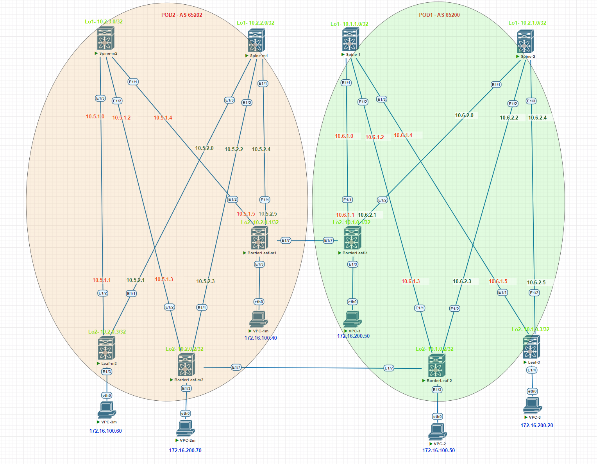

# Проектная работа

## Тема: Построение фабрики VXLAN/EVPN для двух POD с использованием технологии multisite

### Цели:

- Построение двух POD VXLAN/EVPN
- Подключение резервного ЦОД с использованием технологии “multisite”

## План:

- Разработка отказоустойчивой и масштабируемой топологии CLOS
- Проектирование DCI с помощью “multisite”
- Проектирование адресного пространства
- Проектирование Underlay и Overlay сетей

### [Презинтация проекта](file/presentation.pptx)

### Схема проектируемой сети



### Конфигурация оборудования

#### POD 1
- [POD1-Spine-1](config/POD-1-Spine-1.conf)
- [POD1-Spine-2](config/POD-1-Spine-2.conf)
- [POD1-BorderLeaf-1](config/POD-1-Leaf-1.conf)
- [POD1-BorderLeaf-2](config/POD-1-Leaf-2.conf)
- [POD1-Leaf-3](config/POD-1-Leaf-3.conf)

#### POD 2
- [POD2-Spine-m1](config/POD-2-Spine-m1.conf)
- [POD2-Spine-m2](config/POD-2-Spine-m2.conf)
- [POD2-BorderLeaf-m1](config/POD-2-Leaf-m1.conf)
- [POD2-BorderLeaf-m2](config/POD-2-Leaf-m2.conf)
- [POD2-Leaf-m3](config/POD-2-Leaf-m3.conf)


### Проверка (Underlay. POD 1)
```
Spine-1# sh ip ospf neighbors
 OSPF Process ID UNDERLAY VRF default
 Total number of neighbors: 3
 Neighbor ID     Pri State            Up Time  Address         Interface
 10.1.0.1          1 FULL/ -          00:01:52 10.6.1.1        Eth1/1
 10.1.0.2          1 FULL/ -          00:01:53 10.6.1.3        Eth1/2
 10.1.0.3          1 FULL/ -          00:01:54 10.6.1.5        Eth1/3


```
```
Spine-2# sh ip ospf neighbors
 OSPF Process ID UNDERLAY VRF default
 Total number of neighbors: 3
 Neighbor ID     Pri State            Up Time  Address         Interface
 10.1.0.1          1 FULL/ -          00:02:12 10.6.2.1        Eth1/1
 10.1.0.2          1 FULL/ -          00:02:07 10.6.2.3        Eth1/2
 10.1.0.3          1 FULL/ -          00:02:12 10.6.2.5        Eth1/3


```
### Проверка (Overlay. POD 1)
```
Spine-1# sh bgp l2vpn evpn summary
Neighbor        V    AS MsgRcvd MsgSent   TblVer  InQ OutQ Up/Down  State/PfxRcd
10.1.0.1        4 65200     132      99      128    0    0 01:28:02 11
10.1.0.2        4 65200       8       9      128    0    0 00:02:57 0
10.1.0.3        4 65200      10       8      128    0    0 00:01:55 3
10.2.1.0        4 65200     132      96      128    0    0 01:27:45 10


```

```
Spine-2# sh bgp l2vpn evpn summary
Neighbor        V    AS MsgRcvd MsgSent   TblVer  InQ OutQ Up/Down  State/PfxRcd
10.1.0.1        4 65200     132      99      157    0    0 01:28:20 11
10.1.0.2        4 65200       8       9      157    0    0 00:02:55 0
10.1.0.3        4 65200      11       8      157    0    0 00:02:39 3
10.1.1.0        4 65200     131      97      157    0    0 01:28:07 10

```

```
```
### Проверка (Route. POD 1)
```
Leaf-1# sh ip route vrf main
172.16.100.0/24, ubest/mbest: 1/0, attached
    *via 172.16.100.1, Vlan100, [0/0], 02:11:44, direct
172.16.100.1/32, ubest/mbest: 1/0, attached
    *via 172.16.100.1, Vlan100, [0/0], 02:11:44, local
172.16.100.40/32, ubest/mbest: 1/0
    *via 10.2.0.1%default, [20/0], 00:53:05, bgp-65200, external, tag 65202, seg
id: 2000 tunnelid: 0xa020001 encap: VXLAN

172.16.200.0/24, ubest/mbest: 1/0, attached
    *via 172.16.200.1, Vlan200, [0/0], 02:11:44, direct
172.16.200.1/32, ubest/mbest: 1/0, attached
    *via 172.16.200.1, Vlan200, [0/0], 02:11:44, local
172.16.200.50/32, ubest/mbest: 1/0, attached
    *via 172.16.200.50, Vlan200, [190/0], 01:08:42, hmm


```
```
Leaf-1# sh bgp l2vpn evpn summary
BGP summary information for VRF default, address family L2VPN EVPN
BGP router identifier 10.1.0.1, local AS number 65200
BGP table version is 117, L2VPN EVPN config peers 3, capable peers 3
28 network entries and 31 paths using 5872 bytes of memory
BGP attribute entries [29/4988], BGP AS path entries [1/6]
BGP community entries [0/0], BGP clusterlist entries [2/8]

Neighbor        V    AS MsgRcvd MsgSent   TblVer  InQ OutQ Up/Down  State/PfxRcd
10.1.1.0        4 65200     116     106      117    0    0 01:34:58 3
10.2.0.1        4 65202     104      88      117    0    0 01:19:13 7
10.2.1.0        4 65200     113     106      117    0    0 01:34:54 3

Neighbor        T    AS PfxRcd     Type-2     Type-3     Type-4     Type-5
10.1.1.0        I 65200 3          1          2          0          0
10.2.0.1        E 65202 7          5          2          0          0
10.2.1.0        I 65200 3          1          2          0          0

```
```
Leaf-1# sh bgp l2vpn evpn
BGP routing table information for VRF default, address family L2VPN EVPN
BGP table version is 117, Local Router ID is 10.1.0.1
Status: s-suppressed, x-deleted, S-stale, d-dampened, h-history, *-valid, >-best
Path type: i-internal, e-external, c-confed, l-local, a-aggregate, r-redist, I-i
njected
Origin codes: i - IGP, e - EGP, ? - incomplete, | - multipath, & - backup, 2 - b
est2

   Network            Next Hop            Metric     LocPrf     Weight Path
Route Distinguisher: 10.1.0.1:32867    (L2VNI 100)
*>e[2]:[0]:[0]:[48]:[0050.7966.680f]:[0]:[0.0.0.0]/216
                      10.2.0.1                                       0 65202 i
*>e[2]:[0]:[0]:[48]:[5000.1300.1b08]:[0]:[0.0.0.0]/216
                      10.2.0.1                                       0 65202 i
*>l[2]:[0]:[0]:[48]:[5000.1400.1b08]:[0]:[0.0.0.0]/216
                      10.6.255.200                      100      32768 i
*>e[2]:[0]:[0]:[48]:[0050.7966.680f]:[32]:[172.16.100.40]/272
                      10.2.0.1                                       0 65202 i
*>i[3]:[0]:[32]:[10.1.0.3]/88
                      10.1.0.3                          100          0 i
*>e[3]:[0]:[32]:[10.2.0.1]/88
                      10.2.0.1                                       0 65202 i
*>l[3]:[0]:[32]:[10.6.255.200]/88
                      10.6.255.200                      100      32768 i

Route Distinguisher: 10.1.0.1:32967    (L2VNI 200)
*>l[2]:[0]:[0]:[48]:[0050.7966.6810]:[0]:[0.0.0.0]/216
                      10.6.255.200                      100      32768 i
*>e[2]:[0]:[0]:[48]:[5000.1300.1b08]:[0]:[0.0.0.0]/216
                      10.2.0.1                                       0 65202 i
*>l[2]:[0]:[0]:[48]:[5000.1400.1b08]:[0]:[0.0.0.0]/216
                      10.6.255.200                      100      32768 i
*>l[2]:[0]:[0]:[48]:[0050.7966.6810]:[32]:[172.16.200.50]/272
                      10.6.255.200                      100      32768 i
*>i[3]:[0]:[32]:[10.1.0.3]/88
                      10.1.0.3                          100          0 i
*>e[3]:[0]:[32]:[10.2.0.1]/88
                      10.2.0.1                                       0 65202 i
*>l[3]:[0]:[32]:[10.6.255.200]/88
                      10.6.255.200                      100      32768 i

Route Distinguisher: 10.1.0.3:3
*>i[2]:[0]:[0]:[48]:[5000.0500.1b08]:[0]:[0.0.0.0]/216
                      10.1.0.3                          100          0 i
* i                   10.1.0.3                          100          0 i

Route Distinguisher: 10.1.0.3:32867
*>i[3]:[0]:[32]:[10.1.0.3]/88
                      10.1.0.3                          100          0 i
* i                   10.1.0.3                          100          0 i

Route Distinguisher: 10.1.0.3:32967
*>i[3]:[0]:[32]:[10.1.0.3]/88
                      10.1.0.3                          100          0 i
* i                   10.1.0.3                          100          0 i

Route Distinguisher: 10.2.0.1:3
*>e[2]:[0]:[0]:[48]:[5000.1300.1b08]:[0]:[0.0.0.0]/216
                      10.2.0.1                                       0 65202 i

Route Distinguisher: 10.2.0.1:32867
*>e[2]:[0]:[0]:[48]:[0050.7966.680f]:[0]:[0.0.0.0]/216
                      10.2.0.1                                       0 65202 i
*>e[2]:[0]:[0]:[48]:[5000.1300.1b08]:[0]:[0.0.0.0]/216
                      10.2.0.1                                       0 65202 i
*>e[2]:[0]:[0]:[48]:[0050.7966.680f]:[32]:[172.16.100.40]/272
                      10.2.0.1                                       0 65202 i
*>e[3]:[0]:[32]:[10.2.0.1]/88
                      10.2.0.1                                       0 65202 i

Route Distinguisher: 10.2.0.1:32967
*>e[2]:[0]:[0]:[48]:[5000.1300.1b08]:[0]:[0.0.0.0]/216
                      10.2.0.1                                       0 65202 i
*>e[3]:[0]:[32]:[10.2.0.1]/88
                      10.2.0.1                                       0 65202 i

Route Distinguisher: 10.1.0.1:4    (L3VNI 2000)
*>i[2]:[0]:[0]:[48]:[5000.0500.1b08]:[0]:[0.0.0.0]/216
                      10.1.0.3                          100          0 i
*>e[2]:[0]:[0]:[48]:[5000.1300.1b08]:[0]:[0.0.0.0]/216
                      10.2.0.1                                       0 65202 i
*>l[2]:[0]:[0]:[48]:[5000.1400.1b08]:[0]:[0.0.0.0]/216
                      10.6.255.200                      100      32768 i
*>e[2]:[0]:[0]:[48]:[0050.7966.680f]:[32]:[172.16.100.40]/272
                      10.2.0.1                                       0 65202 i


```
```
Leaf-2# sh ip route vrf main
IP Route Table for VRF "main"
'*' denotes best ucast next-hop
'**' denotes best mcast next-hop
'[x/y]' denotes [preference/metric]
'%<string>' in via output denotes VRF <string>

172.16.100.0/24, ubest/mbest: 1/0, attached
    *via 172.16.100.1, Vlan100, [0/0], 01:23:47, direct, tag 65200
172.16.100.1/32, ubest/mbest: 1/0, attached
    *via 172.16.100.1, Vlan100, [0/0], 01:23:47, local, tag 65200
172.16.200.0/24, ubest/mbest: 1/0, attached
    *via 172.16.200.1, Vlan200, [0/0], 01:23:47, direct, tag 65200
172.16.200.1/32, ubest/mbest: 1/0, attached
    *via 172.16.200.1, Vlan200, [0/0], 01:23:47, local, tag 65200


```
```
Leaf-2# sh bgp l2vpn evpn
BGP routing table information for VRF default, address family L2VPN EVPN
BGP table version is 94, Local Router ID is 10.1.0.2
Status: s-suppressed, x-deleted, S-stale, d-dampened, h-history, *-valid, >-best
Path type: i-internal, e-external, c-confed, l-local, a-aggregate, r-redist, I-i
njected
Origin codes: i - IGP, e - EGP, ? - incomplete, | - multipath, & - backup, 2 - b
est2

   Network            Next Hop            Metric     LocPrf     Weight Path
Route Distinguisher: 10.1.0.2:32867    (L2VNI 100)
*>l[2]:[0]:[0]:[48]:[0050.7966.6807]:[0]:[0.0.0.0]/216
                      10.6.255.200                      100      32768 i
*>l[2]:[0]:[0]:[48]:[5000.0400.1b08]:[0]:[0.0.0.0]/216
                      10.6.255.200                      100      32768 i
*>l[2]:[0]:[0]:[48]:[0050.7966.6807]:[32]:[172.16.100.50]/272
                      10.6.255.200                      100      32768 i
*>i[3]:[0]:[32]:[10.1.0.3]/88
                      10.1.0.3                          100          0 i
*>l[3]:[0]:[32]:[10.6.255.200]/88
                      10.6.255.200                      100      32768 i

Route Distinguisher: 10.1.0.2:32967    (L2VNI 200)
*>l[2]:[0]:[0]:[48]:[5000.0400.1b08]:[0]:[0.0.0.0]/216
                      10.6.255.200                      100      32768 i
*>i[3]:[0]:[32]:[10.1.0.3]/88
                      10.1.0.3                          100          0 i
*>l[3]:[0]:[32]:[10.6.255.200]/88
                      10.6.255.200                      100      32768 i

Route Distinguisher: 10.1.0.3:3
* i[2]:[0]:[0]:[48]:[5000.0500.1b08]:[0]:[0.0.0.0]/216
                      10.1.0.3                          100          0 i
*>i                   10.1.0.3                          100          0 i

Route Distinguisher: 10.1.0.3:32867
* i[3]:[0]:[32]:[10.1.0.3]/88
                      10.1.0.3                          100          0 i
*>i                   10.1.0.3                          100          0 i

Route Distinguisher: 10.1.0.3:32967
* i[3]:[0]:[32]:[10.1.0.3]/88
                      10.1.0.3                          100          0 i
*>i                   10.1.0.3                          100          0 i

Route Distinguisher: 10.1.0.2:4    (L3VNI 2000)
*>l[2]:[0]:[0]:[48]:[5000.0400.1b08]:[0]:[0.0.0.0]/216
                      10.6.255.200                      100      32768 i
*>i[2]:[0]:[0]:[48]:[5000.0500.1b08]:[0]:[0.0.0.0]/216
                      10.1.0.3                          100          0 i

```
```
Leaf-2# sh bgp l2vpn evpn summary
BGP summary information for VRF default, address family L2VPN EVPN
BGP router identifier 10.1.0.2, local AS number 65200
BGP table version is 94, L2VPN EVPN config peers 3, capable peers 3
13 network entries and 16 paths using 3172 bytes of memory
BGP attribute entries [14/2408], BGP AS path entries [0/0]
BGP community entries [0/0], BGP clusterlist entries [2/8]

Neighbor        V    AS MsgRcvd MsgSent   TblVer  InQ OutQ Up/Down  State/PfxRcd
10.1.1.0        4 65200      64      39       94    0    0 00:03:41 3
10.2.0.2        4 65202      87     101       94    0    0 00:03:39 0
10.2.1.0        4 65200      61      39       94    0    0 00:03:39 3

Neighbor        T    AS PfxRcd     Type-2     Type-3     Type-4     Type-5
10.1.1.0        I 65200 3          1          2          0          0
10.2.0.2        E 65202 0          0          0          0          0
10.2.1.0        I 65200 3          1          2          0          0

```
```
```
### Проверка (Underlay. POD 2)
```
Spine-m1# sh ip ospf neighbors
 OSPF Process ID UNDERLAY VRF default
 Total number of neighbors: 3
 Neighbor ID     Pri State            Up Time  Address         Interface
 10.2.0.1          1 FULL/ -          00:13:32 10.5.1.1        Eth1/1
 10.2.0.2          1 FULL/ -          00:04:48 10.5.1.3        Eth1/2
 10.2.0.3          1 FULL/ -          00:00:52 10.5.1.5        Eth1/3

```
```
Spine-m2# sh ip ospf neighbors
 OSPF Process ID UNDERLAY VRF default
 Total number of neighbors: 3
 Neighbor ID     Pri State            Up Time  Address         Interface
 10.2.0.1          1 FULL/ -          00:04:00 10.5.2.1        Eth1/1
 10.2.0.2          1 FULL/ -          00:03:56 10.5.2.3        Eth1/2
 10.2.0.3          1 FULL/ -          00:01:14 10.5.2.5        Eth1/3


```
### Проверка (Overlay. POD 2)
```
Spine-m1# sh bgp l2vpn evpn summary
Neighbor        V    AS MsgRcvd MsgSent   TblVer  InQ OutQ Up/Down  State/PfxRcd
10.2.0.1        4 65202     180     147      140    0    0 00:10:37 8
10.2.0.2        4 65202       9       9      140    0    0 00:03:36 0
10.2.0.3        4 65202      10       8      140    0    0 00:01:10 3
10.2.3.0        4 65202      20       9      140    0    0 00:03:46 11


```
```
Spine-m2# sh bgp l2vpn evpn summary
Neighbor        V    AS MsgRcvd MsgSent   TblVer  InQ OutQ Up/Down  State/PfxRcd
10.2.0.1        4 65202      17      10       49    0    0 00:03:43 8
10.2.0.2        4 65202      58      53       49    0    0 00:44:51 0
10.2.0.3        4 65202      59      55       49    0    0 00:01:27 3
10.2.2.0        4 65202      20       9       49    0    0 00:04:06 11


```
```
Leaf-m1# show bgp l2vpn evpn route-type 4
BGP routing table information for VRF default, address family L2VPN EVPN
Route Distinguisher: 10.2.0.1:27001   (ES [0300.0000.00fe.b200.0309 0])
BGP routing table entry for [4]:[0300.0000.00fe.b200.0309]:[32]:[10.2.0.1]/136,
version 52
Paths: (1 available, best #1)
Flags: (0x000002) (high32 00000000) on xmit-list, is not in l2rib/evpn

  Advertised path-id 1
  Path type: local, path is valid, is best path, no labeled nexthop
  AS-Path: NONE, path locally originated
    10.2.0.1 (metric 0) from 0.0.0.0 (10.2.0.1)
      Origin IGP, MED not set, localpref 100, weight 32768
      Extcommunity: ENCAP:8 RT:0000.0000.feb2

  Path-id 1 advertised to peers:
    10.1.0.1           10.2.2.0           10.2.3.0


```
```
Leaf-m1# sh bgp l2vpn evpn
BGP routing table information for VRF default, address family L2VPN EVPN
BGP table version is 78, Local Router ID is 10.2.0.1
Status: s-suppressed, x-deleted, S-stale, d-dampened, h-history, *-valid, >-best
Path type: i-internal, e-external, c-confed, l-local, a-aggregate, r-redist, I-i
njected
Origin codes: i - IGP, e - EGP, ? - incomplete, | - multipath, & - backup, 2 - b
est2

   Network            Next Hop            Metric     LocPrf     Weight Path
Route Distinguisher: 10.1.0.1:4
  e[2]:[0]:[0]:[48]:[5000.1400.1b08]:[0]:[0.0.0.0]/216
                      10.6.255.200                                   0 65200 i

Route Distinguisher: 10.1.0.1:32867
  e[2]:[0]:[0]:[48]:[5000.1400.1b08]:[0]:[0.0.0.0]/216
                      10.6.255.200                                   0 65200 i
  e[3]:[0]:[32]:[10.6.255.200]/88
                      10.6.255.200                                   0 65200 i

Route Distinguisher: 10.1.0.1:32967
  e[2]:[0]:[0]:[48]:[0050.7966.6810]:[0]:[0.0.0.0]/216
                      10.6.255.200                                   0 65200 i
  e[2]:[0]:[0]:[48]:[5000.1400.1b08]:[0]:[0.0.0.0]/216
                      10.6.255.200                                   0 65200 i
  e[2]:[0]:[0]:[48]:[0050.7966.6810]:[32]:[172.16.200.50]/248
                      10.6.255.200                                   0 65200 i
  e[3]:[0]:[32]:[10.6.255.200]/88
                      10.6.255.200                                   0 65200 i

Route Distinguisher: 10.2.0.1:32867    (L2VNI 100)
*>l[2]:[0]:[0]:[48]:[0050.7966.680f]:[0]:[0.0.0.0]/216
                      10.2.0.1                          100      32768 i
*>l[2]:[0]:[0]:[48]:[5000.1300.1b08]:[0]:[0.0.0.0]/216
                      10.2.0.1                          100      32768 i
*>l[2]:[0]:[0]:[48]:[0050.7966.680f]:[32]:[172.16.100.40]/272
                      10.2.0.1                          100      32768 i
*>l[3]:[0]:[32]:[10.2.0.1]/88
                      10.2.0.1                          100      32768 i
*>i[3]:[0]:[32]:[10.2.0.3]/88
                      10.2.0.3                          100          0 i

Route Distinguisher: 10.2.0.1:32967    (L2VNI 200)
*>l[2]:[0]:[0]:[48]:[5000.1300.1b08]:[0]:[0.0.0.0]/216
                      10.2.0.1                          100      32768 i
*>l[3]:[0]:[32]:[10.2.0.1]/88
                      10.2.0.1                          100      32768 i
*>i[3]:[0]:[32]:[10.2.0.3]/88
                      10.2.0.3                          100          0 i

Route Distinguisher: 10.2.0.3:3
*>i[2]:[0]:[0]:[48]:[5000.0e00.1b08]:[0]:[0.0.0.0]/216
                      10.2.0.3                          100          0 i
* i                   10.2.0.3                          100          0 i

Route Distinguisher: 10.2.0.3:32867
*>i[3]:[0]:[32]:[10.2.0.3]/88
                      10.2.0.3                          100          0 i
* i                   10.2.0.3                          100          0 i

Route Distinguisher: 10.2.0.3:32967
*>i[3]:[0]:[32]:[10.2.0.3]/88
                      10.2.0.3                          100          0 i
* i                   10.2.0.3                          100          0 i

Route Distinguisher: 10.2.0.1:27001   (ES [0300.0000.00fe.b200.0309 0])
*>l[4]:[0300.0000.00fe.b200.0309]:[32]:[10.2.0.1]/136
                      10.2.0.1                          100      32768 i

Route Distinguisher: 10.2.0.1:3    (L3VNI 2000)
*>i[2]:[0]:[0]:[48]:[5000.0e00.1b08]:[0]:[0.0.0.0]/216
                      10.2.0.3                          100          0 i
*>l[2]:[0]:[0]:[48]:[5000.1300.1b08]:[0]:[0.0.0.0]/216
                      10.2.0.1                          100      32768 i
```
```
Leaf-m1# sh bgp l2vpn evpn summary
BGP summary information for VRF default, address family L2VPN EVPN
BGP router identifier 10.2.0.1, local AS number 65202
BGP table version is 78, L2VPN EVPN config peers 3, capable peers 3
21 network entries and 24 paths using 5124 bytes of memory
BGP attribute entries [22/3784], BGP AS path entries [1/6]
BGP community entries [0/0], BGP clusterlist entries [2/8]

Neighbor        V    AS MsgRcvd MsgSent   TblVer  InQ OutQ Up/Down  State/PfxRcd
10.1.0.1        4 65200     143     126       78    0    0 01:56:31 7
10.2.2.0        4 65202     155     150       78    0    0 00:12:43 3
10.2.3.0        4 65202      23      11       78    0    0 00:05:29 3

Neighbor        T    AS PfxRcd     Type-2     Type-3     Type-4     Type-5
10.1.0.1        E 65200 7          5          2          0          0
10.2.2.0        I 65202 3          1          2          0          0
10.2.3.0        I 65202 3          1          2          0          0
```

```
Leaf-m1# sh ip route vrf main
172.16.100.0/24, ubest/mbest: 1/0, attached
    *via 172.16.100.1, Vlan100, [0/0], 03:20:47, direct
172.16.100.1/32, ubest/mbest: 1/0, attached
    *via 172.16.100.1, Vlan100, [0/0], 03:20:47, local
172.16.100.40/32, ubest/mbest: 1/0, attached
    *via 172.16.100.40, Vlan100, [190/0], 02:09:59, hmm
172.16.200.0/24, ubest/mbest: 1/0, attached
    *via 172.16.200.1, Vlan200, [0/0], 03:20:46, direct
172.16.200.1/32, ubest/mbest: 1/0, attached
    *via 172.16.200.1, Vlan200, [0/0], 03:20:46, local
```
```
Leaf-2# sh bgp l2vpn evpn summary
Neighbor        V    AS MsgRcvd MsgSent   TblVer  InQ OutQ Up/Down  State/PfxRcd
10.1.1.0        4 65200      94      66       94    0    0 00:30:48 3
10.2.0.2        4 65202     114     128       94    0    0 00:30:47 0
10.2.1.0        4 65200      91      66       94    0    0 00:30:46 3

Neighbor        T    AS PfxRcd     Type-2     Type-3     Type-4     Type-5
10.1.1.0        I 65200 3          1          2          0          0
10.2.0.2        E 65202 0          0          0          0          0
10.2.1.0        I 65200 3          1          2          0          0
```
```
Leaf-2# sh bgp l2vpn evpn
 BGP routing table information for VRF default, address family L2VPN EVPN
BGP table version is 94, Local Router ID is 10.1.0.2
Status: s-suppressed, x-deleted, S-stale, d-dampened, h-history, *-valid, >-best
Path type: i-internal, e-external, c-confed, l-local, a-aggregate, r-redist, I-i
njected
Origin codes: i - IGP, e - EGP, ? - incomplete, | - multipath, & - backup, 2 - b
est2

   Network            Next Hop            Metric     LocPrf     Weight Path
Route Distinguisher: 10.1.0.2:32867    (L2VNI 100)
*>l[2]:[0]:[0]:[48]:[0050.7966.6807]:[0]:[0.0.0.0]/216
                      10.6.255.200                      100      32768 i
*>l[2]:[0]:[0]:[48]:[5000.0400.1b08]:[0]:[0.0.0.0]/216
                      10.6.255.200                      100      32768 i
*>l[2]:[0]:[0]:[48]:[0050.7966.6807]:[32]:[172.16.100.50]/272
                      10.6.255.200                      100      32768 i
*>i[3]:[0]:[32]:[10.1.0.3]/88
                      10.1.0.3                          100          0 i
*>l[3]:[0]:[32]:[10.6.255.200]/88
                      10.6.255.200                      100      32768 i

Route Distinguisher: 10.1.0.2:32967    (L2VNI 200)
*>l[2]:[0]:[0]:[48]:[5000.0400.1b08]:[0]:[0.0.0.0]/216
                      10.6.255.200                      100      32768 i
*>i[3]:[0]:[32]:[10.1.0.3]/88
                      10.1.0.3                          100          0 i
*>l[3]:[0]:[32]:[10.6.255.200]/88
                      10.6.255.200                      100      32768 i

Route Distinguisher: 10.1.0.3:3
* i[2]:[0]:[0]:[48]:[5000.0500.1b08]:[0]:[0.0.0.0]/216
                      10.1.0.3                          100          0 i
*>i                   10.1.0.3                          100          0 i

Route Distinguisher: 10.1.0.3:32867
* i[3]:[0]:[32]:[10.1.0.3]/88
                      10.1.0.3                          100          0 i
*>i                   10.1.0.3                          100          0 i

Route Distinguisher: 10.1.0.3:32967
* i[3]:[0]:[32]:[10.1.0.3]/88
                      10.1.0.3                          100          0 i
*>i                   10.1.0.3                          100          0 i

Route Distinguisher: 10.1.0.2:4    (L3VNI 2000)
*>l[2]:[0]:[0]:[48]:[5000.0400.1b08]:[0]:[0.0.0.0]/216
                      10.6.255.200                      100      32768 i
*>i[2]:[0]:[0]:[48]:[5000.0500.1b08]:[0]:[0.0.0.0]/216
                      10.1.0.3                          100          0 i
```
Leaf-2# sh ip route vrf main
IP Route Table for VRF "main"
'*' denotes best ucast next-hop
'**' denotes best mcast next-hop
'[x/y]' denotes [preference/metric]
'%<string>' in via output denotes VRF <string>

172.16.100.0/24, ubest/mbest: 1/0, attached
    *via 172.16.100.1, Vlan100, [0/0], 02:11:01, direct, tag 65200
172.16.100.1/32, ubest/mbest: 1/0, attached
    *via 172.16.100.1, Vlan100, [0/0], 02:11:01, local, tag 65200
172.16.100.50/32, ubest/mbest: 1/0, attached
    *via 172.16.100.50, Vlan100, [190/0], 00:32:22, hmm
172.16.200.0/24, ubest/mbest: 1/0, attached
    *via 172.16.200.1, Vlan200, [0/0], 02:11:01, direct, tag 65200
172.16.200.1/32, ubest/mbest: 1/0, attached
    *via 172.16.200.1, Vlan200, [0/0], 02:11:01, local, tag 65200

```
```
### Проверка (Ping между POD)
```
VPCS-1m> ping 172.16.100.30
84 bytes from 172.16.100.30 icmp_seq=1 ttl=64 time=30.706 ms
84 bytes from 172.16.100.30 icmp_seq=2 ttl=64 time=33.076 ms
84 bytes from 172.16.100.30 icmp_seq=3 ttl=64 time=21.028 ms
84 bytes from 172.16.100.30 icmp_seq=4 ttl=64 time=31.581 ms
84 bytes from 172.16.100.30 icmp_seq=5 ttl=64 time=18.329 ms

```
```
VPCS-1m> ping 172.16.200.20
84 bytes from 172.16.200.20 icmp_seq=1 ttl=62 time=25.278 ms
84 bytes from 172.16.200.20 icmp_seq=2 ttl=62 time=17.525 ms
84 bytes from 172.16.200.20 icmp_seq=3 ttl=62 time=18.453 ms
84 bytes from 172.16.200.20 icmp_seq=4 ttl=62 time=19.638 ms
84 bytes from 172.16.200.20 icmp_seq=5 ttl=62 time=20.356 ms
```


```
VPCS-2> ping 172.16.100.40
84 bytes from 172.16.100.40 icmp_seq=1 ttl=62 time=23.922 ms
84 bytes from 172.16.100.40 icmp_seq=2 ttl=62 time=20.967 ms
84 bytes from 172.16.100.40 icmp_seq=3 ttl=62 time=17.761 ms
84 bytes from 172.16.100.40 icmp_seq=4 ttl=62 time=19.283 ms
84 bytes from 172.16.100.40 icmp_seq=5 ttl=62 time=19.140 ms
```

