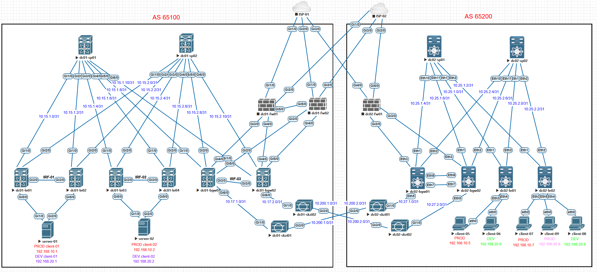

# Проектная работа

## Тема: Повышение эффективности корпоративной сети ЦОД через внедрение архитектуры EVPN/VXLAN

### Цели:

- Модернизация текущей сетевой инфраструктуры с поддержкой возможностей использования VXLAN/EVPN
- Отказ от традиционной топологии tier-3 в центре обработки данных
- Подключение резервного ЦОД с использованием технологии “multifabric”

## План:

- Разработка отказоустойчивой и масштабируемой топологии CLOS для существующего ЦОД
- Проектирование DCI с помощью “multi-fabric”
- Проектирование адресного пространства
- Проектирование Underlay и Overlay сетей
- Обеспечение безопасности при передачи информации между фабриками

### Схема существующей сети


### Схема проектируемой сети



### Конфигурация оборудования

#### POD 1
- [dc01-sp01](config/dc01-sp01.conf)
- [dc01-sp02](config/dc01-sp01.conf)
- [dc01-le01](config/dc01-le01.conf)
- [dc01-le03](config/dc01-le03.conf)
- [dc01-bgw01](config/dc01-le05.conf)

#### POD 2
- [dc02-sp01](config/dc02-sp01.conf)
- [dc02-sp02](config/dc02-sp01.conf)
- [dc02-le01](config/dc02-le01.conf)
- [dc02-le02](config/dc02-le02.conf)
- [dc02-bgw01](config/dc02-bgw01.conf)
- [dc02-bgw02](config/dc02-bgw02.conf)

### Проверка (Underlay. POD 1)
```
<dc01-sp01>disp ospf peer

 Area: 0.0.0.0
 Router ID       Address         Pri Dead-Time  State             Interface
 10.12.1.0       10.15.1.1       1   36         Full/ -           GE1/0
 10.12.3.0       10.15.1.5       1   32         Full/ -           GE3/0
 10.12.5.0       10.15.1.9       1   35         Full/ -           GE5/0
```
```
<dc01-sp02>disp ospf peer

 Area: 0.0.0.0
 Router ID       Address         Pri Dead-Time  State             Interface
 10.12.1.0       10.15.2.1       1   38         Full/ -           GE1/0
 10.12.3.0       10.15.2.5       1   32         Full/ -           GE3/0
 10.12.5.0       10.15.2.9       1   37         Full/ -           GE5/0
```
### Проверка (Overlay. POD 1)
```
<IRF-01>disp bgp peer l2vpn evpn

 BGP local router ID: 10.12.1.0
 Local AS number: 65100
 Total number of peers: 2                 Peers in established state: 2

  * - Dynamically created peer
  Peer                    AS  MsgRcvd  MsgSent OutQ PrefRcv Up/Down  State

  10.11.1.0            65100      138      122    0       5 01:05:32 Established
  10.11.2.0            65100      143      113    0       5 01:05:32 Established
```
```
<IRF-02>disp bgp peer l2vpn evpn

 BGP local router ID: 10.12.3.0
 Local AS number: 65100
 Total number of peers: 2                 Peers in established state: 2

  * - Dynamically created peer
  Peer                    AS  MsgRcvd  MsgSent OutQ PrefRcv Up/Down  State

  10.11.1.0            65100      503      361    0       8 04:13:17 Established
  10.11.2.0            65100      413      390    0       8 03:51:16 Established
```
```
<IRF-03>disp bgp peer l2vpn evpn

 BGP local router ID: 10.13.5.0
 Local AS number: 65100
 Total number of peers: 2                 Peers in established state: 2

  * - Dynamically created peer
  Peer                    AS  MsgRcvd  MsgSent OutQ PrefRcv Up/Down  State

  10.11.1.0            65100      155       93    0       6 01:09:16 Established
  10.11.2.0            65100      175       93    0       6 01:09:16 Established
```
### Проверка (Route. POD 1)
```
<IRF-01>disp ip routing-table vpn-instance PROD

Destinations : 14       Routes : 14

Destination/Mask   Proto   Pre Cost        NextHop         Interface
0.0.0.0/32         Direct  0   0           127.0.0.1       InLoop0
127.0.0.0/8        Direct  0   0           127.0.0.1       InLoop0
127.0.0.1/32       Direct  0   0           127.0.0.1       InLoop0
127.255.255.255/32 Direct  0   0           127.0.0.1       InLoop0
192.168.10.0/24    Direct  0   0           192.168.10.254  Vsi10
192.168.10.2/32    BGP     255 0           10.12.3.0       Vsi1
192.168.10.5/32    BGP     255 0           10.12.5.0       Vsi1
192.168.10.7/32    BGP     255 0           10.12.5.0       Vsi1
192.168.10.254/32  Direct  0   0           127.0.0.1       InLoop0
192.168.10.255/32  Direct  0   0           192.168.10.254  Vsi10
192.168.30.0/24    BGP     255 0           10.12.5.0       Vsi1
224.0.0.0/4        Direct  0   0           0.0.0.0         NULL0
224.0.0.0/24       Direct  0   0           0.0.0.0         NULL0
255.255.255.255/32 Direct  0   0           127.0.0.1       InLoop0
```
```
<IRF-01>disp ip routing-table vpn-instance DEV

Destinations : 13       Routes : 13

Destination/Mask   Proto   Pre Cost        NextHop         Interface
0.0.0.0/32         Direct  0   0           127.0.0.1       InLoop0
127.0.0.0/8        Direct  0   0           127.0.0.1       InLoop0
127.0.0.1/32       Direct  0   0           127.0.0.1       InLoop0
127.255.255.255/32 Direct  0   0           127.0.0.1       InLoop0
192.168.20.0/24    Direct  0   0           192.168.20.254  Vsi20
192.168.20.2/32    BGP     255 0           10.12.3.0       Vsi2
192.168.20.6/32    BGP     255 0           10.12.5.0       Vsi2
192.168.20.8/32    BGP     255 0           10.12.5.0       Vsi2
192.168.20.254/32  Direct  0   0           127.0.0.1       InLoop0
192.168.20.255/32  Direct  0   0           192.168.20.254  Vsi20
224.0.0.0/4        Direct  0   0           0.0.0.0         NULL0
224.0.0.0/24       Direct  0   0           0.0.0.0         NULL0
255.255.255.255/32 Direct  0   0           127.0.0.1       InLoop0
```
```
<IRF-01>dis bgp l2vpn evpn

 BGP local router ID is 10.12.1.0
 Status codes: * - valid, > - best, d - dampened, h - history,
               s - suppressed, S - stale, i - internal, e - external
               Origin: i - IGP, e - EGP, ? - incomplete

 Total number of routes from all PEs: 20

 Route distinguisher: 1:1010
 Total number of routes: 8

     Network            NextHop         MED        LocPrf     PrefVal Path/Ogn

* >  [2][0][48][cc3e-5f81-85b7][32][192.168.10.1]/136
                        0.0.0.0         0          100        32768   i
* >i [2][0][48][cc3e-5f82-332c][0][0.0.0.0]/104
                        10.12.3.0       0          100        0       i
*  i                    10.12.3.0       0          100        0       i
* >i [2][0][48][cc3e-5f82-332c][32][192.168.10.2]/136
                        10.12.3.0       0          100        0       i
*  i                    10.12.3.0       0          100        0       i
* >  [3][0][32][10.12.1.0]/80
                        0.0.0.0         0          100        32768   i
* >i [3][0][32][10.12.3.0]/80
                        10.12.3.0       0          100        0       i
*  i                    10.12.3.0       0          100        0       i

 Route distinguisher: 1:2010
 Total number of routes: 6

     Network            NextHop         MED        LocPrf     PrefVal Path/Ogn

* >  [2][0][48][cc3e-5f81-85b7][32][192.168.20.1]/136
                        0.0.0.0         0          100        32768   i
* >i [2][0][48][cc3e-5f82-332c][32][192.168.20.2]/136
                        10.12.3.0       0          100        0       i
*  i                    10.12.3.0       0          100        0       i
* >  [3][0][32][10.12.1.0]/80
                        0.0.0.0         0          100        32768   i
* >i [3][0][32][10.12.3.0]/80
                        10.12.3.0       0          100        0       i
*  i                    10.12.3.0       0          100        0       i

 Route distinguisher: 65100:1(PROD)
 Total number of routes: 8

     Network            NextHop         MED        LocPrf     PrefVal Path/Ogn

* >i [2][0][48][cc3e-5f82-332c][32][192.168.10.2]/136
                        10.12.3.0       0          100        0       i
* >  [5][0][24][192.168.10.0]/80
                        0.0.0.0         0          100        32768   i
* >i [5][0][24][192.168.30.0]/80
                        10.12.5.0                  100        0       65200i
*  i                    10.12.5.0                  100        0       65200i
* >i [5][0][32][192.168.10.5]/80
                        10.12.5.0                  100        0       65200i
*  i                    10.12.5.0                  100        0       65200i
* >i [5][0][32][192.168.10.7]/80
                        10.12.5.0                  100        0       65200i
*  i                    10.12.5.0                  100        0       65200i

 Route distinguisher: 65100:2(DEV)
 Total number of routes: 6

     Network            NextHop         MED        LocPrf     PrefVal Path/Ogn

* >i [2][0][48][cc3e-5f82-332c][32][192.168.20.2]/136
                        10.12.3.0       0          100        0       i
* >  [5][0][24][192.168.20.0]/80
                        0.0.0.0         0          100        32768   i
* >i [5][0][32][192.168.20.6]/80
                        10.12.5.0                  100        0       65200i
*  i                    10.12.5.0                  100        0       65200i
* >i [5][0][32][192.168.20.8]/80
                        10.12.5.0                  100        0       65200i
*  i                    10.12.5.0                  100        0       65200i
<IRF-01>

```
```
<server-01>ping -vpn-instance PROD 192.168.10.2
Ping 192.168.10.2 (192.168.10.2): 56 data bytes, press CTRL+C to break
56 bytes from 192.168.10.2: icmp_seq=0 ttl=253 time=6.729 ms
56 bytes from 192.168.10.2: icmp_seq=1 ttl=253 time=2.904 ms
56 bytes from 192.168.10.2: icmp_seq=2 ttl=253 time=3.650 ms
56 bytes from 192.168.10.2: icmp_seq=3 ttl=253 time=2.115 ms
56 bytes from 192.168.10.2: icmp_seq=4 ttl=253 time=2.893 ms

--- Ping statistics for 192.168.10.2 in VPN instance PROD ---
5 packet(s) transmitted, 5 packet(s) received, 0.0% packet loss
round-trip min/avg/max/std-dev = 2.115/3.658/6.729/1.610 ms


<server-01>ping -vpn-instance DEV 192.168.20.2
Ping 192.168.20.2 (192.168.20.2): 56 data bytes, press CTRL+C to break
56 bytes from 192.168.20.2: icmp_seq=0 ttl=253 time=3.569 ms
56 bytes from 192.168.20.2: icmp_seq=1 ttl=253 time=2.257 ms
56 bytes from 192.168.20.2: icmp_seq=2 ttl=253 time=1.925 ms
56 bytes from 192.168.20.2: icmp_seq=3 ttl=253 time=1.925 ms
56 bytes from 192.168.20.2: icmp_seq=4 ttl=253 time=2.471 ms

--- Ping statistics for 192.168.20.2 in VPN instance DEV ---
5 packet(s) transmitted, 5 packet(s) received, 0.0% packet loss
round-trip min/avg/max/std-dev = 1.925/2.429/3.569/0.606 ms
```
### Проверка (Underlay. POD 2)
```
dc02-sp01#show ip ospf neighbor
Neighbor ID     Instance VRF      Pri State                  Dead Time   Address         Interface
10.22.2.0       1        default  0   FULL                   00:00:32    10.25.1.3       Ethernet2
10.22.1.0       1        default  0   FULL                   00:00:29    10.25.1.1       Ethernet1
10.23.1.0       1        default  0   FULL                   00:00:33    10.25.1.5       Ethernet10
10.23.2.0       1        default  0   FULL                   00:00:30    10.25.1.7       Ethernet11
```
```
dc02-sp02#show ip ospf neighbor
Neighbor ID     Instance VRF      Pri State                  Dead Time   Address         Interface
10.22.2.0       1        default  0   FULL                   00:00:32    10.25.2.3       Ethernet2
10.22.1.0       1        default  0   FULL                   00:00:32    10.25.2.1       Ethernet1
10.23.1.0       1        default  0   FULL                   00:00:30    10.25.2.5       Ethernet10
10.23.2.0       1        default  0   FULL                   00:00:37    10.25.2.7       Ethernet11
```
### Проверка (Overlay. POD 2)
```
a
```
```

```


